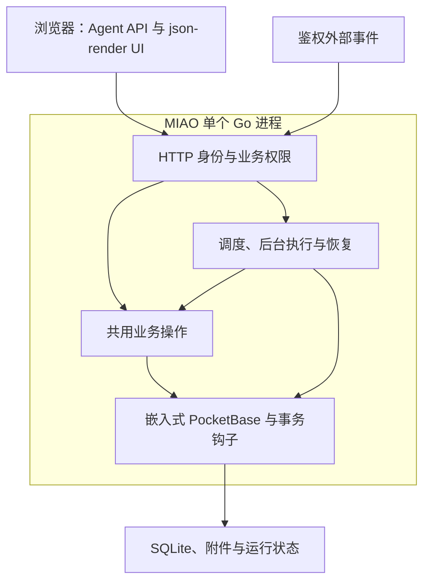
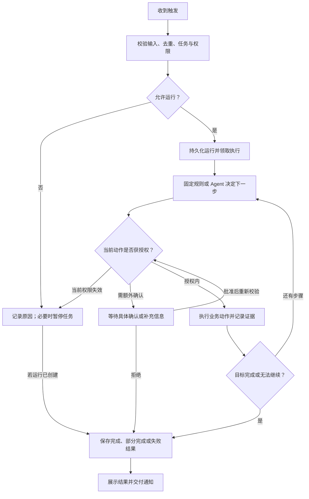

# MIAO 产品与运维手册

本文档是 MIAO 唯一的详细产品、接口与运维手册。根目录 [README.md](../README.md) 提供项目概览和快速开始；仓库维护指引见 [AGENTS.md](../AGENTS.md)。当前应用由一个 Go 进程提供 HTTP API、嵌入 `public/` UI，并在进程内使用 PocketBase 管理身份和数据。下文中 2026-09-30 的生产部署记录描述重构前版本，不表示 Go 版本已部署。

第 1–8 节记录当前代码实现和操作方式；第 9 节定义 Agent 运行模型与验收要求，9.14 记录后台交付范围，第 10 节记录本次共享业务环境的实现与验收。2026-09-30 的生产部署与固定后台报表验收针对首次部署版本；后续后台任务交付补齐已在 2026-10-01 本地完成自动化回归测试及干净目录迁移验证，尚未部署到生产，真实 AI、邮件与其他异常场景仍未完成验收。新增能力实现后，应同步更新当前功能、边界和 API 参考，避免把产品决策写成已上线功能。

## 1. 产品概览

MIAO 帮助团队通过服务端 Agent 创建和使用业务工具，并按明确授权公开只读页面。PocketBase 管理身份和业务数据；MIAO API 按请求检查工作区和应用权限。企业 AI 密钥保存在服务端，浏览器只访问经过认证的 Agent API。

MIAO 的工作流程是：描述业务目标、由 Agent 规划数据结构和业务界面、预览并确认发布，然后在持久化的业务界面里处理日常工作。界面修改与发布（含匿名公开范围）全部通过小助手对话完成，产品不提供可视化页面编辑器或手动发布按钮。数据表和记录管理作为检查与维护入口保留。Go 服务替换 Bun/Fastify API 服务，复用 PocketBase 原生身份、存储和迁移能力；记录事务钩子使用 Go。交付以全新数据目录为基线，不提供旧 Bun/Fastify 或旧界面 schema 兼容层。

应用按可组合的通用原语建模：用户定义的数据表和关联承载领域数据；受控 json-render Spec 组合界面；业务动作和状态流承载事务与生命周期；事件/定时任务、Agent 和声明式采集脚本承载自动化与外部输入；显式发布策略限定匿名访客可读的页面、记录字段和图片。新增行业场景应组合这些原语，不增加行业专属平台模块。

当前 Agent 对话通过可见的应用控制界面启动持久化 harness run；会话按账号和工作区保存，应用数据与权限仍由后端重新查询校验。

## 2. 当前功能

访问根路径 `/` 直接显示登录页面，不再提供宣传首页。注册和忘记密码入口保留在登录页；退出登录、登录凭证失效及邮箱验证完成后返回登录页。已有有效登录状态时继续进入工作台并恢复当前工作区视图。登录、工作台、数据检查和平台后台沿用 `miao.my/docs/prototypes` 的白色背景、黑色主按钮与细边框界面风格。

- 账号注册、登录、邮箱验证、密码重置；支持注册策略和邮箱域限制。
- 工作区、成员邀请、工作区角色，以及应用访问名单。
- 概览页直接列出应用卡片，不再提供对话输入框；小助手固定在侧栏。卡片显示访问量、记录数和数据表数：打开应用（`POST /api/apps/:id/visit`）和公开页面首次加载（`POST /api/public/:slug/visit`）各自累计一次 `apps.view_count`，记录数为应用全部数据表的记录总和，统计读取失败时卡片显示占位符而不是隐藏应用。
- 应用、数据表、字段和记录的管理；字段支持文本、数字、布尔、日期、邮箱、网址、选项、关联和附件。
- schema v3/json-render 多页面界面、受控组件与真实数据源；动作可引用通用业务动作。平台不接受应用源码生成或执行。
- 通用业务动作：应用管理员可定义带前置条件的跨表创建/更新步骤；动作在共享业务事务内执行，支持运行时输入引用和幂等回执，不绑定具体行业对象。
- 通用状态流：应用管理员可把任意用户自建表的状态字段配置为状态机，声明状态集合和合法转换；状态流不预设产品、线索、订单或其他行业对象。
- 外部读取：基础版由 Agent 和声明式采集脚本直接读取 HTTP(S) URL；每次运行受请求数、响应大小和条目预算约束，采集写入保存幂等回执。
- 应用界面版本、草稿修订、历史界面前向恢复和显式发布；发布前检查数据表、字段和当前发布版本。
- 持久化 Agent harness run 支持候选回执、确认、取消、等待和恢复；候选选择使用服务端 Jev evaluation-model v4 协议，固定上游 commit `fc2a696a50a30cb30c878ab1eb65e102487eea0f`，模型凭据不进入浏览器。BackendPlan、受控 json-render 草稿和普通后台任务均通过共享 Engine；任务工具与业务动作继续使用原授权、预算和未知写入核实流程。
- Agent 支持结构化查询、批量修改预览和确认执行、到期/状态变化/新增记录提醒，以及新增记录后的固定字段动作。
- 应用后台任务仍由共享 harness 生命周期推进，声明式采集脚本由 Go 服务调度，只执行声明的 HTTP(S) GET、字段映射、过滤、去重、入库和站内通知。
- 应用主操作区提供当前应用已声明的能力入口，以及后台任务、访问权限和应用管理入口；数据表入口仅在应用声明 `data_management` 能力时显示，未声明时仍可由 Agent 按权限使用底层数据工具。后台任务页提供分页历史与运行详情。工作区通知入口支持分页、已读处理与直接打开运行详情，最新一页有未读通知时显示提示。
- 工作区审计、数据 JSON 导出、平台管理、AI 用量统计与服务端密钥配置。

## 3. 权限模型

工作区 owner 管理空间和应用访问权限。应用权限分为 viewer（只读）、editor（修改普通记录）、manager（管理应用与草稿）、publisher（管理并发布）。批量修改需要单独授予 `can_batch`；viewer 不能写入。未受限应用默认对工作区成员开放普通记录编辑，发布、应用管理和结构变更仍检查对应角色。

任务管理和运行处理要求任务创建者具有 publisher 权限，或由当前工作区 owner 操作；后台实际执行仍使用创建者的当前权限，不因 owner 处理而继承 owner 身份。任务列表和结果按应用访问权限读取。

平台管理员只能管理账号、工作区和应用元数据、AI 配置与汇总用量，不能浏览业务记录、附件内容或私有 Agent 对话正文。每个业务 API 都会在服务端检查当前工作区与应用权限；隐藏前端按钮不构成授权。

## 4. 已知范围与安全边界

- json-render Spec 由服务器校验，界面上限、组件属性、数据源和动作引用受 schema v3 约束；不提供源码编辑、任意计算表达式、SQL 或代码执行。
- 业务动作当前最多 20 个步骤和 40 个条件；步骤仅支持普通字段的创建/更新，文件、结构变更、删除、外部调用和自动计算尚未纳入通用动作契约。
- 通用状态流当前绑定一张表和一个选项/文本状态字段，最多 32 个状态和 64 个转换；转换复用记录权限、乐观更新时间校验、审计和幂等回执，暂不包含审批人、计算节点或外部调用。
- 基础版外部读取只支持无凭据 HTTP(S) GET；单次响应最多 2 MiB、超时 15 秒，最多提取 32 个字段和 100 条记录；采集脚本另有独立请求、页数和记录预算。
- 通用公开发布复用当前正式 json-render 页面及用户自建数据表。每个数据源单独授权字段、发布状态值、slug 和可公开图片；草稿记录、未授权字段及普通附件保持私有。匿名 HTML 由受控服务端 renderer 输出，不渲染用户源码。
- 公开 CMS 接口为已发布记录提供分页列表、按 slug 的详情及服务器渲染 HTML；可声明 SEO 标题/描述字段。图片通过显式授权的公开代理路径读取，普通业务附件继续使用受保护文件代理。
- 多账号使用 `X-Miao-Tenant-Id` 选择工作区，并用成员字段和 app access role 绑定应用访问；同一工作区内对话仍按用户私有存储。
- 批量更新限同一张表、统一字段赋值、最多 100 条记录。先预览目标记录，再由用户确认；过期计划、权限变化或记录被其他操作修改时会阻止相应写入。整批操作不保证事务性回滚。
- 自动化首版提供站内通知，以及新增记录时对同一记录设置一个固定字段值；不发送邮件或企微消息。
- 原自动化规则继续执行固定动作，到期扫描与后台任务调度由 Go 服务定时检查；同一任务串行，首版执行器全局一次执行一项运行。
- 后台任务的读写授权精确到表和字段，也可以额外声明已启用的通用业务动作 ID；动作执行仍受动作自身输入、条件、事务和应用权限约束。首版不支持附件、关联字段、新增、删除、批量写入、结构修改或任意网络工具。
- PocketBase 对 MIAO 创建的业务集合安装模型钩子：业务记录保存与符合条件的事件运行入队在同一个 SQLite 事务中完成；事务失败时一同回滚。通过 PocketBase Go 模型保存同类记录都会触发，直接操作 SQLite 不在覆盖范围内。后台和原固定动作写入显式抑制事件，避免循环。鉴权的外部事件可对已启用的 manual 任务入队。
- 当前 Go 服务按单实例方式部署。记录更新由 PocketBase 在事务内比较预期更新时间后更新，阻止读取与写入之间的并发覆盖；执行租约用于单实例故障恢复，不构成多副本部署保证。
- 文件上传最多 5 MB；CSV/XLSX 读取和每批导入最多 100 行，导入须审阅并确认计划。图片/PDF 只保存和下载，未提供 OCR 或 PDF 文本提取。
- Agent 对话和正在搭建的候选选择可能依赖配置模型服务；模型不可用不影响已发布界面、确定性 CRUD、声明采集步骤与历史回执读取。Jev 决策与后台任务已接入共享持久 loop；真实模型、等待恢复及离线调度仍需按目标环境验收，不以代码接入代替现场证据。
- 静态检查和自动化测试不能替代目标环境中的真实账号、AI Gateway、反向代理、公开图片及备份恢复验收。

### 身份与工作区

| 方法 | 路径 | 用途 |
| --- | --- | --- |
| POST | `/auth/verify-email`、`/auth/password-reset/request`、`/auth/password-reset/confirm` | 邮箱验证与密码重置 |
| GET / DELETE | `/me` | 获取当前用户上下文；删除账号需密码和确认邮箱 |
| POST | `/me/deactivate` | 停用当前账号，保留数据 |
| GET | `/workspace/members`、`/workspace/invites` | 查询成员与邀请 |
| POST / DELETE | `/workspace/invites`、`/workspace/invites/:id` | 创建或撤销邀请 |
| PATCH / DELETE | `/workspace/members/:id` | 调整成员角色或移出工作区 |
| GET | `/workspace/ai-usage`、`/workspace/ai-usage/requests` | 分类统计与分页调用明细 |
| PATCH | `/workspace/ai-budget` | 所有者调整总量与 LLM/JEV 分类预算 |
| GET | `/workspace/audit`、`/workspace/export` | 查看审计日志或导出获授权数据 |

### 应用和业务数据

| 方法 | 路径 | 用途 |
| --- | --- | --- |
| GET / POST | `/apps` | 列表或创建应用 |
| GET / PATCH / DELETE | `/apps/:id` | 查看、修改、归档或确认后删除应用 |
| GET / POST | `/apps/:id/collections` | 列表或创建数据表 |
| PATCH / DELETE | `/apps/:id/collections/:slug` | 修改或确认后删除数据表 |
| GET | `/apps/:id/runtime` | 当前已发布的 schema v3/json-render 界面与真实数据源 |
| GET | `/apps/:id/versions/:versionId/validation` | 重新校验 json-render Spec、数据源和动作引用，不发布版本 |
| POST | `/apps/:id/versions/preview` | 只读校验/预览未保存的 `definition`；支持 `ui_page`/`record_id`，不写版本或业务记录 |
| GET / PUT | `/apps/:id/access` | owner 查看或设置成员应用角色与 `can_batch` |
| GET / POST | `/apps/:id/collections/:slug/records` | 分页查询或新增记录 |
| PATCH / DELETE | `/apps/:id/collections/:slug/records/:recordId` | 编辑或删除记录 |
| GET | `/apps/:id/collections/:slug/records/:recordId/files/:fieldName` | 下载获授权的附件 |
| GET | `/apps/:id/publication` | 查看匿名发布状态；配置随小助手发布链路写入，不提供手动配置接口 |
| GET | `/public/:slug/runtime` | 匿名读取当前正式版本中已授权的公开页面 |
| POST | `/public/:slug/visit` | 匿名记录一次公开页面访问；仅累计 `apps.view_count`，不返回业务数据 |
| GET | `/public/:slug/records` | 匿名读取单页授权的数据表与字段；只读、分页 |
| GET | `/public/:slug/records/:itemSlug` | 读取明确授权且已发布的 slug 详情 |
| GET | `/public/:slug/images/:pageId/:source/:table/:recordId/:field` | 读取显式公开的图片字段；其他文件仍走受保护附件接口 |
| GET / POST / PATCH | `/apps/:id/collection-scripts` 及脚本操作子路径 | 声明脚本、启停、试运行、执行和读取持久化回执 |

记录分页使用 `page`、`perPage`，支持文本搜索、排序和单字段筛选。记录写入格式为 `{"data":{"field_name":"value"}}`。附件写入额外提供 `files` 映射；每个文件最多 5 MB，支持 PNG、JPEG、GIF、WebP、PDF 和纯文本。

### Agent 操作、批量修改与提醒

| 方法 | 路径 | 用途 |
| --- | --- | --- |
| POST | `/apps/:id/query` | 结构化条件查询；最多 8 个条件，支持 `eq`、`contains`、`before`、`after`、`empty` |
| POST | `/apps/:id/batch-plans` | 预览 1–100 条记录的统一字段赋值，不写入记录 |
| GET / POST | `/apps/:id/batch-plans/:jobId`、`/apps/:id/batch-plans/:jobId/commit` | 查询计划或提交确认执行 |
| GET / POST | `/agent/runs`、`/agent/runs/:runId` | 创建和读取持久化 harness run |
| POST | `/agent/runs/:runId/confirm`、`/cancel` | 确认候选或取消运行 |
| GET | `/agent/runs/:runId/events` | 按 sequence 读取运行事件 |
| GET / POST | `/agent/threads`、`/agent/threads/:threadId/messages` | 按当前账号隔离的私有对话线程；浏览器 Agent 仍使用私有检查点接口 |
| GET / POST | `/apps/:id/automations`、`/apps/:id/automations/:ruleId/enable` | 查询或创建默认停用的规则，再确认启用 |
| GET | `/notifications` | 当前用户可访问应用的站内提醒；带 `page` 返回分页对象，不带则保留原数组响应 |
| POST | `/notifications/:notificationId/read` | 校验当前接收人与应用权限后标记已读 |

### 通用业务动作

业务动作是可配置的领域层，不预设产品、客户、订单或其他行业实体。定义由 `inputs`、`conditions` 和 `steps` 组成；输入类型支持 `text`、`number`、`bool`，必填输入在执行前校验。条件支持 `eq`、`neq`、`empty`、`not_empty`；步骤支持 `create` 和 `update`，字段值、`record_id`、`expected_updated_at` 可以使用已声明的 `$input_name` 引用执行输入。所有步骤在一个 PocketBase 事务中执行，并复用应用写权限、字段校验、记录审计和事件入队。schema v3 页面通过受控 `action_id` 引用动作。

### 通用公开发布

公开发布是一份应用级只读访问策略。先通过小助手对话发布 schema v3/json-render 界面；发布候选中的公开判断（`ui.publish.public`）由 Jev 依据请求给出、确认门复核后写入唯一链接标识和允许公开的页面，不再提供手动配置入口。页面级校验规则保持不变。每页必须为每个数据源提供 `reads`，包括 `source`、用户数据表 `table`、公开字段 `fields`、发布状态 `status_field`/`published_value` 和稳定详情 `slug_field`。只有本页数据源中的普通字段可以公开；图片字段还必须列在 `images` 并同时列入字段白名单。附件字段的原始存储名、关联、工作区/应用内部字段和未授权记录不进入匿名响应。

公开内容页面示例（字段必须存在于当前正式版本和绑定数据表）：

```json
{
  "enabled": true,
  "confirm": true,
  "slug": "catalog",
  "pages": [{"id":"news","reads":[{"source":"news_source","table":"news","fields":["title","slug","body","cover"],"images":["cover"],"status_field":"status","published_value":"published","slug_field":"slug","seo_title_field":"title","seo_description_field":"summary"}]}]
}
```

匿名 JSON 列表与详情分别使用 `/api/public/:slug/records?page_id=...&table=...&source=...` 和 `/api/public/:slug/records/:itemSlug?page_id=...&table=...&source=...`。平台生成 `/s/:slug/:pageId/:source/:itemSlug` 的服务端 HTML，输出 title、description、canonical 和授权字段；页面正文始终转义文本，不解释记录为标记或运行应用源码。图片 URL 使用 `/api/public/:slug/images/:pageId/:source/:table/:recordId/:field`；接口重验发布状态、记录归属、显式图片名单和 MIME 类型。关闭发布或撤销字段授权后立即失败关闭，`no-store` 禁止浏览器缓存公开响应。

草稿内容与界面版本发布彼此独立：只有 `status_field` 等于确认的 `published_value` 的记录能从匿名列表、详情、HTML 或图片端点读取。创建/更新记录无需重新编写 Spec；页面按绑定数据源读取当前记录。公开请求按来源地址限流。匿名访客每次打开公开页面会通过 `/api/public/:slug/visit` 累计一次应用访问量，接口先验证发布仍开启，计数失败只影响统计。

| 方法 | 路径 | 用途 |
| --- | --- | --- |
| GET / POST | `/apps/:id/actions` | 查询或创建默认草稿业务动作 |
| PATCH | `/apps/:id/actions/:actionId` | 修改定义并生成新的草稿版本 |
| POST | `/apps/:id/actions/:actionId/enable` | 明确确认后启用或暂停动作 |
| POST | `/apps/:id/actions/:actionId/execute` | 传入 `idempotency_key` 和 `input` 执行已启用动作；重复键返回原回执 |

示例定义（表名和字段需替换为当前应用真实结构）：

```json
{
  "conditions": [{"table":"orders","record_id":"$order_id","field":"status","op":"eq","value":"待发货"}],
  "steps": [
    {"id":"ship","operation":"update","table":"orders","record_id":"$order_id","expected_updated_at":"$order_updated_at","data":{"status":"已发货"}},
    {"id":"log","operation":"create","table":"activities","data":{"note":"$note"}}
  ]
}
```

### 通用状态流

状态流是数据模型和业务动作之间的通用流程层。它只绑定当前应用的一张用户自建表和一个状态字段，定义可用状态以及 `from` 到 `to` 的合法转换。产品目录、线索跟进、订单履约等场景都应通过不同表结构和状态流配置表达，不在服务端增加行业实体。

| 方法 | 路径 | 用途 |
| --- | --- | --- |
| GET / POST | `/apps/:id/workflows` | 查询或创建默认草稿状态流 |
| PATCH | `/apps/:id/workflows/:workflowId` | 修改定义并生成新的草稿版本 |
| POST | `/apps/:id/workflows/:workflowId/enable` | 明确确认后启用或暂停状态流 |
| POST | `/apps/:id/workflows/:workflowId/transition` | 按合法转换、当前状态和 `expected_updated_at` 推进一条记录；重复幂等键返回原回执 |

定义示例（表和字段必须替换为当前应用真实结构）：

```json
{
  "table": "work_items",
  "state_field": "status",
  "states": [
    {"id": "new", "label": "新建"},
    {"id": "done", "label": "完成"}
  ],
  "transitions": [
    {"id": "finish", "label": "完成", "from": "new", "to": "done"}
  ]
}
```

状态流转换不会绕过应用权限或并发保护；状态字段被其他操作修改后，必须重新读取记录并重新决定是否转换。

### 外部读取与采集脚本

基础版不再配置独立连接器。后台 Agent 可以直接读取任务需要的公开 HTTP(S) URL；采集脚本在声明中填写 `source.url`，可选声明分页 URL、详情 URL 模板和 JSON/HTML 提取规则。每次读取仍执行固定超时和大小/条目预算，采集回执保存 HTTP 元数据与映射后的条目。外部页面文本始终视为不可信数据，不能借其内容扩大任务授权。

| 方法 | 路径 | 用途 |
| --- | --- | --- |
| GET / POST | `/apps/:id/connectors` | 旧版连接器配置（基础版不再使用） |
| PATCH | `/apps/:id/connectors/:connectorId` | 旧版连接器修改接口 |
| POST | `/apps/:id/connectors/:connectorId/enable` | 旧版连接器启停接口 |
| POST | `/apps/:id/connectors/:connectorId/fetch` | 旧版连接器读取接口 |

连接器不会自动决定写入哪张业务表。Agent 根据用户配置的任务目标和已有动作处理提取条目；外部页面文本始终视为不可信数据，不能借其内容扩大任务授权。

HTML 配置示例：

```json
{
  "base_url": "https://example.com",
  "allowed_paths": ["/catalog"],
  "extract": {
    "format": "html",
    "item_selector": "article.item",
    "fields": {
      "title": {"selector": ".title"},
      "url": {"selector": "a", "attribute": "href"}
    }
  }
}
```

JSON 配置使用同样的 `extract.fields` 映射，`format` 设为 `json`，`items_path` 和各字段值使用 JSON Pointer，例如 `/data/items`、`/name`。

### 声明式采集脚本

采集脚本把外部 URL 读取、目标表映射、过滤、稳定去重键、基线通知和计划保存为版本化声明。脚本创建与修订会在同一事务内重新检查当前工作区成员、应用发布权限、应用归档状态、脚本负责人和连接器/目标表/接收人引用；草稿可以引用未归档的连接器，只有试运行、启用和正式运行要求来源连接器已经启用。并发保存或撤权不会覆盖已变化的修订。启用与暂停同样要求 `expected_revision`，且在事务内重新读取脚本和负责人权限；暂停不会撤销已经产生的运行或业务记录。

| 方法 | 路径 | 用途 |
| --- | --- | --- |
| GET / POST | `/apps/:id/collection-scripts` | 查询或创建采集脚本草稿 |
| PATCH | `/apps/:id/collection-scripts/:scriptId` | 暂停或草稿状态下保存新修订，传 `expected_revision` |
| POST | `/apps/:id/collection-scripts/:scriptId/enable` | 传 `confirm: true` 和 `expected_revision` 启用具体修订 |
| POST | `/apps/:id/collection-scripts/:scriptId/pause` | 传 `expected_revision` 停止后续调度 |
| POST | `/apps/:id/collection-scripts/:scriptId/preview` | 读取当前修订并只展示样本，不持久化运行、不写业务表或通知 |
| POST | `/apps/:id/collection-scripts/:scriptId/run` | 传 `confirm: true`、`expected_revision` 和可重试的 `request_id` 执行已启用修订 |
| GET | `/apps/:id/collection-scripts/:scriptId/runs` | 查询运行及持久化结果 |
| POST | `/apps/:id/collection-scripts/:scriptId/runs/:runId/retry-notifications` | 管理者传 `confirm: true` 仅重试失败/受阻通知，不重放采集或业务写入 |

正式运行创建持久化回执时会在事务内复核脚本仍为启用状态、版本和负责人权限，并按脚本与事件键复用已有回执。每次外部读取和每次业务写入还会复核脚本的声明版本；运行期间暂停脚本、改版、撤销负责人或暂停连接器只停止后续写入，已经完成的记录保留。业务记录、稳定来源键回执和站内通知待投递记录在同一事务内保存，避免部分写入造成下一次重复创建。调度器更新下一次运行时间时使用同一版本和原 `next_run_at` 作为条件，避免旧调度覆盖新的启停或修订。

正式运行接口返回 202 与持久化的 `queued` 运行，不等待外部抓取；关闭页面不取消该运行。定时扫描同样只入队，执行复用后台 worker 的单执行槽和持久租约，最多运行 10 分钟，来源请求/页面/条目预算仍按声明限制。服务中断后核对已提交的来源键与业务写入回执，标记失败或部分完成并保留记录；不会重置预算自动重放，需审阅后明确发起新运行。调度器与通知重试不依赖浏览器在线。

`counts.notifications` 表示此次创建的 outbox 回执数量，不代表投递成功。单个运行查询的 `delivery` 分别给出 pending/delivered/failed/blocked 数量和有限错误；界面支持管理者确认后只重试通知。临时失败保存错误并至少间隔一分钟重试，每轮最多 25 条；权限或失效引用拒绝记为 blocked，不自动循环重试。投递在事务中重新授权，原事件键避免重复通知。首次基线必须显式声明 `silent` 或 `notify`，不默认向成员发送历史存量。

只读试运行不会创建持久化运行记录，也不会写业务表、来源键回执或通知；页面展示有限的新增/变化/跳过/错误样本。正式运行的首次成功完成运行作为基线：`baseline: silent` 只静默首次基线，后续新增记录仍会进入站内通知；失败或部分完成的运行不会把自己当成成功基线。结果页展示来源、版本、计划、计数、最多 25 条样本和分页历史，通知中的运行入口会回到对应采集回执。

### 后台任务与运行

下列路径均以 `/api` 为前缀，并继续使用用户身份与工作区请求头。草稿仅保存定义，不执行。启用必须确认具体版本；运行持有不可变定义快照。

| 方法 | 路径 | 用途 |
| --- | --- | --- |
| GET / POST | `/apps/:id/tasks` | 每页 25 项查询或创建任务草稿，查询支持 `page` |
| PATCH | `/apps/:id/tasks/:taskId` | 修改草稿或暂停任务，传 `expected_revision`，生成新草稿版本 |
| POST | `/apps/:id/tasks/:taskId/enable` | 传 `confirm: true`、`expected_revision` 确认启用 |
| POST | `/apps/:id/tasks/:taskId/preview` | 对具体 `expected_revision` 做只读试运行，草稿也可运行，不写入、不通知、不启用日程 |
| POST | `/apps/:id/tasks/:taskId/archive`、`/apps/:id/tasks/:taskId/restore` | 确认当前版本后归档并取消剩余运行；恢复为新草稿，重新确认才启用 |
| POST | `/apps/:id/tasks/:taskId/transfer` | 传 `user_id`、`confirm: true`、`expected_revision` 转交给有发布权限的真实成员；未结束运行须先处理，转交后生成待授权草稿 |
| POST | `/apps/:id/tasks/:taskId/pause` | 停止后续触发，已经入队的运行另行取消 |
| POST | `/apps/:id/tasks/:taskId/run` | 运行已启用版本，传 `expected_revision`、可复用的 `request_id`；返回 202 和运行标识 |
| GET | `/apps/:id/runs`、`/apps/:id/runs/:runId` | 分页查询运行，或读取结果、动作证据及 `attempt_history`；检查点不返回浏览器 |
| POST | `/apps/:id/runs/:runId/cancel` | 请求停止尚未执行动作，不回滚已完成写入 |
| POST | `/apps/:id/runs/:runId/retry` | 失败或部分完成后传 `confirm: true`，创建关联的新运行，保留原授权快照和已成功动作回执；原运行已消耗的模型请求数从重试预算扣除；首次执行外最多两次人工失败重试；批准或补充信息后的续接不消耗此额度 |
| POST | `/apps/:id/runs/:runId/resolve` | 传 `confirm: true`、`expected_updated_at` 及 `decision: approve/reject`；补充信息使用 `answer` |

创建请求示例，表和字段必须替换为当前应用真实定义：

```json
{
  "name": "每周客户跟进检查",
  "definition": {
    "goal": "检查客户最近跟进日期，列出需要处理的客户和依据，不修改记录。",
    "execution": "agent",
    "trigger": { "type": "weekly", "time": "09:00", "weekdays": [1], "timezone": "Asia/Shanghai" },
    "scope": { "tables": [{ "table": "customers", "read_fields": ["name", "last_contact"], "write_fields": [] }], "recipient_ids": [] },
    "limits": { "max_writes": 0, "max_requests": 12, "timeout_seconds": 180 }
  }
}
```

`execution: report` 为固定数据快照，只显示每张表第一页（25 条）及总量，不解释自然语言目标或进行 AI 分析。固定报告接入共享 Engine 的 Runtime，持久保存授权校验、候选、步骤、完成回执和事件，不调用模型。`agent` 可分页查询和调用受控工具；获授权的业务动作 revision 会固化进运行快照，版本变化后拒绝执行。普通 Agent 的旧执行循环已移除。周日为 0；一次性 `at` 必须带时区；状态变化使用 `table`、`field`、`from`、`to`，字段必须是已授权读取的选项字段，起止状态必须不同；可选选项字段可以使用空字符串表示未设置。接收人默认仅负责人，其他成员使用真实用户 ID；交付时重新检查权限。`limits.confirmation_timeout_hours` 控制待处理期限，默认 72 小时，可设 1–720；过期取消剩余动作并保留原回执，未知写入效果不会自动重放。只读试运行保留运行结果供审阅，不产生站内通知，不提供写入批准流程，但仍使用原有模型请求预算。

模型完成文本不能替代实际写入回执。写入结果未知时进入待核实，核实接口只在当前记录与预期字段值一致时确认，不重新发送原写入；不一致时应拒绝此运行并基于当前记录重新建立任务。

### 平台与 AI Gateway

- 工作台侧栏的“工作区管理”是当前工作区的独立管理页面，不再用独立成员/日志弹窗承载常规管理。页面包含“成员与邀请”“操作日志”“工作区设置”；工作区切换后重新读取对应工作区数据，邀请链接不跨工作区保留。
- 成员可查看成员列表；owner/admin 可邀请和撤销邀请，只有 owner 可调整成员角色、移除成员和读取操作日志。邀请输入邮箱后直接发送：已配置邮件服务时向受邀邮箱发送邀请邮件，同时始终返回可复制的邀请链接；受邀人打开链接、用受邀邮箱登录或注册后自动加入（无需再确认），链接 24 小时内有效，过期或撤销后失效。工作区设置集中显示当前工作区与角色，并提供既有 AI 用量/预算和按权限导出的入口，不扩大原有授权。
- 工作区切换下拉末尾提供“创建工作区…”（加号图标）：已登录用户（开启邮箱验证时须已验证）可创建新工作区并成为其所有者，创建后立即切换，数量暂无上限。`POST /api/workspaces` 接收 `{"name"}`（去空白后必填，1–160 字符），在同一事务内写入 `tenants`（`owner_id` 与 slug）和 `role=owner` 的成员记录，返回 `{id, name, slug, role}`；名称不要求唯一，`tenants.slug` 仅作展示（无唯一索引、不参与路由）。
- “平台管理”仅对平台管理员名单中的账号开放，侧栏包含用户、工作区、基本设置，并保留应用目录、AI 用量、平台审计和 AI 服务。平台管理员权限不等同于工作区业务权限。名单保存在数据库 `platform_settings` 的 `platform_admins` 项，首次部署由 `MIAO_ADMIN_EMAILS` 引导：启动时一次性导入并记录审计；此后在后台“平台管理员”分组维护，保存时须至少保留一名管理员，移除当前登录账号需要名单中已有另一位已注册且可用的管理员。失去后台访问时，停机执行 `miao admin-grant EMAIL [EMAIL...]` 恢复（与生效名单合并写入并记录审计）。
- `/admin/settings` 按分组维护业务设置，读取走 `GET /api/admin/settings`，保存走 `PUT /api/admin/settings/{registration|mail|admins|backup}`，每组与平台审计记录在同一事务内写入，保存后对后续请求立即生效、重启保留；进行中的后台任务在下一次模型或邮件调用时读取新配置，不在运行中途固定快照。注册组：注册方式（开放/仅邀请/关闭）、最多 50 个允许邮箱域名（ASCII 或 punycode，不含 `@`）和注册需验证邮箱；开启验证前必须已保存有效邮件服务，否则返回 409。邮件组：公开访问地址、发件人和 Resend 密钥，密钥支持保留/轮换/清除，界面只显示末尾提示，不回传明文。
- 业务设置的有效数据库记录是权威来源；`尚未配置`（无记录且环境未提供）、`主动清除`（记录删除后不再回退环境值）、`已停用`（AI/Jev 开关关闭）和`无法解密`（加密密钥不匹配时明确报错，不静默回退）四种状态明确区分。环境变量只在首次启动对缺失的组做一次性导入并记录 `settings.environment.imported` 审计，此后不再读取；每次启动都不会用环境值覆盖后台修改。

- `/admin/overview`、`/admin/runtime` 提供平台汇总数据与非敏感运行状态。
- `/admin/users`、`/admin/workspaces`、`/admin/apps`、`/admin/usage`、`/admin/audit` 提供分页平台管理能力。
- `/admin/ai` 分别管理 LLM 和 JEV：独立启停、模型、密钥来源、加密后台密钥轮换、恢复环境配置及真实连接检查。LLM 支持 Vercel Gateway / CAPI，JEV 固定使用 Vercel evaluation-model v4，不宣称 CAPI JEV 兼容。密钥只返回末尾提示，完整密钥、提示词和上游响应正文不返回浏览器。
- 平台 `/api/admin/usage` 与 `/api/admin/usage/requests`、空间 `/api/workspace/ai-usage` 与 `/api/workspace/ai-usage/requests` 分别汇总与分页查看明细。查询参数 `from` / `to` 为 RFC3339 时间，连续范围最多 31 天，`kind` 为 `llm` / `jev` / `unclassified`，留空查全部；日期界面使用 UTC。缺少类型的记录归为未分类，不猜测回填。输入/输出 token 独立标识是否由上游返回，缺失值显示未知，用量不是费用账单。
- 空间所有者通过 `PATCH /api/workspace/ai-budget` 同时设置 `daily_limit`、`llm_daily_limit` 和 `jev_daily_limit`，均为 0–100000 整数；0 表示不限制。总上限与分类上限同时执行。失败调用和连接检查也消耗预算，停用/预算拦截在创建请求记录前拒绝。
- 配置 API：`GET /api/admin/ai` 返回两个服务的安全配置；`PUT /api/admin/ai/{llm|jev}` 接收 `enabled`、`model`、`key_mode`（`keep` / `replace` / `environment`，`environment` 表示清除后台密钥），LLM 另接收 `provider` 与 `base_url`，`replace` 必须提供 `api_key`。切换提供商/地址时不能使用 `keep`。`DELETE` 同路径清除全部后台配置（恢复代码默认值）；`POST` 同路径加 `/check` 执行真实低 token 检查并保存最近结果。配置变更清除旧检查历史。
- `/agent/runs` 与 `/agent/runs/:runId/events` 是经过认证的运行和事件 API；浏览器不直接连接 AI 服务。

## 6. 自托管部署

部署脚本支持 Linux 和 macOS 的 x64 与 ARM64。`go.mod` 固定 PocketBase 0.40.4 和 Go 1.27.1 工具链；安装及运维脚本使用 PM2、`curl` 和 `openssl`。运行 `miao` 二进制不需要 Go、Node.js 或独立 PocketBase。

```sh
npm run server:install
# 按安装输出修改配置：注册策略、平台管理员邮箱和 AI 服务密钥
npm run server:start
npm run server:status
npm run server:logs
```

默认监听 `0.0.0.0:41874`，PM2 只管理一个 `miao-platform` 进程。对公网提供服务时配置 HTTPS 反向代理并限制服务端口访问。PocketBase 的原始集合、管理员、文件令牌和备份 HTTP API 不向公网挂载；前端通过 MIAO 的工作区和应用权限入口访问。

### 主要配置项

注册策略（含邮箱验证）、邮件服务（公开地址、发件人、Resend 密钥）、AI/Jev 提供商与密钥、平台管理员名单和备份策略都保存在数据库并由平台管理员通过 `/admin/settings` 与 `/admin/ai` 管理。环境变量仅保留运行时边界，并在首次启动对尚未配置的组做一次性导入（记录审计，之后不再读取，环境变更不会覆盖后台修改）：

| 配置 | 用途 |
| --- | --- |
| `MIAO_DATA_DIR` | 持久数据根目录；数据库与附件仍位于其 `pb_data/` 子目录 |
| `MIAO_PORT`、`HOST` | HTTP 端口和监听地址 |
| `MIAO_SETTINGS_ENCRYPTION_KEY` | 加密数据库中的服务密钥；升级保留原密钥，缺失时不能保存或读取独立密钥 |
| `MIAO_ADMIN_EMAILS` | 首次管理员引导：启动时一次性导入平台管理员名单 |
| `MIAO_BACKUP_DIR`、`MIAO_BACKUP_RETENTION_DAYS` | 备份目录和保留天数的引导值，导入后由后台备份策略管理 |
| `MIAO_AI_*`、`AI_GATEWAY_API_KEY`、`MIAO_JEV_*`、`MIAO_PUBLIC_URL`、`MIAO_MAIL_FROM`、`RESEND_API_KEY`、`MIAO_REGISTRATION_*`、`MIAO_REQUIRE_EMAIL_VERIFICATION` | 旧安装接续用引导值：首次启动一次性导入对应分组 |

全新安装只需前四项；其余业务设置登录平台后台配置。服务密钥加密后保存在数据库，不能提交到版本库。服务端仅使用进程内 PocketBase，不配置独立 PocketBase 地址、端口或 superuser 凭据。

### 二进制打包与全新安装

```sh
MIAO_VERSION=v0.3.0 npm run package
# dist/miao_v0.3.0_linux_amd64.tar.gz 和同名 .sha256（平台随 GOOS/GOARCH）
```

CI 为 Linux/macOS x64/ARM64 生成二进制包；推送 `v*` 标签时，全部检查通过后发布到 [GitHub Releases](https://github.com/tans/miao/releases)。该流水线随本次变更提供，实际下载版本以 Releases 页面为准。归档包含带版本的 `miao`、PM2 配置及运维脚本，使用当前架构直接安装，不提供自动更新或旧架构切换。

```sh
# 下载所需平台的归档与同名校验文件，放在同一目录
sha256sum -c miao_v0.3.0_linux_amd64.tar.gz.sha256
# macOS 使用 shasum -a 256 -c 同名校验文件
tar -xzf miao_v0.3.0_linux_amd64.tar.gz
bash scripts/install.sh
# 按安装输出编辑配置，并使用安装目录中的 start.sh 启动
```

二进制安装需要系统 PM2、`curl` 和 `openssl`，无需 Go、Node.js/npm 构建依赖。源码安装使用 `npm run server:install`，仅需 Go 工具链；已有本地二进制可传 `bash scripts/install.sh --binary /path/to/miao`。安装器将二进制放入 `$MIAO_INSTALL_DIR/bin/`、运维脚本与 PM2 配置放入 `$MIAO_INSTALL_DIR/runtime/`，启动不依赖原源码或解压目录。自定义安装目录时，后续命令使用相同 `MIAO_INSTALL_DIR`；自定义配置路径时，同样保留 `MIAO_CONFIG_FILE`。

静态 UI、初始化脚本和 Go 模型钩子随同一二进制交付。项目尚未上线，应用数据库仅保留 `pb_migrations/20260928000000_initial.js`，一次性创建最终集合、字段、索引和访问规则；PocketBase 自身的系统迁移仍由内嵌依赖管理。上线前直接修改初始化定义，不新增增量迁移、旧数据回填或兼容升级脚本。初始化成功后由 PocketBase 记录脚本名，重复打开同一数据目录不会再次建表或创建超级用户。数据目录锁阻止两个 MIAO 进程同时打开同一目录。

安装器不会清除已有数据，本次合并也不升级、重置或清理旧开发数据。旧目录已记录初始化脚本时，不会自动获得后来修改的字段；需要使用新的隔离数据目录验证最新结构，不应手动删除迁移记录来强制重跑。旧开发备份不作为当前初始化结构的兼容升级入口。正式上线后再为已交付的数据结构建立版本化迁移流程。真实 AI、邮件和 HTTPS 代理仍需目标环境验证。

## 7. 备份与恢复

```sh
npm run backup
npm run restore -- /path/to/miao_backup_20261001_120000_000000000.zip --confirm
```

备份使用 PocketBase 的一致性归档，包含数据库、集合结构、任务检查点和本地附件。备份目录与保留天数读取与后台“备份策略”相同的数据库设置（默认数据目录下 `backups/`、保留 30 天；首次运行前环境引导值会一次性导入）。项目脚本短暂停止写入，完成后仅重新启动此前在线的服务。备份失败也会尝试恢复原运行状态。脚本不创建定时任务或异地副本，部署者需另外配置。归档含用户和业务数据，按生产数据保护。

恢复脚本停止 MIAO，调用同一二进制的 `restore` 命令，先在临时目录检查归档路径、SQLite 完整性和迁移，再用一个事务暂停已启用任务与固定规则、取消历史未结束运行、标记中断执行段、清除旧租约，保留动作证据。全部成功后才替换 `pb_data`；原目录保留为 `pb_data.before_restore_*`。归档验证或隔离失败不会替换当前数据库。恢复结束服务保持停止，负责人核实恢复点之后已发生的动作，再执行 `server:start` 并逐项启用任务。确认恢复无误后可手动删除保留的旧数据目录。

手动运维可在停机后执行 `MIAO_DATA_DIR=/path/to/data miao backup`、`miao restore ARCHIVE --confirm` 或 `miao admin-grant EMAIL [EMAIL...]`（恢复平台管理员访问），也可用 `miao version` 查看构建版本。命令和服务共用数据目录锁；禁止另起独立 PocketBase 访问该目录。恢复前另存当前备份，先在隔离环境演练。

## 8. 验证与维护

```sh
npm ci
npm test                 # go test ./...；当前无测试文件，仅检查包编译
npm run check            # go vet ./... 和 git diff --check
npm run build
```

仓库已删除全部 Go 测试文件和运行时测试脚本，`test:race`、`test:runtime` 命令及对应 CI 步骤也已移除。保留 `npm test` 作为仓库工作流的兼容入口；当前所有包报告 `[no test files]`，成功退出只表示包编译通过，不表示业务行为已经验证。CI 执行包编译、vet、差异格式检查和 Linux/macOS x64/ARM64 无 CGO 构建。后文历史阶段的测试证据不代表当前仓库仍保留相应测试。

交付前仍需在目标环境验证真实邮件、AI Gateway、HTTPS 代理和目标环境部署。修改产品、API 或部署行为时更新本手册对应章节，保持 README 聚焦概览和快速开始。

## 9. Agent 运行模型与交付要求

### 9.1 已确定的产品方向

2026-09-29 确认以下决策，作为后续实现和验收依据：

1. **支持无人值守执行。** 浏览器关闭、用户退出或无人在线时，已启用的任务仍由服务端调度和执行；执行时继续检查授权有效性。退出登录不等于撤销任务授权。
2. **支持预先授权的自动操作。** 用户启用任务时确定可访问的数据、可调用的工具和可执行的动作。范围内自动执行，范围外停在相应动作之前，请求有权成员确认。
3. **保持同一套应用能力与权限。** 浏览器交互和后台执行使用相同业务工具契约与服务端权限检查。创建应用、维护应用、使用应用是 Agent 的任务场景，不重新引入 Builder/User 双 Agent 产品实体。
4. **应用仍是核心实体。** 持续任务归属具体应用和工作区，具有负责人；Agent 是执行者。用户通过对话创建、修改任务，通过简洁界面查看状态、结果并进行确认。

9.1–9.12 保留完整产品契约；当前代码覆盖范围见 9.14，不把尚未实现或验证的约定描述为可用功能。当前后台 API 和集成方式见第 5、6 节及 9.13。

### 9.2 先区分业务动作、Agent 任务和触发条件

| 概念 | 含义 | 示例 |
| --- | --- | --- |
| 业务动作 | 输入、权限和结果明确的业务操作，可以直接执行 | 保存客户、更新字段、发送已确定的站内提醒 |
| Agent 任务 | 需要理解、分析或选择工具才能完成的目标 | 分析客户流失风险，给出跟进建议 |
| 触发条件 | 决定何时创建一次执行，不决定权限，也不天然要求调用模型 | 人发送消息、每周一 09:00、新客户创建 |
| 持续任务定义 | 保存目标、触发条件、授权和交付方式，可重复运行 | 每周检查未跟进客户并汇总给销售负责人 |
| 一次运行 | 某次触发产生的执行实例，记录独立输入、版本、状态和结果 | 2026-10-05 09:00 的客户检查 |

普通表单保存继续直接调用业务 API；固定规则能完成的动作由确定性代码执行。只有需要推理的部分才启动 Agent。用户可通过 Agent 建立上述任一规则，不必让每一次规则执行都消耗模型。

### 9.3 触发场景总表

| 入口 | 谁发起、带入什么 | 执行与交付 | 当前情况 |
| --- | --- | --- | --- |
| 聊天指令 | 已登录成员；消息、所在应用、获授权的上下文 | 当前浏览器 Agent 处理，回复原对话；目标支持明确转交后台的长任务 | 已有浏览器交互和创建后台任务工具；直接转交当前聊天执行尚未实现 |
| 页面操作 | 当前成员；选中的记录和明确操作 | 普通动作直接执行；“分析客户”等 Agent 操作生成运行并在原页面展示结果 | 已有普通业务操作，通用页面 Agent 操作为目标能力 |
| 时间触发 | 已启用任务；一次性时间、周期或业务截止日期 | 服务端在无人在线时执行，将结果保存到应用并按约定通知 | 固定到期提醒保留；一次性、每日、每周后台任务已接入代码，待验收 |
| 业务事件 | 已提交的业务变化；记录标识、事件标识、必要的前后值 | 先检查事件和条件，再执行固定动作或 Agent 任务 | 新增与指定状态变化已在 PocketBase 保存事务中创建持久运行，后台执行仍待真实环境验收 |
| 外部调用 | 获授权的外部系统或 Agent；经校验的 API/Webhook 输入 | 调用绑定任务，返回受限的运行标识或结果；按任务约定交付 | 外部触发 Agent 的专用入口为目标能力 |

持续监控可由周期检查或事件订阅表达，无需让模型无休止循环。审批通过、失败重试属于既有运行的续接，不是重新发起一项没有上下文的新任务。外部 Agent 也必须作为有权限的调用者进入既定任务，不能直接继承平台管理权限。

### 9.4 应用管理与业务执行的边界

| 场景 | Agent 的工作 | 执行边界 |
| --- | --- | --- |
| 创建、修改应用 | 理解需求、规划数据和界面、准备草稿 | 按当前管理权限执行；界面发布继续显式确认 |
| 日常使用 | 查询、分析、生成内容、处理业务记录 | 当前成员权限；现有批量修改继续预览和确认 |
| 后台业务任务 | 按已保存目标分析和执行获授权动作 | 任务授权与当前有效权限共同约束，不依赖浏览器会话 |

普通业务任务授权不包含修改应用结构、发布版本、管理成员或扩大自身授权。后台任务可以提出应用改进建议，但必须进入原有的管理与发布流程。这里的职责划分不要求用户创建或管理多个 Agent。

### 9.5 持续任务应保存什么

以下是产品契约，字段名称不构成数据库或 API 定稿：

| 内容 | 要求 |
| --- | --- |
| 归属与责任 | 工作区、应用、创建者、当前负责人、授权人 |
| 目标与完成标准 | 做什么、处理范围、结果格式；明确何时算完成 |
| 触发条件 | 入口类型、时间/时区或事件条件、有效期 |
| 执行方式 | 固定动作或 Agent 任务；需要的工具和数据来源 |
| 授权范围 | 可读数据、可写字段、允许动作、单次数量限制、获准通知的接收人和渠道 |
| 运行限制 | 超时、模型用量预算、并发规则、最大尝试次数 |
| 结果交付 | 结果保存位置、接收人、通知条件、异常负责人 |
| 版本与状态 | 不可变的已启用版本；草稿、已启用、已暂停、已归档及原因 |

任务目标和授权范围必须分开保存。自然语言指令只能表达意图，实际可执行动作由服务端结构化规则限制。触发输入、业务记录、附件和外部消息都是待处理数据，不能借其内容扩大授权。

### 9.6 用户如何建立和维护任务

1. 用户在应用对话中提出目标，例如“每周一九点检查七天未跟进的客户，把摘要发给销售负责人”。
2. Agent 生成任务草稿，明确时区、数据范围、工具、允许动作、接收人和完成标准；不能确定的必要信息向用户询问。
3. 展示简洁的任务摘要与预计影响。可先进行只读试运行；试运行不执行正式写入或外部发送。
4. 有权用户确认并启用任务。创建草稿不会启动调度；“启用”同时记录具体版本及其授权。
5. 后续通过“改成周五”“暂停这个任务”“立即执行一次”等对话指令维护，也保留暂停、查看结果、确认等必要界面操作。
6. 修改目标、数据范围、动作或接收人产生新草稿，确认后才影响后续运行。已有运行保留原版本，权限撤销则立即约束后续动作。

暂停任务阻止新的触发；取消某次运行要求执行者在安全边界停止尚未执行的动作。已经完成的写入或发送不会因为取消自动撤销，需要在结果中明确展示。

### 9.7 执行身份与预先授权

后台执行使用服务端任务执行上下文，记录任务负责人、授权人、触发来源和运行标识，不保存浏览器登录令牌用于长期运行，也不把 PocketBase 管理员权限当成业务授权。

首期沿用当前规则的责任关系：创建者作为任务负责人和授权人；其须具有相应任务管理及业务操作权限。每个动作的有效权限取**任务明确授权、授权人当前权限、工作区和应用约束的交集**。负责人离开工作区、权限不足、应用归档或授权失效时，暂停相关任务并记录原因；不得自动换成 owner 身份继续执行。负责人转交必须重新授权。

| 动作情况 | 执行行为 |
| --- | --- |
| 查询或分析在授权范围内 | 自动执行，结果仍按应用权限访问 |
| 写入或通知已被任务明确授权 | 在字段、数量、接收人和渠道限制内自动执行，并逐项留记录 |
| 动作超出任务授权，但属于可申请的业务操作 | 在动作发生前进入待确认，展示具体对象、变更和影响，由有权成员处理 |
| 授权人权限已撤销或应用不可用 | 阻止执行并暂停任务；不能通过普通确认绕过当前权限 |
| 无法判断目标对象、缺少必要数据 | 请求补充信息，保留当前进度，不自行猜测后写入 |

一次确认只授权所展示的具体动作，不自动扩大后续运行的权限。长期扩大范围需修改任务并重新启用。等待期间释放执行资源；批准后重新检查权限、目标记录和动作有效期，发生变化时重新预览。拒绝或确认过期均留下结果，不能无限等待。

现有批量修改的“预览后人工确认”机制继续有效。未来后台预授权批量写入需要独立验证数量、数据版本与授权证据，不能由 Agent 伪造用户确认调用现有接口。

### 9.8 时间、事件与外部输入规则

- **时间：** 支持一次性和周期任务；使用明确的 IANA 时区，并展示下一次运行时间。业务日期按任务时区解释；首期默认跳过夏令时中不存在的当地时间，对重复的当地时间仅执行第一次，并记录原因。到点表示进入调度，不承诺零延迟完成。
- **错过的运行：** 首期默认将停机期间错过的周期合并为一次恢复检查，记录遗漏区间，不自动重放多次写入或通知。需要逐次补跑的任务应显式配置并预览影响。
- **并发：** 同一任务默认串行；前一运行未结束时，周期检查合并等待，独立业务事件持久排队，不能静默丢弃不同记录的事件。积压超限时报告负责人。
- **事件：** 业务写入提交后才产生事件，包含稳定事件标识和来源。按业务条件筛选后才启动执行；写入和事件交付的失败应可恢复。当前接入点之外的直接数据库写入不在已有覆盖范围内。
- **避免循环：** 保存触发因果链，默认不让任务自身的写入反复触发同一任务；跨任务链设置次数和预算限制。
- **外部入口：** 验证调用身份或签名、时间有效性、重复请求和输入格式；调用者只能触发获授权的任务，不能提交任意系统提示或借接口创建新授权。

触发去重与业务动作去重分别处理。事件重复投递不应创建重复业务执行；一次运行重试不应再次完成已经成功的写入或发送。

### 9.9 一次运行的生命周期

后台运行使用新的 `miao_runs`，旧固定规则继续使用 `automation_runs`，两者不做隐式迁移。下表是状态含义；当前代码用 queued、running、waiting、completed、partial、failed、cancelled 表达对应状态。确认期限已接入，剩余扩展项见 9.14。

| 状态 | 用户含义 | 后续处理 |
| --- | --- | --- |
| 排队中 | 已收到请求，等待执行 | 可取消；执行前检查版本、权限和预算 |
| 执行中 | 正在查询、分析或调用工具 | 可进入等待、完成、失败或取消 |
| 等待处理 | 等待确认或补充必要信息 | 有权成员处理后续接；拒绝或过期后结束并注明原因 |
| 已完成 | 完成标准满足，结果已持久保存 | 可查看结果和动作明细 |
| 部分完成 | 一部分动作成功，剩余未完成 | 展示成功范围，重试只处理未完成部分 |
| 失败 | 无已确认的业务完成结果，执行无法继续 | 展示失败步骤和是否存在待核实的外部效果 |
| 已取消 | 用户取消或等待处理被终止 | 展示原因以及停止前已执行的动作 |

每次运行保存触发来源、输入引用、任务版本、执行身份、开始/结束时间、动作记录、结果、错误和用量。重试保留原运行关联和每次尝试记录；采用修改后的任务定义重新执行时，作为新运行记录，并标明关联来源。

后台执行必须在刷新、关闭浏览器和服务重启后可追踪。服务端通过持久任务状态、执行租约和检查点恢复工作，不能只依靠进程内定时器。重启后先核实未完成动作再恢复，避免重复写入。

后台任务的任务快照、授权、动作和运行检查点已纳入 PocketBase 数据备份。恢复历史备份与普通服务重启分别处理：恢复后先暂停自动执行，取消未结束的后台和交互 Agent 运行并清除执行占用，保留步骤、预算和动作回执。核对恢复点之后可能已经发生的写入和外部发送，再由负责人重新授权，避免历史状态回退造成重复操作。

对超时、临时网络故障进行有上限的重试；权限失败、输入错误和预算耗尽需停止并报告。外部发送超时但结果未知时，先查询交付状态；无法确认且对方不支持幂等时请求人工核实，不能宣称已经送达或盲目重发。模型输出“完成”不能替代工具执行证据。

### 9.10 结果交付与界面

任务结果、通知和聊天消息各有职责：结果是持久业务产物，通知告诉相关成员有事需要关注，聊天是追问和操作入口。后台运行不依赖某个私人聊天窗口存在，也不自动暴露该窗口历史。

- **交互任务：** 在原对话或页面展示结果；转为后台前明确提示，返回可再次打开的运行入口。
- **后台任务：** 在所属应用保存结果摘要、关联业务对象和运行详情；按任务约定产生站内通知。
- **待处理事项：** 对需要确认、补充信息、执行失败的运行集中展示，标明负责人和原因。
- **通知：** 成功结果可汇总，异常和待确认事项按约定通知负责人；正常“无符合条件记录”属于成功结果，不应生成错误告警。
- **外部渠道：** 邮件、企微等作为后续扩展，需要接入凭据、接收人授权和交付回执；当前仅能承诺站内通知。

业务执行结果与通知交付状态分开记录。报告已生成但通知失败时，重试通知即可，不应重新执行报告中的业务操作。结果读取和通知内容必须再次检查接收人的当前权限，避免因链接或摘要泄露业务数据。

产品界面只需在应用内提供任务列表、运行详情和待处理入口；任务创建与复杂修改仍通过 Agent。任务列表展示名称、触发条件、负责人、状态、下次运行和最近结果，无需增加流程画布。

### 9.11 端到端业务示例

**每周客户跟进检查（时间触发、只读分析）**

用户确认每周一 09:00、Asia/Shanghai，检查指定客户表中超过七天未跟进的记录。任务有读取和向指定销售负责人发送站内通知的授权，没有客户字段写权限。即使浏览器关闭，也生成持久报告并通知负责人；没有符合条件的客户时记录正常完成。Agent 提议修改客户状态时必须等待具体确认。

**新客户分类（业务事件、获授权写入）**

新客户提交成功后触发分析，Agent 只可读取指定字段，并将“行业分类”写成允许选项之一，每次处理一条记录。信息不足时请求处理而不猜测写入。重复事件不重复分类；分类过程中客户被其他成员修改时先重新核实。该场景对应已接入的记录事件后台 Agent 路径，真实 AI 与写入行为尚待验收；旧固定字段赋值规则仍单独运行。

**页面分析与外部资料到达（另两类入口）**

员工点击客户页“生成跟进建议”，按其当前权限创建任务并在页面取回结果；需要较长时间时明确转交后台。后续接入的外部系统可用获授权入口提交资料标识，触发预先定义的分析任务；消息本身不能决定访问其他应用或新增收件人。这两个 Agent 入口尚待实现。

### 9.12 交付顺序与验收

| 阶段 | 交付内容 | 关键验收 |
| --- | --- | --- |
| 第一阶段：后台运行基础 | 任务定义、预先授权、服务端执行、持久运行记录、待确认与站内结果交付；先接入手动和时间入口 | 关闭浏览器仍完成；服务重启后可恢复；退出不撤销任务，但权限撤销阻止后续动作；超预算停止 |
| 第二阶段：事件运行 | 复用同一执行机制接入记录事件和页面 Agent 操作；补齐可靠事件交付 | 重复事件不重复写入；自身写入不循环；并发修改被识别；不同记录事件不丢失 |
| 第三阶段：外部协作 | 受限 API/Webhook 触发，以及获授权的外部通知渠道 | 调用身份校验、防重放、租户隔离、发送回执和未知结果处理 |

所有阶段都要验证：草稿不会自动运行；扩大授权需重新确认；等待处理不会占用持续模型运行；部分成功如实展示；重试不重复已成功动作；普通已发布业务界面在模型不可用时仍可使用。

本次工程化沿用 [Presentator](https://github.com/presentator/presentator) 的嵌入式 PocketBase、模型钩子和真实数据库验证方式，保留 MIAO 的工作区、应用权限、Agent 与任务产品契约。

### 9.13 已选架构与任务流程

**当前架构：** 一个 Go 进程嵌入 `public/`、PocketBase 和不可变迁移。HTTP 入口、后台执行器共用 Go 业务权限与持久化适配器；Go 模型钩子在 SQLite 事务内检查更新时间、保存记录审计和入队事件。原生持久化 API 保留 PocketBase 的校验、受保护文件和存储能力。PocketBase 认证处理器在进程内复用，不监听独立端口。



业务授权由工作区成员关系、应用角色和当前任务授权共同限制；进程内持久化权限不能代替业务授权。时间触发由调度模块产生，业务事件与记录提交在同一事务中入队，外部事件先校验身份、任务版本和事件 ID。记录事件只有 Go 模型钩子这一处入队入口。

浏览器使用服务端 Agent harness API 和受控 json-render renderer；Go 后台 Agent 使用服务端 AI Gateway 与任务授权。调用共用 AI 配置及 PocketBase 数据；后台工具限制任务授权字段与预算。运行状态、草稿、候选和动作回执保存在 PocketBase，刷新/重启后由服务端恢复。

用户建立任务的流程：对话描述目标 → 生成任务草稿 → 展示范围和动作 → 有权用户确认启用 → 保存版本及授权 → 调度后续运行。普通页面保存直接使用业务工具；需要推理的页面操作才创建 Agent 任务。



每次动作都重新检查权限、任务授权和业务对象；模型推理不代替授权。等待确认时释放执行资源，续接时重新核实数据与权限。执行异常按 9.9 处理，保留已成功动作并只重试未完成部分；通知失败只重试交付，不重做业务操作。对应代码已实现主要路径，真实运行和异常场景尚未验收，具体边界见下一节。

### 9.14 本次实现与交接边界

本次迁移收敛为 Go 运行时和服务端 Agent harness，移除旧 Fastify 后端、旧浏览器 SDK、旧资源准备及源码版本入口。上线前的应用数据库结构统一收敛到一个内嵌初始化脚本，不再保留开发期增量迁移。

| 模块 | 代码职责 |
| --- | --- |
| `internal/runtime/` | PocketBase 启动、迁移、数据锁与离线备份恢复 |
| `internal/pocketbase/native.go` | 原生记录、集合、认证和文件存储适配 |
| `internal/pocketbase/events.go` | 保存事务、版本检查、记录审计和事件入队 |
| `internal/httpapi/server.go`、`apps.go`、`operations.go` | 共用权限、记录校验、查询与确认操作 |
| `internal/httpapi/task_definition.go` | 结构化授权、限制和时区调度 |
| `internal/httpapi/task_worker.go` | 共享 harness 状态、等待/恢复、任务授权、预算、工具回执与通知适配 |
| `internal/httpapi/tasks.go` | 任务版本、启停、归档、转交、运行与续接 |
| `pb_migrations/migrations.go` 与 `20260928000000_initial.js` | 内嵌唯一应用数据库初始化脚本 |
| `public/modules/` | 浏览器业务界面、通知、任务和 Agent 工具 |

交接时重点验证：草稿不运行、关闭浏览器后执行、Go 后台 Agent 与现有 Gateway 配合、重启后不重复已确认动作、字段越权先暂停、权限撤销停止、并发记录变更被阻止、取消保留成功证据，以及通知失败不重做业务操作。

本轮交付排查已补齐只读试运行、确认期限、负责人转交、任务归档与恢复、积压暂停和通知、独立执行段历史、记录与事件运行原子入队、通知入口与已读处理，以及历史备份恢复后的自动隔离。仍未覆盖后续阶段的跨任务因果链、任意外部 API 调用与外部通知渠道（鉴权外部事件入队已实现，见第 10 节）；首版通过禁止后台写入再次触发任务来阻断任务链。任务与运行界面、对话工具和 API 均支持分页，不再只展示固定前 N 项。运行重试沿用已有预算计数，不重新授予写入或模型额度。部分完成后的动态推理仍需要通过真实场景核实，动作去重仅针对相同运行中相同工具和相同参数，不承诺任意业务目标的语义去重。

周期积压在同一任务有未结束运行时合并跳过；停机后至多补一次到期检查，保存计划时间和检查时间，入队失败则保留原计划时间等待重试，但未单独生成遗漏区间清单。夏令时计算已实现跳过不存在时间、选择重复时间第一次的规则，未持久记录跳过原因。模型完成标准目前依赖任务目标、终止原因与工具错误检查，没有独立业务验收器。运行等待不持续占用模型；超过配置期限后取消剩余执行，保留动作证据。排队达到 100 项时暂停该任务新触发并通知负责人，已有事件运行保留，待处理积压后人工恢复。服务收到退出信号时中断并等待当前执行保存回执，异常中断则由持久状态恢复。


此前 Go 测试曾覆盖真实数据库与事务回滚；这些测试及竞态检查入口现已移除，当前验证方式见第 8 节。生产服务未更新；真实模型与邮件成功路径、跨设备交互和目标环境部署仍需目标环境验收。

原子事件实现使用 PocketBase 的 [Go 模型钩子](https://pocketbase.io/docs/go-event-hooks/) 和 `RunInTransaction`，事务内部始终使用事务应用实例。历史测试曾注入审计或入队失败，确认记录、历史和运行共同回滚；并发使用同一更新时间的两个写入，只允许一次成功。

## 10. 五个方向的联合实现

本次 Go 重构保留 PocketBase、静态 UI、json-render runtime、Agent harness、应用运行界面、后台任务和审阅恢复在同一应用下。此前使用真实 PocketBase 做过回归验证，相关测试代码现已移除；生产服务未更新。

### 10.1 持久化、文件和导入

应用 business_context/context_revision 保存最多 16000 字的团队业务约定，管理者修改，成员按应用权限读取。交互 Agent 每轮携带约定、页面和选中记录；后台 Agent 读取执行时约定，约定不扩大授权。

agent_sessions 保存每个用户、每个工作区一份私有可见消息，不再恢复旧交互检查点。保存匹配权限范围及 revision；旧设备保存不能覆盖新版本。退出登录保留会话，重置会删除服务端会话；上限 240 条消息、256 KiB JSON UTF-8。权限变化会丢弃旧范围；Agent 新建应用后重新绑定权限范围。助手对话框提供应用上下文选择，可指定一个有权访问的应用；持久 harness 运行、业务说明和操作均以该应用为作用域，也可切回整个工作区上下文。

对话附件保存到当前应用，首次上传须选择或创建应用。Agent 使用 list_files/read_file 读取 CSV、XLSX 或文本，再映射到真实字段、preview_import，等待下一轮确认后 commit_import；也可 attach_file_to_record 保存文本、图片或 PDF 到附件字段。共享文件与记录附件设为 PocketBase protected，通过 MIAO 鉴权代理读取；不向前端暴露管理员或文件令牌。

表头必须非空且不重复，最多 100 列；每次读取前 100 行并返回截断标记，Excel 可选择工作表，不执行公式。XLSX 解压上限 32 MB、2000 个 ZIP 条目。导入计划最多 100 行、约 500 KB，15 分钟过期，提交时重查权限与字段。逐行保存回执，重复提交完成计划返回原结果；中断保留 running 和已有回执，禁止盲目重复。没有自动补导、无限量导入或整批事务回滚。

已移除应用源码编辑与 HTML/CSS/JavaScript 运行契约。浏览器不接收任意源码工具；版本只保存经服务端校验的 json-render Spec，页面数据、组件和动作引用受当前应用资源、发布版本与权限约束。

### 10.2 界面和恢复

json-render 页面定义采用 `{schema_version:3,title,pages:[{id,title,data_sources,spec}]}`。数据源引用当前应用数据表及显式字段；`spec` 仅包含平台注册组件及校验过的属性、子节点和数据源引用。预览只读地使用真实记录，正式界面只有确认发布后切换；内容记录状态与界面发布指针彼此独立。业务动作使用固定字段更新或引用当前应用已启用的通用动作，服务端在执行前重查成员、应用、发布版本、记录更新时间和当前写权限。

miao_record_changes 在 PocketBase 更新事务中保存非文件字段前后值、操作者和来源，后台更新同样留痕。先查看历史与当前记录，后续消息确认后恢复。仅修改历史中发生变化且当前仍等于历史 after 值的字段，产生新的前向修改；不恢复附件、删除或表结构，不能替代备份。

### 10.3 新接口

所有接口检查账号、工作区和应用权限。外部事件只接受已启用 manual 任务、匹配 revision、最多 16000 字 JSON input；调用者必须有管理权限，不是匿名 webhook。

| 接口（应用前缀为 /api/apps/:id） | 用途 |
| --- | --- |
| GET/PUT/DELETE /api/agent/conversation | 私有会话读取、版本保存、清除 |
| GET/PUT /context | 共享业务约定与版本修改 |
| GET/POST /files | 分页文件目录与上传 |
| GET /files/:fileId/content?sheet=... | 有界表格或文本读取 |
| GET /files/:fileId/download | 鉴权下载 |
| POST /files/:fileId/attach | 使用 expected_updated_at 附文件 |
| POST /import-plans | 校验映射记录并创建计划 |
| GET /import-plans/:planId | 逐行回执 |
| POST /import-plans/:planId/commit | confirm 和 plan_id 确认执行 |
| GET /runtime?ui_page=... | 当前发布页面 |
| POST /runtime/actions/:actionId | confirm、ui_page、record_id、expected_updated_at、expected_version_id |
| POST /versions/preview | 校验与只读预览未保存定义，按组件/字段/顺序显示差异 |
| GET /versions/:versionId/diff | 与正式版本比较 |
| GET /versions/:versionId/validation | 校验 schema v3/json-render Spec、资源与动作引用 |
| GET /collections/:slug/records/:recordId | 单条记录与更新时间 |
| GET /record-changes?record_id=... | 分页历史 |
| POST /record-changes/:changeId/restore | confirm 和 expected_updated_at 恢复 |
| POST /tasks/:taskId/events | event_id、expected_revision、input；任务 revision 内去重 |

### 10.4 演示与验收

三个 GTM 场景及 BackendPlan/迁移此前使用真实 PocketBase 临时目录和 HTTP API 做过自动化回归，相关测试已删除。目标环境验收仍需逐项验证：

- CMS：Agent 候选生成受控 v3 草稿、草稿不出现在匿名列表/详情/HTML/图片、发布后列表/slug 详情/SEO 和内容更新。
- CRM：邀请接受、租户切换、跨 workspace app 拒绝、角色写权限及 run/对话 owner 隔离。
- 采集：schedule/路径/过滤/转换/去重、preview 无持久 run、通知独立重试、连接器授权。
- BackendPlan/迁移：opaque candidate→计划→确认/基线→回执→真实表落地和附件保护迁移重放。

历史回归不能替代目标环境从空工作区经 Agent/Jev 的现场录屏或真实线上采集回执。对外演示仍需记录真实 URL、账号/角色、来源、运行回执和截图/录屏。

当前实现状态：#47 的 schema v3/json-render、动态公开 CMS、显式图片代理和无源码页面契约已集成；#48 的 Backend Catalog/Spec、确认 BackendPlan、受控采集 API 和真实 apply 回执已集成；#49 的 durable harness、Jev v4 候选选择和 task_worker 生命周期适配已集成，后台 Agent loop 正在持续接入统一决策与持久回执。#50/#10 的目标环境三场景现场证据仍未完成，不应标记 issue 完成或宣传完整空白 workspace 搭建已验收。
### 10.7 Issue #7 工程收敛

`internal/httpapi/business.go` 是页面、Agent API、导入/批量、附件、记录恢复和后台写入的共享业务入口。执行身份明确包含用户、工作区、应用和来源；动态业务字段仍保留 map。记录写入在事务内重新读取成员与应用权限，检查当前结构、更新时间及后台字段授权，再调用 PocketBase 原生保存。导入逐行回执和后台动作回执与对应记录、审计及事件共同提交；整批仍逐行执行，部分结果如实返回，不做整批回滚。存储故障返回错误并保留已提交回执，执行中的计划不会盲目重跑。

应用及创建者授权、表结构与元数据、访问权限替换、版本发布标记与应用发布指针使用事务。任务定义、应用角色、确认计划与逐行回执使用明确 Go 类型。后台写入额度按全部已完成动作计算，不能通过多次调用越过预算。

浏览器只保留服务端私有会话实现。工具错误显示具体原因；流式响应中断保留已收到文字并提示核对已发生操作，尝试保存部分对话。后台详情请求关闭或切换后不会重新打开旧详情；排队/运行界面明确提示服务端会继续执行。

本轮复用已有 CI 和回归，新增验证覆盖 Jev 候选、BackendPlan apply、公开发布、权限隔离、采集通知、导入回执和 runtime smoke。尚未发布正式版本或部署生产；真实模型、真实来源和目标环境多账号/浏览器现场不以 API smoke 代替验收。

### 10.8 共享运行内核的架构与交付计划（待实施）

2026-10-06 确定以下重构方向。本节是待实施计划，不改变 10.4 的当前实现状态，不代表已完成统一 Agent loop 或目标环境验收。执行总表见 [#53](https://github.com/tans/miao/issues/53)，阶段回执继续写入 [#52](https://github.com/tans/miao/issues/52)，产品与现场验收标准保持 [#50](https://github.com/tans/miao/issues/50) 和 [#10](https://github.com/tans/miao/issues/10)。

运行内核先在现有仓库、现有 `go.mod` 内完善 `internal/harness` 独立包，支持独立测试，保持单 Go 进程交付。出现真实外部复用或独立发布需求后，再评估独立 Go module/仓库；本轮不增加独立 Agent 服务、通用工作流画布或行业专属执行模块。

| 边界 | 计划职责 |
| --- | --- |
| Agent loop | 观察、枚举合法候选、决策、校验、执行、记录、重建下一轮观察及目标完成检查 |
| Harness | 持久运行与步骤、确认、取消、预算、执行占用、恢复及增量事件 |
| MIAO 适配层 | 身份与应用作用域、业务权限、BackendCatalog/Spec、json-render、PocketBase、业务动作、采集和通知 |
| Jev 决策适配 | 将有界观察和合法候选映射到已验证的 Jev 协议；只返回选择，不执行业务 |

HTTP 聊天入口和后台任务入口调用同一个内核，通过适配层提供不同上下文与授权策略。内核不得反向依赖 HTTP、PocketBase 或 MIAO 业务处理器。开放参数优先使用用户明确输入和真实资料；必要的生成模型工具只产生经 schema/引用校验的声明内容，不维护另一套模型主导工具循环。

连续运行状态与工具回执由 harness 保存，每轮重新构造有界观察；不预设必须扩展 Jev 上游 continuation 协议。实际协议和候选参数适配先按 #55 验证，不把本地模拟当成真实模型兼容证据。完成必须基于目标检查和真实回执；等待释放执行占用，恢复先核对已完成效果，未知效果不得盲目重试，取消保留已经发生的结果。

以下保留最初分层计划的历史估算，合计 14.5–25.5 人日，不含等待环境、账号或上游服务。它包含已经完成的工作，不能作为剩余工期。#54/#56 已完成，架构计划、Jev 适配和多步内核分别由 #65/#66/#68 合入；#57 持久化实现见 10.11。当前按 #69 先贯通多人 CRM，再接续 CMS 和采集；实际 PR、验证、阻塞与剩余工作量仅在 #53 维护。

| 子任务 | 工作量 | 前置依赖 | PR 或回执边界 |
| --- | --- | --- | --- |
| [#54](https://github.com/tans/miao/issues/54) 本地清理与基线 | 0.5 人日 | 无 | 操作回执；必要修复才产生 PR |
| [#55](https://github.com/tans/miao/issues/55) Jev 与运行契约 | 1–2 人日 | #54 | 协议验证、内核契约和必要测试 |
| [#56](https://github.com/tans/miao/issues/56) 独立多步 loop | 2–3 人日 | #55 | 通用内核与独立测试 |
| [#57](https://github.com/tans/miao/issues/57) 持久化与恢复 | 1–2 人日 | #56 | 步骤、确认、占用和回执 |
| [#58](https://github.com/tans/miao/issues/58) 交互 Agent 接入 | 1–2 人日 | #55、#57 | MIAO 适配层、聊天及事件续读 |
| [#59](https://github.com/tans/miao/issues/59) 空应用后端搭建 | 2–3 人日 | #57、#58 | 动态候选、BackendSpec 草稿与确认落地 |
| [#60](https://github.com/tans/miao/issues/60) 后台任务迁移 | 1–2 人日 | #55、#57 | 替换 legacy 决策 loop，保留授权和回执 |
| [#61](https://github.com/tans/miao/issues/61) Composer 编辑 | 2–4 人日 | #55、#57、#59 | 受控创建、树编辑和版本边界 |
| [#62](https://github.com/tans/miao/issues/62) 真实环境准备 | 0.5–1 人日 | 可并行核实 | 环境回执；必要配置修复才产生 PR |
| [#63](https://github.com/tans/miao/issues/63) 三场景现场闭环 | 2.5–4 人日 | #58、#59、#60、#61、#62 | 验收证据及直接阻塞修复 |
| [#64](https://github.com/tans/miao/issues/64) 最终验证与收尾 | 1–2 人日 | #63 | 回归、运维文档与完成清单核对 |

每个实现 PR 链接对应子任务及能力父项；架构计划 PR 不关闭实现/验收 issues。#57/#58/#59/#61 按可演示的纵向功能切片推进，可共用 PR；#60 后台迁移不作为首个 CRM 前置。纯 Git 清理、环境核实和截图回执不创建空 PR；产生代码或运维文档修改时提交并推送。每个有意义阶段将实际 PR/提交、直接验证证据、剩余阻塞和下一步回写 #53，父 issue 仅按其自身完成标准勾选或关闭。#52 已合并进度职责到 #53；历史 #63 的现场验收职责已合并到 #10。

相关变更执行 `npm test`、`npm run check` 和构建；当前不含自动化测试，`npm test` 仅检查包编译。多步运行、等待续接、取消、预算和恢复，以及数据库/权限适配须在目标环境验证；迁移变更在干净目录验证。服务生命周期使用系统 PM2 与项目脚本。

现场验收按 CRM → CMS → 采集推进，仍要求空工作区经真实 Agent/Jev 搭建并修改应用、三个真实独立账号的 CRM，以及真实公开来源的声明采集、关闭浏览器后运行、去重和持久站内通知。目标环境、角色、模型、来源和证据可用性在 #62 核实，现场证据集中在 #10；等待条件与产品缺陷分别记录，不降低 #50 的标准。

### 10.9 Jev 传输适配与运行契约

本节 10.9–10.11 是 MIAO 架构与 Jev 决策流程的唯一维护入口；Issue [#81](https://github.com/tans/miao/issues/81) 只追踪这份说明的核对状态，不再维护平行的架构草稿。以下描述以当前 `main` 源码为准：[`internal/jev/evaluator.go`](../internal/jev/evaluator.go) 定义传输和响应校验，[`internal/httpapi/harness.go`](../internal/httpapi/harness.go) 定义 HTTP 入口和模式/候选接入，[`internal/harness/loop.go`](../internal/harness/loop.go) 与 [`internal/harness/loop_contract.go`](../internal/harness/loop_contract.go) 定义持续运行契约，[`internal/settings/reads.go`](../internal/settings/reads.go) 定义配置来源与密钥优先级，[`internal/httpapi/ai_services.go`](../internal/httpapi/ai_services.go) 定义后台配置、连接检查和用量边界。目标环境、真实凭据、浏览器和生产数据的结果仍分别记录在现场验收 issue，不由本节推断。

`internal/jev` 是只依赖 Go 标准库的服务端决策适配器。Vercel Gateway 传输按固定上游 commit `fc2a696a50a30cb30c878ab1eb65e102487eea0f` 的 `experimental-evaluator.ts` 实现 v4 choice 协议；Typesafe 官方接口使用 `https://api.typesafe.ai/v1/systemone`，模型随请求体提交。两种传输每次都提交 `{state, questions}`，每题声明 `type: "choice"`、指令及 `criteria` 候选；回复只接受已提供的候选键。置信度来源随传输区分：官方接口读取每题答案内的 `confidence`，Gateway 读取上游 `providerMetadata.typesafe.confidence[question]`；用量字段官方为 `usage.input_tokens`/`usage.output_tokens`，Gateway 为 `usage.inputTokens` 和可选 `usage.outputTokens`。两条传输都校验概率范围、整数用量、响应大小和默认 10 秒超时。HTTP 层继续负责企业配置、配额和持久用量回执。

Jev provider 由 `MIAO_JEV_PROVIDER` 选择：`typesafe`（官方接口，默认模型 `jev-latest`）或 `vercel`（默认，Gateway，默认模型 `typesafe-ai/jev`）。`MIAO_JEV_API_KEY` 可单独配置；仅当 JEV 与生成模型 provider 都为 `vercel` 且未单独配置时，才复用企业 Gateway 密钥。生成模型 provider 为 `capi`、或 JEV 走官方接口时，必须显式提供对应凭据，不能把 CAPI 或 Gateway 密钥发给对方。这三个设置通过安装配置和 PM2 传入服务端，不进入浏览器或发布 Spec。

平台后台设置覆盖环境默认值，后台同样可切换 provider；切换 provider 时必须明确选择新密钥或环境密钥，防止把凭据发给错误的服务。JEV 密钥优先级为后台独立密钥、`MIAO_JEV_API_KEY`、Vercel 类型的 LLM 密钥（仅 provider 为 `vercel` 时适用）。后台密钥用 `MIAO_SETTINGS_ENCRYPTION_KEY` 加密，环境密钥不复制到数据库。当前 PocketBase 本身也使用该环境值加密，安装配置应使用 32 个 ASCII 字符并保持稳定，不可随意轮换。

上线前直接更新唯一初始化脚本 `pb_migrations/20260928000000_initial.js`。新增分类、模型、延迟、token 可知性与分类预算字段在干净目录初始化验收；已有旧目录不会自动补列，禁止为了验收清空已有数据。

运行接口在 `internal/harness/loop_contract.go` 定义：

| 契约 | 含义 |
| --- | --- |
| `Observation` | 代码读取的有界状态及 revision；下一轮重新读取实际状态 |
| `CandidateOption` / `Decision` | 服务端枚举候选；决策只返回候选 ID |
| `StepResult` / `Step` | 继续、等待或效果未知，以及步骤 ID、候选快照、结果和持久回执 |
| `Completion` | 代码检查目标后的满足状态、证据和缺失项；决策器不能自行宣布完成 |
| `Limits` / `LoopState` | 步数、决策次数、时间、无进展和观察大小约束，以及逐轮状态 |
| `Runtime` | 业务适配提供 observe/enumerate/decide/validate/execute/check-complete，内核负责推进 |

持续状态与工具回执由 harness 保存，不由 Jev 保存模型 transcript；执行后将真实结果构造成下一轮 `state`。结构化参数先按已选操作、真实资源和用户输入生成合法候选，缺失开放值时请求补充或调用受控模型工具，依赖参数分轮选择。未知效果进入待核实状态，不盲目执行下一步。

本阶段实现独立传输适配、运行类型契约和共享 Agent loop 接入。协议回归使用本地 HTTP 服务核对固定上游请求、两步依赖观察、候选拒绝、置信度/用量校验和超时；它不证明真实 Jev 账号可用。当前本地生成模型配置为 CAPI，Jev 走 Typesafe 官方接口并配置了独立密钥（已用真实官方接口探针验证连通与用量回执）；#55/#62 的环境验收仍待完成。

### 10.10 多步内核实现与接入边界

`harness.Engine` 现在通过 `NewRuntime(store, runtime, limits)` 执行连续 observe/enumerate/decide/validate/execute/record 循环。原来的 `New(store, plan, execute)` 映射为同一个内核的显式单操作适配，保留现有调用行为；它不代表旧后台模型循环已完成迁移。平台多步业务适配和持久步骤接入仍由 #57/#58/#59/#60 完成。

每轮从代码提供的状态重新枚举候选，决策只返回 ID，选择前冻结候选的能力与参数。步骤使用运行 ID 和候选版本生成稳定标识，保存执行结果、确认范围和回执；下一轮观察包含实际结果。完成必须由代码检查目标，附证据且没有缺失项，模型选择未提供的 finish 不会执行或标记成功。每个写候选独立确认，上一项确认不会授予下一项权限。

内核区分继续、等待、已知失败、效果未知、取消、预算耗尽和能力缺失。等待释放本次调用，续接复用同一步骤；调用方断连进入可续接状态，不能等同用户取消。取消保留已经完成的效果与回执并阻止后续步骤。执行中断而无回执、写操作失败且未明确证明无副作用时，进入 `unknown` 等待核实，恢复不会自动重做。

默认限额为 64 步、96 次决策、96 次模型请求、3 次连续无进展、256 KiB 单次观察/候选快照及 10 分钟累计执行时间；等待用户的时间不计入执行时间。Jev 和生成模型的服务端请求都经过 `ReserveModelRequest`，嵌套工具调用共享本次运行的模型预算，额度耗尽前阻止下一次模型请求。运行外调用仍使用原有企业配额。

此前独立测试使用按 JSON 保存/读取的内存存储和确定性能力，覆盖多步依赖与实际结果、伪造完成/候选、参数冻结、逐项确认、等待重建执行器、未知效果不重做、取消保留回执、步数/决策/嵌套模型预算、无进展、观察大小、时间耗尽和断连恢复，不依赖 PocketBase 或真实模型；相关测试代码现已移除。历史证据只证明当时的内核契约；PocketBase 接入的具体实现和验证见 10.11，真实产品搭建与目标环境恢复仍须现场验收。

### 10.11 步骤持久化、事务事件与执行占用

交互运行的 `loop` 和后台运行的 `harness_loop` 保存步骤、候选与确认快照、执行结果、目标检查、模型请求和累计执行预算。`storage_revision` 与候选确认版本分开：前者用于存储条件更新，后者绑定用户批准的具体操作。`Store.Commit` 在同一个 PocketBase 事务内检查存储修订号和执行租约，校验并保存状态，再写入对应事件；任何必要写入失败都会回滚，不把事件缺失视作运行成功。后台事件使用独立的运行键，避免与交互运行 ID 冲突。

每次推进或确认领取唯一执行租约，同一进程内的另一个 Engine 也必须通过数据库检查；失效执行器不能保存状态或释放新执行器的租约。等待和调用结束释放占用。断连保留可继续状态，取消只更新控制字段并留下事件，不覆盖执行器已经完成的效果。当前执行器保存回执后检查取消请求，停止后续步骤。异常退出后的租约在期限后可接续；累计执行时间根据持久开始时间及租约期限计入预算，等待确认的时间不计入。此机制不提供任意外部副作用的 exactly-once 保证。

中断步骤通过 `Recovery.Reconcile` 只读核实已发生效果：UI 草稿带稳定步骤标识，已应用的 BackendPlan 按当前版本和完整持久回执核实。只有取得已完成回执才记录完成步骤并继续；效果未知、部分完成或缺少回执时保留 `unknown`，不重新执行写入。UI 草稿在保存事务中重新检查成员、应用角色和资源引用，重复步骤返回已有草稿。重新执行前仍检查确认版本、范围、期限和当前业务权限。

持久化字段和草稿步骤标识已收敛进唯一初始化脚本。真实 PocketBase 临时目录回归覆盖步骤和事件重启读取、两步逐项确认后重建执行器、模型预算断连后保留、两个 Engine 竞争、取消保留效果、过期租约和累计时间、存储失败事务回滚、无回执状态拒绝重放，以及实际草稿创建成功但步骤事件失败后的回执核实。初始化检查覆盖干净目录；上线前不提供既有业务数据升级路径。

这些是持久运行能力的工程证据，不是已完成 CRM 或真实模型验收。当前交付顺序以 #53/#69 为准：先从空工作区贯通多人 CRM 的创建、发布、使用与持续修改，再接续公开 CMS 和后台采集；10.8 的分层估算仅保留为历史计划，不能当作剩余工期。聊天仍需 #58/#59/#61 的实际多步产品接入；真实 Jev、目标 URL 和三个账号的验收仍待 #55/#62/#10。

### 10.12 应用模板、运行界面和场景配置入口

应用模板独立承载在“应用模板”页面，不再作为对话框中的入口；用户可在页面中选择 CRM、CMS、采集模板并一键创建真实应用。创建仍走同一持久 Agent/Jev/BackendPlan/UI 草稿流程，模板名称为空时由服务端使用模板默认名称。结构变更按 BackendPlan 展示影响并确认，UI Spec 草稿绑定已创建的数据表及字段。界面版本独立于业务记录，版本草稿可在应用运行页预览并确认发布；已有正式界面的应用仍显示后续草稿列表。CRM/内部应用的受控列表卡片、详情、表单、关联与成员字段通过业务 API 读写，不要求模型在线。模板优先为每个数据表生成列表页，在 12 页容量内补充详情页；列表和详情均可编辑记录。页面容量不足时明确拒绝生成并保留原草稿。

应用“配置发布与采集”入口复用既有配置 API：CMS 选择当前正式 UI 页面、公开字段、状态/已发布值、slug、SEO 字段和显式图片，并再次确认匿名读取；仅启用后的公开授权生效。采集脚本配置来源 URL、目标表/字段映射、筛选、去重、接收人和计划。采集 JSON 声明可在页面内修改，试运行只读展示响应，立即运行仅在脚本启用后开放并产生业务写入/通知；启用前需要版本确认，已启用脚本可暂停。采集配置仍使用受约束的 JSON 声明编辑，不提供通用可视化流程设计器。

已发布内部界面在列表页提供受控搜索/分页，记录详情通过 Spec 中的 `RecordDetail` 数据源绑定识别，不依赖页面标题或 `_detail` 命名；详情页保留当前记录上下文，返回列表时清理筛选。写入表单支持文件字段编码、请求进行中防重复提交和错误反馈。公开 CMS runtime 同样支持已授权文本字段搜索/分页，公开详情只返回授权字段、稳定记录 ID、slug 链接和已授权 SEO 值；匿名正文 HTML 仅在显式授权后输出基本排版，经过服务端净化，脚本和任意代码不会执行。

上述是产品轮廓和接口/UI 接线，不代表真实 CRM/CMS/采集三场景验收。尚需在验收阶段核对各角色权限、关系详情上下文、CMS 公开渲染/图片输出和真实来源脚本映射/定时/去重/通知，并按 #10 留存真实环境证据；不得将本地构建或静态能力描述为现场完成。

应用运行页提供“编辑界面”，草稿列表提供“编辑草稿”：从具体版本载入受控定义，可添加/删除页面、修改标题、添加/替换/删除组件、移动分组和重排顺序。组件只使用既有目录与真实绑定，修改保留未涉及的树、动作和字段顺序。展示字段和新增表单字段可分别指定；遗漏必填字段的新增表单不会开放写入。数据源可保存最多 8 个普通字段筛选（eq/neq，文本 contains）及受控排序，不接受任意查询表达式；正式内部查询、公开列表和公开详情沿用同一筛选，公开筛选/排序字段还须显式授权。匿名授权不会自动扩大。

编辑中的“本地预览”通过 `POST /api/apps/{id}/versions/preview` 校验尚未保存的定义并只读查询真实数据；请求不会创建版本或写业务记录。保存新草稿与聊天生成共用事务服务，在事务内复核身份、权限、真实表/字段/动作及基线。编辑器携带 `based_on_version_id`、`expected_latest_version_id` 和 `expected_published_version_id`；并发新草稿、发布变化或撤权会拒绝保存，当前编辑内容和原有效版本保留。后端字段更新使用服务端初始快照，将本次新增字段追加到原绑定；原有隐藏字段和自定义标题不会无条件重置。改表显示名称仅同步仍使用原生成文案的标签。

草稿只读预览支持切换各页面、从列表打开记录详情，并按页面/数据源/组件展示修改前后的具体值与顺序。发布按钮在预览后开放，确认携带审阅时的正式版本 ID；若期间正式界面变化，发布冲突要求重新预览。历史正式界面可创建恢复草稿，继续预览和确认发布；恢复只切换 UI，不回滚业务记录。工程编译和静态检查不代表这些操作已通过真实角色或浏览器验收，开放界面需求使用下述受控编辑接入，实际模型与取消/恢复效果留到统一验收。

编辑器“描述界面修改”将当前有效定义、实际版本基线和用户要求送入原有持久 harness，`context.mode = "ui_edit"`。服务端保存来源/初始 Spec 快照；生成模型只整理有界的编辑方案，最多 32 个 `app_title/page_title/add_page/remove_page/fields/form_fields/query/add/replace/remove/move/props` 操作。Go 薄适配参考锁定 `@json-render/core 0.21.0` 与上游 `fc2a696a50a30cb30c878ab1eb65e102487eea0f` 的 `packages/core/src/experimental-composition-tree.ts`（Git blob `0fe8cd157169de6bd1c77b5a85c7bec866597ad8`）：替换保留子节点/位置，删除移除子树，移动保留子树且不允许循环。平台仅适配受控目录、默认 children 和数据绑定；未增加 Node 服务或任意执行器。

模型整理后的方案必须通过完整 Spec/资源校验，具体差异进入持久候选，并可在聊天里只读预览。只有确认实际候选才事务保存新草稿；发布仍为独立确认。唯一完备的编辑方案由代码确定执行，未为每个组件调用 Jev；以后出现多个合法候选继续沿用共享 Runtime.Decide。确认/执行前核对来源和最新 UI/正式版本；过期方案拒绝，不能静默重建或覆盖。完成判定由代码核对持久版本回执、真实表/字段及方案定义，而不是模型 finish。模型请求沿用 harness 的持久预算与工作区配额，等待、取消、刷新、续读和未知结果恢复沿用现有 API；取消或生成失败保留最后有效持久草稿。尚未配置生成模型时请求补充并提示手动编辑，不用固定模板冒充生成成功。

小助手发送区不再让人选择操作模式；已选择应用时，服务端先将当前请求和合法候选交给 Jev，由 Jev 判断是搭建或修改应用、日常记录与查询，还是界面修改。未选择应用时固定进入搭建流程。日常记录候选复用真实授权、字段/关联/成员校验和 `saveBusinessRecord`，只允许一次单条新增、单条修改或最多 25 条的分页/文本查询。普通记录写入采用 Runtime 产生的 `Direct` 策略，保留真实写效果、错误/未知结果和恢复语义，不再要求搭建确认；Jev 不能指定该策略，结构、UI、发布和启用操作仍须确认。结构化 JSON 请求可在无模型时使用；自由文字由受控生成模型整理，缺必填事实或不唯一目标请求补充，不猜用户/关系/记录 ID，不批量导入或删除。查看者只读查询，写入在业务事务边界重新授权；修改带真实记录更新时间和表结构快照。

记录写入在同一业务事务内保存命名空间 `effect:<step_id>` 的 `miao_harness_events` 回执（sequence=1），并检查运行 CAS 修订号、租约和取消请求；正常运行事件序号保持独立。副作用恢复只读取已提交回执，不盲目重新新增/修改，持久化回执与记录写入任一失败一起回滚。完成后的聊天展示真实查询结果或保存回执；此机制仍需在统一验收阶段验证重复提交、撤权、取消和存储错误。

小助手从用户提交需求起就渲染「开始处理」运行明细卡片（先于任何模型调用），折叠摘要包含目标与应用上下文；harness 每次 phase 转换、候选操作与终态按序追加为明细行，确认（批准/拒绝/预览）、等待补充信息、取消与待核实恢复保持为明细旁的可操作入口。明细数据完全来自 `GET /api/agent/runs/:id/events` 的持久事件流，不维护第二套事件；提交、模板创建、恢复与归档明细均默认折叠，用户展开后查看已有明细，后续事件不会强制改变其开合状态。运行与事件没有自动过期机制，完成不会删除服务端运行回执。归档明细提供经确认的单条清除入口，移除该运行的助手消息与明细展示，服务端审计回执保留；整个会话也可经确认清除。

聊天附件与补充需求已接到运行输入。未选择应用时允许不超过 64 KB 的 UTF-8 文本/Markdown/CSV；选择应用后通过既有文件 API 上传最多 5 MB 文件，运行只允许当前用户和应用的文件引用，每轮最多 4 份。文本/表格只向需求整理提供有界样本（不是完整导入授权）；图片/PDF 只保留文件引用，不声称 OCR、图像理解或 PDF 文本提取。CSV/XLSX 不作为单条业务附件，也不会自动入库，仍需现有导入计划审阅。用户明确指定本轮已上传文件和附件字段时，日常单条新增/修改可使用共用业务服务保存附件。刷新/继续时复核引用所属用户/应用和当前授权，跨用户文件引用拒绝；上传在事务边界重查写权限。附件本身与样本保持在用户私有运行中，不作为匿名公开内容自动发布。

CMS 公开配置可为每个数据源显式选择 `html_fields`（最多 4 个已授权 text 字段），与图片授权独立。未选择的文本按普通文字输出；状态/Slug/SEO 字段不能声明为正文 HTML。服务端使用锁定 `bluemonday v1.0.27` 的窄白名单净化，正文每字段最多处理 64000 字符，允许段落、基本强调、h2–h4、列表、引用、代码块和 HTTP(S) 链接，移除事件、脚本、样式、iframe/SVG 和正文外链图片；图片仍只走显式字段授权/代理。公开列表、详情 API、匿名 json-render 与服务端 HTML 共用净化后的内容，内部原始记录不被改写。图片代理同样受当前发布记录状态和数据源筛选限制。净化/匿名实际浏览器场景尚待统一验收，不将工程编译当作安全或功能验收证据。

CRM 声明模板包含客户、联系人和跟进记录三张表；联系人/跟进通过普通 relation 绑定客户，负责人/跟进人使用普通 member 引用。页面与表单依然从实际字段生成，不引入 CRM 专用处理器。模板调整不会自动改写已创建应用，需要通过同一后端计划明确审阅修改。

界面修改模式可直接发送 `{"edits":[{"op":"page_title","page":"customers","value":"客户档案"}]}`；等待补充时也可用同一 JSON 形式回答。参数完备的方案走代码校验、具体差异、只读预览和候选确认，无须生成模型。受控编辑增加 `page_order`（所有页面 ID 的完整顺序）、`add_source/remove_source`（最终定义仍须满足组件绑定）、`actions`（现有动作定义）；未修改部分保留，最多仍为 32 项。模型和结构化输入共用解析与完整 Spec/真实动作引用校验，确认保存和正式发布仍分开。实际交互、取消恢复及跨角色验收留到统一测试阶段。

交互对话存储只保存可见的 user/assistant 文字与 CAS 修订号，浏览器不再编码或提交旧会话检查点，服务端不读取/恢复旧检查点。运行状态以持久 harness Run/Step/Event 为准。权限范围使用前后端一致的 `{tenant_id,user_id,role,apps:[[app_id,role],...]}`，应用按 ASCII ID 排序，跨用户/工作区或撤权时旧范围不复用。历史会话范围不迁移；新保存清空旧 checkpoint 字段，保留数据库列直到后续配置收敛。文字最多 240 条、JSON UTF-8 最多 256 KiB，前端按实际序列化字节截取有界内容。切换上下文后返回的加载/保存响应不覆盖当前会话。

“应用配置”加入通用业务动作和状态流程草稿入口。动作支持有限的输入、前置条件和事务内 create/update 步骤；流程绑定当前表的状态字段、状态及合法转换。新增入口只保存草稿，审阅声明后明确启用；修改声明产生新修订并回到草稿，暂停不删除定义或历史记录。界面编辑器可编辑数据源动作数组，并从真实已启用资源绑定业务动作或当前表状态转换；受控模型也只接收当前权限下最多 32 个已启用动作和流程。

UI 动作绑定保存 `action_id/action_revision` 或 `workflow_id/workflow_revision/transition_id`；普通字段更新仍为 `set`，三种方式只能选择一种。草稿保存/预览/发布校验所属应用、表和修订；同一页面的动作 ID 必须唯一。旧业务动作引用缺少修订时，新草稿补上当前实际修订；旧正式按钮保持不可用，须重新保存、审阅发布。动作暂停、修订变化或流程转换失效时，runtime 返回不可用标识，不静默执行新定义。

业务配置的创建、保存与启停使用事务内管理授权和修订/状态比较，冲突返回 409，撤权返回真实权限错误。交互执行统一识别 PocketBase 的结构化 HTTP 状态和包装错误；未分类的存储/网络失败按 503 处理，写入结果未知时保留待核实状态，避免此前将未知失败错误归为普通 404。

列表和详情 renderer 显示当前合法状态转换，以及有界 text/number/bool 业务输入表单；`record_id/record_updated_at` 由服务端从实际当前记录提供。业务动作和流程执行在同一业务事务内重新授权，核对启用状态、定义/修订、表字段、正式 UI 和记录更新时间；流程的状态检查、写入与幂等回执同事务完成。HTTP 与内部 UI 直接调用共享服务，不互调 handler。前端为一次动作保留请求键，网络失败重试复用键，成功刷新后才清理；服务端幂等键含用户/工作区、UI、动作修订、记录版本与输入，避免不同成员或新记录版本误复用。匿名公开页面仍不给写动作。以上只为轮廓实现，实际多步骤/权限/并发/重复确认与浏览器操作待统一验收。

详情页的相关列表可声明数据源 `context: {source: "主 RecordDetail 的数据源 ID", field: "本表 relation 字段"}`。服务端校验 relation 的目标与主表一致，禁止跨页、循环或间接上下文；从当前 `record_id` 核实主记录及其筛选范围后，相关列表只查询关联到该主记录的行。主记录不存在或未选择时，关联列表为空且新增不可用；有效主记录生成 `create_defaults`，关联表单预填引用，超过普通关联选项前 100 条的主记录也补入选择列表。新生成的详情页会按真实 relation 字段添加相关列表，CRM 因而包含当前客户的联系人和跟进。现有自定义布局保留，可从编辑器自行添加绑定。

界面编辑器提供新增/移除数据绑定及列表、选择关联详情范围；移除绑定同时移除使用它的记录组件，保留业务数据及其他组件。关联上下文进入具体 before/after 差异和版本确认；受控 composer 的 `context` 操作支持明确绑定或移除。加字段时，本轮新增字段也追加到已显式配置的新增表单字段，未修改顺序和原有隐藏字段保留。

关联列表搜索和分页保留主 `record_id`，主详情固定查询第一页且不接受子列表文字搜索；关联动作提交 `context_record_id`，事务内复核当前主记录、关系及源筛选，不能用该按钮操作其他主记录下的行。表单文件编码和提交使用原应用/工作区上下文，切换后不把旧表单写入新应用。匿名发布拒绝含私有记录上下文的页面，需建立独立公开页面并单独授权。真实 CRM 关联、缺失主记录、表单和动作行为仍待统一验收。

搭建模式也可以发送裸应用声明 JSON，或唯一的 `{"definition": {...}}` 包装，等待补充时同样支持。声明按已有 schema 校验后直接形成后端计划、具体候选与 UI 草稿，不依赖生成模型；模板和声明不能混用，声明不能携带身份、权限或任意运行参数。修改已有应用时，只处理声明中明确的表与字段，保留未涉及字段/记录，经真实授权与基线校验后确认落地。模型缺失仍仅影响开放自然语言整理，不影响合法的确定性声明或已发布应用使用。

搭建声明支持可选 `actions` / `workflows`，各最多 8 项，每项为 `{name,description,definition}`。定义只引用本声明中的逻辑表/字段；动作使用有界 inputs/conditions/create-update steps，流程使用真实状态字段/选项/转换，复用通用校验。真实表完成后，适配器把逻辑引用转为当前账号下的候选表/字段引用，逐个生成 BackendPlan 并审阅落地为业务配置草稿，再生成 UI 草稿。不会自动启用或猜测 UI 按钮绑定；用户仍需审阅启用并绑定具体修订。同名且同定义资源复用，同名多份或定义不同明确报冲突，避免重复创建或静默覆盖；完整判定包含实际动作/流程草稿。

搭建声明也支持可选 `connectors` / `collection_scripts`，最多 8 项。采集脚本用声明中的 URL、逻辑目标表和字段映射表达来源，真实表完成后转换为当前应用的表 opaque 引用，先经 BackendPlan 审阅，再以草稿和版本回执落地，不自动启用。外部配置同名且定义变化不会被静默覆盖，必须回到配置页明确修改；创建后的连接器和采集脚本会进入后续搭建观察，持续修改不丢失已有资源。

BackendPlan 落地按计划中保存的 `__backend_table_ref/__backend_field_refs/__backend_state_field_ref` 解析当前真实资源或已完成的建表回执，禁止失效/跨表引用；不再误读归一化时已移除的 `table_ref`。动作/流程校验使用事务内真实表集合，避免从事务外读取过期定义；部分完成回执保留明确错误和剩余项。复杂声明、多步骤及依赖计划的真实执行仍留到统一验收，工程编译不替代场景证明。

已有同名且唯一的动作/流程可通过应用声明持续修改。服务端枚举资源绑定的 `business_actions.update/workflows.update` 候选，计划保存真实资源 ID、旧修订、启用状态与定义快照；审阅落地时在事务内复核这些基线、当前管理权限及真实表/字段。成功更新原资源、修订加一并回到 draft，不自动重新启用；旧 UI 修订绑定不可用，需重新审阅启用和界面发布。声明未涉及的资源不删除，历史回执和业务记录不回滚；同名多份仍要求明确处理，不能猜测更新目标。受控自然语言整理能读取当前最多 32 项动作/流程逻辑定义，不能获得启用或执行权限。

配置页的创建/保存/启用也在同一事务内校验当前真实表与动作/流程引用；表结构变化导致失效时拒绝启用，暂停仍可执行以停止失效定义。上述持续修改与并发修订边界尚待统一真实验收。

声明修改产生 UI 草稿时，只对本次明确声明且实际定义匹配的资源刷新已有按钮修订引用，具体变化进入 UI 差异并单独确认；不新增猜测按钮、不改变其他资源绑定。仍为未发布草稿，相关业务配置启用后才允许发布正式界面；如果流程转换被移除或改为其他表，失效绑定拒绝保存，保留原有效草稿供编辑。
