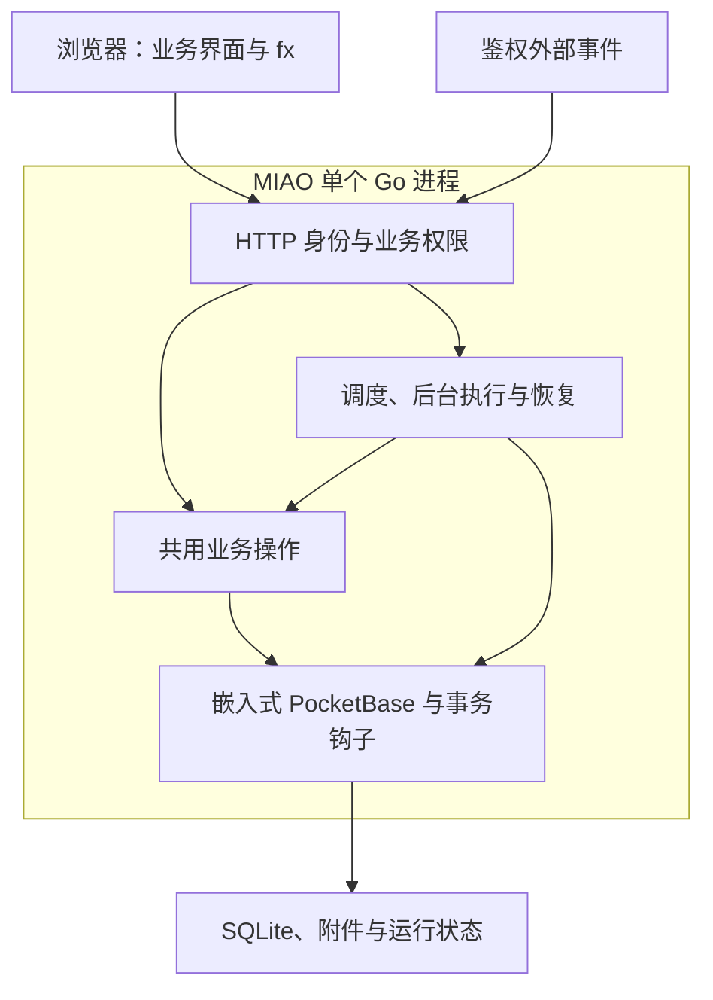
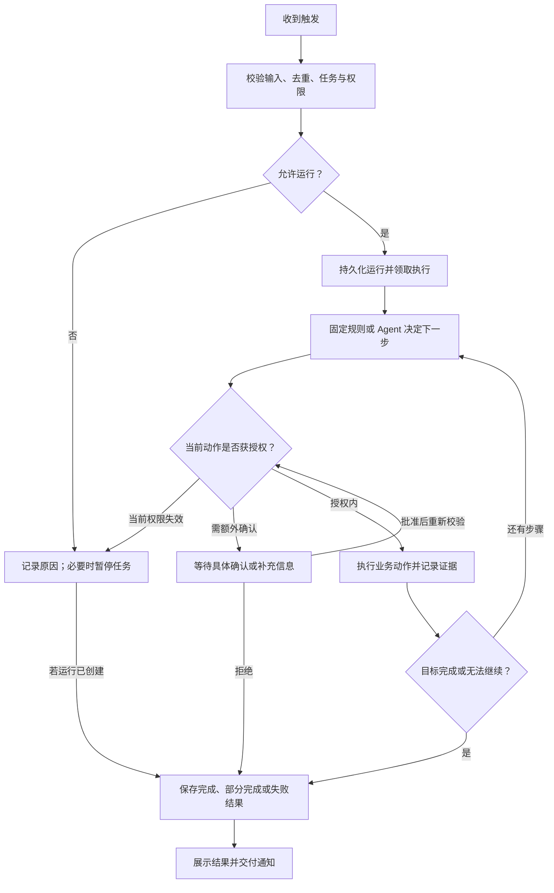

# MIAO 产品与运维手册

本文档是 MIAO 唯一的详细产品、接口与运维手册。根目录 [README.md](../README.md) 提供项目概览和快速开始；仓库维护指引见 [AGENTS.md](../AGENTS.md)。当前应用由一个 Go 进程提供 HTTP API、嵌入 `public/` UI，并在进程内使用 PocketBase 管理身份和数据。下文中 2026-09-30 的生产部署记录描述重构前版本，不表示 Go 版本已部署。

第 1–8 节记录当前代码实现和操作方式；第 9 节定义 Agent 运行模型与验收要求，9.14 记录后台交付范围，第 10 节记录本次共享业务环境的实现与验收。2026-09-30 的生产部署与固定后台报表验收针对首次部署版本；后续后台任务交付补齐已在 2026-10-01 本地完成自动化回归测试及干净目录迁移验证，尚未部署到生产，真实 AI、邮件与其他异常场景仍未完成验收。新增能力实现后，应同步更新当前功能、边界和 API 参考，避免把产品决策写成已上线功能。

## 1. 产品概览

MIAO 帮助团队通过内置 fx Agent 创建和使用业务工具，并按明确授权公开只读页面。PocketBase 管理身份与业务数据；MIAO API 按请求检查工作区和应用权限。企业 AI 密钥保存在服务端，浏览器 Agent 通过已认证的 MIAO 代理访问 AI 服务。

MIAO 的工作流程是：描述业务目标、由 Agent 规划数据结构和业务界面、预览并确认发布，然后在持久化的业务界面里处理日常工作。数据表和记录管理作为检查与维护入口保留。Go 服务替换 Bun/Fastify API 服务，复用 PocketBase 原生身份、存储和迁移能力；记录事务钩子使用 Go。交付以全新数据目录为基线，不提供旧 Bun/Fastify 或旧界面 schema 兼容层。

应用按可组合的通用原语建模：用户定义的数据表和关联承载领域数据；受控 json-render Spec 组合界面；业务动作和状态流承载事务与生命周期；事件/定时任务、受限连接器和声明式采集脚本承载自动化与外部输入；显式发布策略限定匿名访客可读的页面、记录字段和图片。新增行业场景应组合这些原语，不增加行业专属平台模块。

当前 Agent 对话通过可见的应用控制界面启动持久化 harness run；会话按账号和工作区保存，应用数据与权限仍由后端重新查询校验。

## 2. 当前功能

访问根路径 `/` 直接显示登录页面，不再提供宣传首页。注册和忘记密码入口保留在登录页；退出登录、登录凭证失效及邮箱验证完成后返回登录页。已有有效登录状态时继续进入工作台并恢复当前工作区视图。登录、工作台、数据检查和平台后台沿用 `miao.my/docs/prototypes` 的白色背景、黑色主按钮与细边框界面风格。

- 账号注册、登录、邮箱验证、密码重置；支持注册策略和邮箱域限制。
- 工作区、成员邀请、工作区角色，以及应用访问名单。
- 应用、数据表、字段和记录的管理；字段支持文本、数字、布尔、日期、邮箱、网址、选项、关联和附件。
- schema v3/json-render 多页面界面、受控组件与真实数据源；动作可引用通用业务动作。平台不接受应用源码生成或执行。
- 通用业务动作：应用管理员可定义带前置条件的跨表创建/更新步骤；动作在共享业务事务内执行，支持运行时输入引用和幂等回执，不绑定具体行业对象。
- 通用状态流：应用管理员可把任意用户自建表的状态字段配置为状态机，声明状态集合和合法转换；状态流不预设产品、线索、订单或其他行业对象。
- 受限连接器：应用管理员可声明 HTTPS 公网主机、路径前缀和响应大小；连接器可由已授权后台任务读取外部资源，并保存幂等抓取回执，不提供任意网络访问。
- 应用界面版本、草稿修订、历史界面前向恢复和显式发布；发布前检查数据表、字段和当前发布版本。
- 持久化 Agent harness run 支持候选回执、确认、取消和恢复；当前候选决策仍由 AI Gateway JSON 选择器完成，并未接入 Jev evaluator。
- Agent 支持结构化查询、批量修改预览和确认执行、到期/状态变化/新增记录提醒，以及新增记录后的固定字段动作。
- 应用后台任务仍由现有任务执行器运行；声明式采集脚本由 Go 服务调度，只执行受限 HTTPS 请求、字段映射、过滤、去重、入库和站内通知。
- 应用主操作区提供当前应用已声明的能力入口，以及后台任务、访问权限和应用管理入口；数据表入口仅在应用声明 `data_management` 能力时显示，未声明时仍可由 Agent 按权限使用底层数据工具。后台任务页提供分页历史与运行详情。工作区通知入口支持分页、已读处理与直接打开运行详情，最新一页有未读通知时显示提示。
- 工作区审计、数据 JSON 导出、平台管理、AI 用量统计与服务端密钥配置。

## 3. 权限模型

工作区 owner 管理空间和应用访问权限。应用权限分为 viewer（只读）、editor（修改普通记录）、manager（管理应用与草稿）、publisher（管理并发布）。批量修改需要单独授予 `can_batch`；viewer 不能写入。未受限应用默认对工作区成员开放普通记录编辑，发布、应用管理和结构变更仍检查对应角色。

任务管理和运行处理要求任务创建者具有 publisher 权限，或由当前工作区 owner 操作；后台实际执行仍使用创建者的当前权限，不因 owner 处理而继承 owner 身份。任务列表和结果按应用访问权限读取。

平台管理员只能管理账号、工作区和应用元数据、AI 配置与汇总用量，不能浏览业务记录、附件内容或 fx 对话正文。每个业务 API 都会在服务端检查当前工作区与应用权限；隐藏前端按钮不构成授权。

## 4. 已知范围与安全边界

- json-render Spec 由服务器校验，界面上限、组件属性、数据源和动作引用受 schema v3 约束；不提供源码编辑、任意计算表达式、SQL 或代码执行。
- 业务动作当前最多 20 个步骤和 40 个条件；步骤仅支持普通字段的创建/更新，文件、结构变更、删除、外部调用和自动计算尚未纳入通用动作契约。
- 通用状态流当前绑定一张表和一个选项/文本状态字段，最多 32 个状态和 64 个转换；转换复用记录权限、乐观更新时间校验、审计和幂等回执，暂不包含审批人、计算节点或外部调用。
- 连接器首版只支持无凭据 HTTPS GET；服务端拒绝非 HTTPS、非默认端口、凭据、片段、内网/回环/链路本地地址、越界路径和跨主机重定向，单次响应最多 2 MiB、超时 15 秒。可用 JSON Pointer 或受限 HTML 选择器映射最多 32 个字段、100 条记录；采集脚本另有独立请求、页数和记录预算。
- 通用公开发布复用当前正式 json-render 页面及用户自建数据表。每个数据源单独授权字段、发布状态值、slug 和可公开图片；草稿记录、未授权字段及普通附件保持私有。匿名 HTML 由受控服务端 renderer 输出，不渲染用户源码。
- 公开 CMS 接口为已发布记录提供分页列表、按 slug 的详情及服务器渲染 HTML；可声明 SEO 标题/描述字段。图片通过显式授权的公开代理路径读取，普通业务附件继续使用受保护文件代理。
- 多账号使用 `X-Miao-Tenant-Id` 选择工作区，并用成员字段和 app access role 绑定应用访问；同一工作区内对话仍按用户私有存储。
- 批量更新限同一张表、统一字段赋值、最多 100 条记录。先预览目标记录，再由用户确认；过期计划、权限变化或记录被其他操作修改时会阻止相应写入。整批操作不保证事务性回滚。
- 自动化首版提供站内通知，以及新增记录时对同一记录设置一个固定字段值；不发送邮件或企微消息。
- 原自动化规则继续执行固定动作，到期扫描与后台任务调度由 Go 服务定时检查；同一任务串行，首版执行器全局一次执行一项运行。
- 后台任务的读写授权精确到表和字段，也可以额外声明已启用的通用业务动作 ID；动作执行仍受动作自身输入、条件、事务和应用权限约束。首版不支持附件、关联字段、新增、删除、批量写入、结构修改或任意网络工具。
- PocketBase 对 MIAO 创建的业务集合安装模型钩子：业务记录保存与符合条件的事件运行入队在同一个 SQLite 事务中完成；事务失败时一同回滚。通过 PocketBase Go 模型保存同类记录都会触发，直接操作 SQLite 不在覆盖范围内。后台和原固定动作写入显式抑制事件，避免循环。鉴权的外部事件可对已启用的 manual 任务入队。
- 当前 Go 服务按单实例方式部署。记录更新由 PocketBase 在事务内比较预期更新时间后更新，阻止读取与写入之间的并发覆盖；执行租约用于单实例故障恢复，不构成多副本部署保证。
- 文件上传最多 5 MB；CSV/XLSX 读取和每批导入最多 100 行，导入须审阅并确认计划。图片/PDF 只保存和下载，未提供 OCR 或 PDF 文本提取。
- Agent 对话和正在搭建的候选选择可能依赖配置模型服务；模型不可用不影响已发布界面、确定性 CRUD、声明采集步骤与历史回执读取。当前 Jev 决策和后台任务统一 loop 尚未完成，不能视为已交付。
- 静态检查和自动化测试不能替代目标环境中的真实账号、AI Gateway、反向代理、公开图片及备份恢复验收。

### 身份与工作区

| 方法 | 路径 | 用途 |
| --- | --- | --- |
| POST | `/auth/verify-email`、`/auth/password-reset/request`、`/auth/password-reset/confirm` | 邮箱验证与密码重置 |
| GET / DELETE | `/me` | 获取当前用户上下文；删除账号需密码和确认邮箱 |
| POST | `/me/deactivate` | 停用当前账号，保留数据 |
| GET | `/workspace/members`、`/workspace/invites` | 查询成员与邀请 |
| POST / DELETE | `/workspace/invites`、`/workspace/invites/:id` | 创建或撤销邀请 |
| PATCH / DELETE | `/workspace/members/:id` | 调整成员角色或移出工作区 |
| GET / PATCH | `/workspace/ai-usage`、`/workspace/ai-budget` | 查询用量或调整请求预算 |
| GET | `/workspace/audit`、`/workspace/export` | 查看审计日志或导出获授权数据 |

### 应用和业务数据

| 方法 | 路径 | 用途 |
| --- | --- | --- |
| GET / POST | `/apps` | 列表或创建应用 |
| GET / PATCH / DELETE | `/apps/:id` | 查看、修改、归档或确认后删除应用 |
| GET / POST | `/apps/:id/collections` | 列表或创建数据表 |
| PATCH / DELETE | `/apps/:id/collections/:slug` | 修改或确认后删除数据表 |
| GET | `/apps/:id/runtime` | 当前已发布的 schema v3/json-render 界面与真实数据源 |
| GET | `/apps/:id/versions/:versionId/validation` | 重新校验 json-render Spec、数据源和动作引用，不发布版本 |
| POST | `/apps/:id/versions` | 创建界面草稿；支持 `based_on_version_id` 保存草稿修订；页面动作可通过 `action_id` 引用当前应用的通用业务动作 |
| POST | `/apps/:id/versions/:versionId/restore` | 从兼容的已发布历史版本创建前向恢复草稿 |
| POST | `/apps/:id/versions/:versionId/publish` | 确认发布；必须传 `expected_published_version_id`，首次发布传 `null` |
| GET / PUT | `/apps/:id/access` | owner 查看或设置成员应用角色与 `can_batch` |
| GET / POST | `/apps/:id/collections/:slug/records` | 分页查询或新增记录 |
| PATCH / DELETE | `/apps/:id/collections/:slug/records/:recordId` | 编辑或删除记录 |
| GET | `/apps/:id/collections/:slug/records/:recordId/files/:fieldName` | 下载获授权的附件 |
| GET / PUT | `/apps/:id/publication` | 查看或配置通用匿名发布；仅应用管理者可操作 |
| GET | `/public/:slug/runtime` | 匿名读取当前正式版本中已授权的公开页面 |
| GET | `/public/:slug/records` | 匿名读取单页授权的数据表与字段；只读、分页 |
| GET | `/public/:slug/records/:itemSlug` | 读取明确授权且已发布的 slug 详情 |
| GET | `/public/:slug/images/:pageId/:source/:table/:recordId/:field` | 读取显式公开的图片字段；其他文件仍走受保护附件接口 |
| GET / POST / PATCH | `/apps/:id/collection-scripts` 及脚本操作子路径 | 声明脚本、启停、试运行、执行和读取持久化回执 |

记录分页使用 `page`、`perPage`，支持文本搜索、排序和单字段筛选。记录写入格式为 `{"data":{"field_name":"value"}}`。附件写入额外提供 `files` 映射；每个文件最多 5 MB，支持 PNG、JPEG、GIF、WebP、PDF 和纯文本。

### Agent 操作、批量修改与提醒

| 方法 | 路径 | 用途 |
| --- | --- | --- |
| POST | `/apps/:id/query` | 结构化条件查询；最多 8 个条件，支持 `eq`、`contains`、`before`、`after`、`empty` |
| POST | `/apps/:id/batch-plans` | 预览 1–100 条记录的统一字段赋值，不写入记录 |
| GET / POST | `/apps/:id/batch-plans/:jobId`、`/apps/:id/batch-plans/:jobId/commit` | 查询计划或提交确认执行 |
| GET / POST | `/agent/runs`、`/agent/runs/:runId` | 创建和读取持久化 harness run |
| POST | `/agent/runs/:runId/confirm`、`/cancel` | 确认候选或取消运行 |
| GET | `/agent/runs/:runId/events` | 按 sequence 读取运行事件 |
| GET / POST | `/agent/threads`、`/agent/threads/:threadId/messages` | 按当前账号隔离的私有对话线程；浏览器 Agent 仍使用私有检查点接口 |
| GET / POST | `/apps/:id/automations`、`/apps/:id/automations/:ruleId/enable` | 查询或创建默认停用的规则，再确认启用 |
| GET | `/notifications` | 当前用户可访问应用的站内提醒；带 `page` 返回分页对象，不带则保留原数组响应 |
| POST | `/notifications/:notificationId/read` | 校验当前接收人与应用权限后标记已读 |

### 通用业务动作

业务动作是可配置的领域层，不预设产品、客户、订单或其他行业实体。定义由 `inputs`、`conditions` 和 `steps` 组成；输入类型支持 `text`、`number`、`bool`，必填输入在执行前校验。条件支持 `eq`、`neq`、`empty`、`not_empty`；步骤支持 `create` 和 `update`，字段值、`record_id`、`expected_updated_at` 可以使用已声明的 `$input_name` 引用执行输入。所有步骤在一个 PocketBase 事务中执行，并复用应用写权限、字段校验、记录审计和事件入队。schema v3 页面通过受控 `action_id` 引用动作。

### 通用公开发布

公开发布是一份应用级只读访问策略。先发布 schema v3/json-render 界面，再用 `/apps/:id/publication` 声明唯一链接标识和允许公开的页面。每页必须为每个数据源提供 `reads`，包括 `source`、用户数据表 `table`、公开字段 `fields`、发布状态 `status_field`/`published_value` 和稳定详情 `slug_field`。只有本页数据源中的普通字段可以公开；图片字段还必须列在 `images` 并同时列入字段白名单。附件字段的原始存储名、关联、工作区/应用内部字段和未授权记录不进入匿名响应。

公开内容页面示例（字段必须存在于当前正式版本和绑定数据表）：

```json
{
  "enabled": true,
  "confirm": true,
  "slug": "catalog",
  "pages": [{"id":"news","reads":[{"source":"news_source","table":"news","fields":["title","slug","body","cover"],"images":["cover"],"status_field":"status","published_value":"published","slug_field":"slug","seo_title_field":"title","seo_description_field":"summary"}]}]
}
```

匿名 JSON 列表与详情分别使用 `/api/public/:slug/records?page_id=...&table=...&source=...` 和 `/api/public/:slug/records/:itemSlug?page_id=...&table=...&source=...`。平台生成 `/s/:slug/:pageId/:source/:itemSlug` 的服务端 HTML，输出 title、description、canonical 和授权字段；页面正文始终转义文本，不解释记录为标记或运行应用源码。图片 URL 使用 `/api/public/:slug/images/:pageId/:source/:table/:recordId/:field`；接口重验发布状态、记录归属、显式图片名单和 MIME 类型。关闭发布或撤销字段授权后立即失败关闭，`no-store` 禁止浏览器缓存公开响应。

草稿内容与界面版本发布彼此独立：只有 `status_field` 等于确认的 `published_value` 的记录能从匿名列表、详情、HTML 或图片端点读取。创建/更新记录无需重新编写 Spec；页面按绑定数据源读取当前记录。公开请求按来源地址限流。

| 方法 | 路径 | 用途 |
| --- | --- | --- |
| GET / POST | `/apps/:id/actions` | 查询或创建默认草稿业务动作 |
| PATCH | `/apps/:id/actions/:actionId` | 修改定义并生成新的草稿版本 |
| POST | `/apps/:id/actions/:actionId/enable` | 明确确认后启用或暂停动作 |
| POST | `/apps/:id/actions/:actionId/execute` | 传入 `idempotency_key` 和 `input` 执行已启用动作；重复键返回原回执 |

示例定义（表名和字段需替换为当前应用真实结构）：

```json
{
  "conditions": [{"table":"orders","record_id":"$order_id","field":"status","op":"eq","value":"待发货"}],
  "steps": [
    {"id":"ship","operation":"update","table":"orders","record_id":"$order_id","expected_updated_at":"$order_updated_at","data":{"status":"已发货"}},
    {"id":"log","operation":"create","table":"activities","data":{"note":"$note"}}
  ]
}
```

### 通用状态流

状态流是数据模型和业务动作之间的通用流程层。它只绑定当前应用的一张用户自建表和一个状态字段，定义可用状态以及 `from` 到 `to` 的合法转换。产品目录、线索跟进、订单履约等场景都应通过不同表结构和状态流配置表达，不在服务端增加行业实体。

| 方法 | 路径 | 用途 |
| --- | --- | --- |
| GET / POST | `/apps/:id/workflows` | 查询或创建默认草稿状态流 |
| PATCH | `/apps/:id/workflows/:workflowId` | 修改定义并生成新的草稿版本 |
| POST | `/apps/:id/workflows/:workflowId/enable` | 明确确认后启用或暂停状态流 |
| POST | `/apps/:id/workflows/:workflowId/transition` | 按合法转换、当前状态和 `expected_updated_at` 推进一条记录；重复幂等键返回原回执 |

定义示例（表和字段必须替换为当前应用真实结构）：

```json
{
  "table": "work_items",
  "state_field": "status",
  "states": [
    {"id": "new", "label": "新建"},
    {"id": "done", "label": "完成"}
  ],
  "transitions": [
    {"id": "finish", "label": "完成", "from": "new", "to": "done"}
  ]
}
```

状态流转换不会绕过应用权限或并发保护；状态字段被其他操作修改后，必须重新读取记录并重新决定是否转换。

### 受限外部连接器

连接器是通用外部输入层。它描述一个不带凭据的 HTTPS 主机 `base_url`、允许的路径前缀、响应大小和可选提取规则，不绑定产品、客户、订单或其他业务实体。JSON 使用 JSON Pointer；HTML 使用单个标签、`#id`、`.class` 或 `[attribute]` 选择器。后台任务通过 `scope.connector_ids` 显式授权后才能调用；抓取回执保存 HTTP 元数据与映射后的条目。后台 Agent 可以根据任务目标检查重复记录，再调用预先启用的通用业务动作写入目标表。

| 方法 | 路径 | 用途 |
| --- | --- | --- |
| GET / POST | `/apps/:id/connectors` | 查询或创建默认停用的连接器草稿 |
| PATCH | `/apps/:id/connectors/:connectorId` | 修改定义并生成新的草稿版本 |
| POST | `/apps/:id/connectors/:connectorId/enable` | 明确确认后启用或暂停连接器 |
| POST | `/apps/:id/connectors/:connectorId/fetch` | 读取允许范围内的外部资源；重复幂等键返回原回执 |

连接器不会自动决定写入哪张业务表。Agent 根据用户配置的任务目标和已有动作处理提取条目；外部页面文本始终视为不可信数据，不能借其内容扩大任务授权。

HTML 配置示例：

```json
{
  "base_url": "https://example.com",
  "allowed_paths": ["/catalog"],
  "extract": {
    "format": "html",
    "item_selector": "article.item",
    "fields": {
      "title": {"selector": ".title"},
      "url": {"selector": "a", "attribute": "href"}
    }
  }
}
```

JSON 配置使用同样的 `extract.fields` 映射，`format` 设为 `json`，`items_path` 和各字段值使用 JSON Pointer，例如 `/data/items`、`/name`。

### 后台任务与运行

下列路径均以 `/api` 为前缀，并继续使用用户身份与工作区请求头。草稿仅保存定义，不执行。启用必须确认具体版本；运行持有不可变定义快照。

| 方法 | 路径 | 用途 |
| --- | --- | --- |
| GET / POST | `/apps/:id/tasks` | 每页 25 项查询或创建任务草稿，查询支持 `page` |
| PATCH | `/apps/:id/tasks/:taskId` | 修改草稿或暂停任务，传 `expected_revision`，生成新草稿版本 |
| POST | `/apps/:id/tasks/:taskId/enable` | 传 `confirm: true`、`expected_revision` 确认启用 |
| POST | `/apps/:id/tasks/:taskId/preview` | 对具体 `expected_revision` 做只读试运行，草稿也可运行，不写入、不通知、不启用日程 |
| POST | `/apps/:id/tasks/:taskId/archive`、`/apps/:id/tasks/:taskId/restore` | 确认当前版本后归档并取消剩余运行；恢复为新草稿，重新确认才启用 |
| POST | `/apps/:id/tasks/:taskId/transfer` | 传 `user_id`、`confirm: true`、`expected_revision` 转交给有发布权限的真实成员；未结束运行须先处理，转交后生成待授权草稿 |
| POST | `/apps/:id/tasks/:taskId/pause` | 停止后续触发，已经入队的运行另行取消 |
| POST | `/apps/:id/tasks/:taskId/run` | 运行已启用版本，传 `expected_revision`、可复用的 `request_id`；返回 202 和运行标识 |
| GET | `/apps/:id/runs`、`/apps/:id/runs/:runId` | 分页查询运行，或读取结果、动作证据及 `attempt_history`；检查点不返回浏览器 |
| POST | `/apps/:id/runs/:runId/cancel` | 请求停止尚未执行动作，不回滚已完成写入 |
| POST | `/apps/:id/runs/:runId/retry` | 失败或部分完成后传 `confirm: true`，保留原快照、预算计数和已成功动作；首次执行外最多两次人工失败重试；批准或补充信息后的续接不消耗此额度 |
| POST | `/apps/:id/runs/:runId/resolve` | 传 `confirm: true`、`expected_updated_at` 及 `decision: approve/reject`；补充信息使用 `answer` |

创建请求示例，表和字段必须替换为当前应用真实定义：

```json
{
  "name": "每周客户跟进检查",
  "definition": {
    "goal": "检查客户最近跟进日期，列出需要处理的客户和依据，不修改记录。",
    "execution": "agent",
    "trigger": { "type": "weekly", "time": "09:00", "weekdays": [1], "timezone": "Asia/Shanghai" },
    "scope": { "tables": [{ "table": "customers", "read_fields": ["name", "last_contact"], "write_fields": [] }], "recipient_ids": [] },
    "limits": { "max_writes": 0, "max_requests": 12, "timeout_seconds": 180 }
  }
}
```

`execution: report` 为固定数据快照，只显示每张表第一页（25 条）及总量，不解释自然语言目标或进行 AI 分析。`agent` 可分页查询和调用受控工具。周日为 0；一次性 `at` 必须带时区；状态变化使用 `table`、`field`、`from`、`to`，字段必须是已授权读取的选项字段，起止状态必须不同；可选选项字段可以使用空字符串表示未设置。接收人默认仅负责人，其他成员使用真实用户 ID；交付时重新检查权限。`limits.confirmation_timeout_hours` 控制待处理期限，默认 72 小时，可设 1–720；过期取消剩余动作并保留原回执，未知写入效果不会自动重放。只读试运行保留运行结果供审阅，不产生站内通知，不提供写入批准流程，但仍使用原有模型请求预算。

模型完成文本不能替代实际写入回执。写入结果未知时进入待核实，核实接口只在当前记录与预期字段值一致时确认，不重新发送原写入；不一致时应拒绝此运行并基于当前记录重新建立任务。

### 平台与 AI Gateway

- `/admin/overview`、`/admin/runtime` 提供平台汇总数据与非敏感运行状态。
- `/admin/users`、`/admin/workspaces`、`/admin/apps`、`/admin/usage`、`/admin/audit` 提供分页平台管理能力。
- `/admin/ai` 管理服务端 AI 密钥；完整密钥不会返回给浏览器。
- `/fx/gateway` 是经过认证的固定代理，仅供 Agent 调用。应用运行时不直接连接 AI 服务。

## 6. 自托管部署

部署脚本支持 Linux 和 macOS 的 x64 与 ARM64。`go.mod` 固定 PocketBase 0.40.4 和 Go 1.27.1 工具链；支持自动工具链下载的 Go 安装会按声明下载所需版本。构建需要 Node.js/npm 准备 fx 浏览器资源；安装及运维脚本使用 PM2、`curl` 和 `openssl`。运行 `miao` 二进制不需要 Go、Node.js 或独立 PocketBase。

```sh
npm run server:install
# 按安装输出修改配置：注册策略、平台管理员邮箱和 AI 服务密钥
npm run server:start
npm run server:status
npm run server:logs
```

默认监听 `0.0.0.0:41874`，PM2 只管理一个 `miao-platform` 进程。对公网提供服务时配置 HTTPS 反向代理并限制服务端口访问。PocketBase 的原始集合、管理员、文件令牌和备份 HTTP API 不向公网挂载；前端通过 MIAO 的工作区和应用权限入口访问。

### 主要配置项

| 配置 | 用途 |
| --- | --- |
| `MIAO_DATA_DIR` | 持久数据根目录；数据库与附件仍位于其 `pb_data/` 子目录 |
| `MIAO_PORT`、`HOST` | HTTP 端口和监听地址 |
| `MIAO_AI_PROVIDER`、`AI_GATEWAY_API_KEY` | AI 服务提供方与服务端密钥 |
| `MIAO_AI_BASE_URL`、`MIAO_AI_MODEL` | AI Gateway 地址和模型名称 |
| `MIAO_PUBLIC_URL`、`RESEND_API_KEY`、`MIAO_MAIL_FROM` | 邮件验证、密码重置和邀请邮件 |
| `MIAO_REGISTRATION_MODE`、`MIAO_ALLOWED_EMAIL_DOMAINS` | 注册策略和允许注册的邮箱域 |
| `MIAO_ADMIN_EMAILS`、`MIAO_SETTINGS_ENCRYPTION_KEY` | 平台管理员与加密保存的服务设置；升级保留原密钥 |
| `MIAO_BACKUP_DIR`、`MIAO_BACKUP_RETENTION_DAYS` | 备份目录和保留时间，默认 30 天 |

服务密钥保存在受限访问的配置中，不能提交到版本库。服务端仅使用进程内 PocketBase，不配置独立 PocketBase 地址、端口或 superuser 凭据。

### 二进制打包与全新安装

```sh
MIAO_VERSION=v0.3.0 npm run package
# dist/miao_v0.3.0_linux_amd64.tar.gz 和同名 .sha256（平台随 GOOS/GOARCH）
```

CI 为 Linux/macOS x64/ARM64 生成二进制包；推送 `v*` 标签时，全部检查通过后发布到 [GitHub Releases](https://github.com/tans/miao/releases)。该流水线随本次变更提供，实际下载版本以 Releases 页面为准。归档包含带版本的 `miao`、PM2 配置及运维脚本，使用当前架构直接安装，不提供自动更新或旧架构切换。

```sh
# 下载所需平台的归档与同名校验文件，放在同一目录
sha256sum -c miao_v0.3.0_linux_amd64.tar.gz.sha256
# macOS 使用 shasum -a 256 -c 同名校验文件
tar -xzf miao_v0.3.0_linux_amd64.tar.gz
bash scripts/install.sh
# 按安装输出编辑配置，并使用安装目录中的 start.sh 启动
```

二进制安装需要 Node.js、系统 PM2、`curl` 和 `openssl`，无需 Go/npm 构建依赖。源码安装仍使用 `npm run server:install`；已有本地二进制可传 `bash scripts/install.sh --binary /path/to/miao`。安装器将二进制放入 `$MIAO_INSTALL_DIR/bin/`、运维脚本与 PM2 配置放入 `$MIAO_INSTALL_DIR/runtime/`，启动不依赖原源码或解压目录。自定义安装目录时，后续命令使用相同 `MIAO_INSTALL_DIR`；自定义配置路径时，同样保留 `MIAO_CONFIG_FILE`。

浏览器资源、迁移和 Go 模型钩子随同一二进制交付。启动会初始化新数据库并应用内嵌迁移；数据目录锁阻止两个 MIAO 进程同时打开同一目录。安装器不会清除已有数据，但本轮不安排旧数据升级或新旧版本切换验收。2026-09-30 的旧服务部署记录不代表当前 Go 版本已部署，真实 AI、邮件、JSPI 浏览器和 HTTPS 代理仍需目标环境验证。

## 7. 备份与恢复

```sh
npm run backup
npm run restore -- /path/to/miao_backup_20261001_120000_000000000.zip --confirm
```

备份使用 PocketBase 的一致性归档，包含数据库、集合结构、任务检查点和本地附件；默认保留 30 天。项目脚本短暂停止写入，完成后仅重新启动此前在线的服务。备份失败也会尝试恢复原运行状态。脚本不创建定时任务或异地副本，部署者需另外配置。归档含用户和业务数据，按生产数据保护。

恢复脚本停止 MIAO，调用同一二进制的 `restore` 命令，先在临时目录检查归档路径、SQLite 完整性和迁移，再用一个事务暂停已启用任务与固定规则、取消历史未结束运行、标记中断执行段、清除旧租约，保留动作证据。全部成功后才替换 `pb_data`；原目录保留为 `pb_data.before_restore_*`。归档验证或隔离失败不会替换当前数据库。恢复结束服务保持停止，负责人核实恢复点之后已发生的动作，再执行 `server:start` 并逐项启用任务。确认恢复无误后可手动删除保留的旧数据目录。

手动运维可在停机后执行 `MIAO_DATA_DIR=/path/to/data miao backup` 或 `miao restore ARCHIVE --confirm`，也可用 `miao version` 查看构建版本。命令和服务共用数据目录锁；禁止另起独立 PocketBase 访问该目录。恢复前另存当前备份，先在隔离环境演练。

## 8. 验证与维护

```sh
npm ci
npm run prepare:fx
npm test                 # 等价于 go test ./...
npm run test:race         # Go 竞态检查
go vet ./...
git diff --check
npm run build
npm run test:runtime      # 需要 PM2；使用隔离的临时服务和数据
```

真实 PocketBase 测试默认执行，不依赖 `POCKETBASE_BIN`，也不会因缺少外部二进制而跳过。测试使用临时目录与进程内 HTTP 请求，覆盖干净迁移、现有附件字段升级、迁移回滚再应用、注册事务、工作区与角色隔离、发布运行、受保护附件、确认与重复导入、批量权限撤销、记录并发和审计回滚、事件去重、后台固定报表、重启及中断恢复、备份恢复隔离。CI 同时执行测试、竞态检查、vet 和 Linux/macOS x64/ARM64 无 CGO 构建，构建前准备 fx 资源。

`test:runtime` 用新数据目录验证二进制安装后的独立运维命令，并跑通登录 → 创建应用 → 审阅并确认导入 → 预览和发布 → 修改记录 → 后台报表 → 查看结果。同一导入和任务请求不会重复执行；沿用既有 PM2 启停、资源、备份恢复及任务隔离检查；测试使用独立 PM2 目录和临时数据，退出时清理。CI 构建后执行同一检查。

交付前仍需在目标环境验证真实邮件、AI Gateway、JSPI 浏览器、HTTPS 代理和目标环境部署。修改产品、API 或部署行为时更新本手册对应章节，保持 README 聚焦概览和快速开始。

## 9. Agent 运行模型与交付要求

### 9.1 已确定的产品方向

2026-09-29 确认以下决策，作为后续实现和验收依据：

1. **支持无人值守执行。** 浏览器关闭、用户退出或无人在线时，已启用的任务仍由服务端调度和执行；执行时继续检查授权有效性。退出登录不等于撤销任务授权。
2. **支持预先授权的自动操作。** 用户启用任务时确定可访问的数据、可调用的工具和可执行的动作。范围内自动执行，范围外停在相应动作之前，请求有权成员确认。
3. **保持同一套应用能力与权限。** 浏览器交互和后台执行使用相同业务工具契约与服务端权限检查。创建应用、维护应用、使用应用是 Agent 的任务场景，不重新引入 Builder/User 双 Agent 产品实体。
4. **应用仍是核心实体。** 持续任务归属具体应用和工作区，具有负责人；Agent 是执行者。用户通过对话创建、修改任务，通过简洁界面查看状态、结果并进行确认。

9.1–9.12 保留完整产品契约；当前代码覆盖范围见 9.14，不把尚未实现或验证的约定描述为可用功能。当前后台 API 和集成方式见第 5、6 节及 9.13。

### 9.2 先区分业务动作、Agent 任务和触发条件

| 概念 | 含义 | 示例 |
| --- | --- | --- |
| 业务动作 | 输入、权限和结果明确的业务操作，可以直接执行 | 保存客户、更新字段、发送已确定的站内提醒 |
| Agent 任务 | 需要理解、分析或选择工具才能完成的目标 | 分析客户流失风险，给出跟进建议 |
| 触发条件 | 决定何时创建一次执行，不决定权限，也不天然要求调用模型 | 人发送消息、每周一 09:00、新客户创建 |
| 持续任务定义 | 保存目标、触发条件、授权和交付方式，可重复运行 | 每周检查未跟进客户并汇总给销售负责人 |
| 一次运行 | 某次触发产生的执行实例，记录独立输入、版本、状态和结果 | 2026-10-05 09:00 的客户检查 |

普通表单保存继续直接调用业务 API；固定规则能完成的动作由确定性代码执行。只有需要推理的部分才启动 Agent。用户可通过 Agent 建立上述任一规则，不必让每一次规则执行都消耗模型。

### 9.3 触发场景总表

| 入口 | 谁发起、带入什么 | 执行与交付 | 当前情况 |
| --- | --- | --- | --- |
| 聊天指令 | 已登录成员；消息、所在应用、获授权的上下文 | 当前浏览器 Agent 处理，回复原对话；目标支持明确转交后台的长任务 | 已有浏览器交互和创建后台任务工具；直接转交当前聊天执行尚未实现 |
| 页面操作 | 当前成员；选中的记录和明确操作 | 普通动作直接执行；“分析客户”等 Agent 操作生成运行并在原页面展示结果 | 已有普通业务操作，通用页面 Agent 操作为目标能力 |
| 时间触发 | 已启用任务；一次性时间、周期或业务截止日期 | 服务端在无人在线时执行，将结果保存到应用并按约定通知 | 固定到期提醒保留；一次性、每日、每周后台任务已接入代码，待验收 |
| 业务事件 | 已提交的业务变化；记录标识、事件标识、必要的前后值 | 先检查事件和条件，再执行固定动作或 Agent 任务 | 新增与指定状态变化已在 PocketBase 保存事务中创建持久运行，后台执行仍待真实环境验收 |
| 外部调用 | 获授权的外部系统或 Agent；经校验的 API/Webhook 输入 | 调用绑定任务，返回受限的运行标识或结果；按任务约定交付 | 外部触发 Agent 的专用入口为目标能力 |

持续监控可由周期检查或事件订阅表达，无需让模型无休止循环。审批通过、失败重试属于既有运行的续接，不是重新发起一项没有上下文的新任务。外部 Agent 也必须作为有权限的调用者进入既定任务，不能直接继承平台管理权限。

### 9.4 应用管理与业务执行的边界

| 场景 | Agent 的工作 | 执行边界 |
| --- | --- | --- |
| 创建、修改应用 | 理解需求、规划数据和界面、准备草稿 | 按当前管理权限执行；界面发布继续显式确认 |
| 日常使用 | 查询、分析、生成内容、处理业务记录 | 当前成员权限；现有批量修改继续预览和确认 |
| 后台业务任务 | 按已保存目标分析和执行获授权动作 | 任务授权与当前有效权限共同约束，不依赖浏览器会话 |

普通业务任务授权不包含修改应用结构、发布版本、管理成员或扩大自身授权。后台任务可以提出应用改进建议，但必须进入原有的管理与发布流程。这里的职责划分不要求用户创建或管理多个 Agent。

### 9.5 持续任务应保存什么

以下是产品契约，字段名称不构成数据库或 API 定稿：

| 内容 | 要求 |
| --- | --- |
| 归属与责任 | 工作区、应用、创建者、当前负责人、授权人 |
| 目标与完成标准 | 做什么、处理范围、结果格式；明确何时算完成 |
| 触发条件 | 入口类型、时间/时区或事件条件、有效期 |
| 执行方式 | 固定动作或 Agent 任务；需要的工具和数据来源 |
| 授权范围 | 可读数据、可写字段、允许动作、单次数量限制、获准通知的接收人和渠道 |
| 运行限制 | 超时、模型用量预算、并发规则、最大尝试次数 |
| 结果交付 | 结果保存位置、接收人、通知条件、异常负责人 |
| 版本与状态 | 不可变的已启用版本；草稿、已启用、已暂停、已归档及原因 |

任务目标和授权范围必须分开保存。自然语言指令只能表达意图，实际可执行动作由服务端结构化规则限制。触发输入、业务记录、附件和外部消息都是待处理数据，不能借其内容扩大授权。

### 9.6 用户如何建立和维护任务

1. 用户在应用对话中提出目标，例如“每周一九点检查七天未跟进的客户，把摘要发给销售负责人”。
2. Agent 生成任务草稿，明确时区、数据范围、工具、允许动作、接收人和完成标准；不能确定的必要信息向用户询问。
3. 展示简洁的任务摘要与预计影响。可先进行只读试运行；试运行不执行正式写入或外部发送。
4. 有权用户确认并启用任务。创建草稿不会启动调度；“启用”同时记录具体版本及其授权。
5. 后续通过“改成周五”“暂停这个任务”“立即执行一次”等对话指令维护，也保留暂停、查看结果、确认等必要界面操作。
6. 修改目标、数据范围、动作或接收人产生新草稿，确认后才影响后续运行。已有运行保留原版本，权限撤销则立即约束后续动作。

暂停任务阻止新的触发；取消某次运行要求执行者在安全边界停止尚未执行的动作。已经完成的写入或发送不会因为取消自动撤销，需要在结果中明确展示。

### 9.7 执行身份与预先授权

后台执行使用服务端任务执行上下文，记录任务负责人、授权人、触发来源和运行标识，不保存浏览器登录令牌用于长期运行，也不把 PocketBase 管理员权限当成业务授权。

首期沿用当前规则的责任关系：创建者作为任务负责人和授权人；其须具有相应任务管理及业务操作权限。每个动作的有效权限取**任务明确授权、授权人当前权限、工作区和应用约束的交集**。负责人离开工作区、权限不足、应用归档或授权失效时，暂停相关任务并记录原因；不得自动换成 owner 身份继续执行。负责人转交必须重新授权。

| 动作情况 | 执行行为 |
| --- | --- |
| 查询或分析在授权范围内 | 自动执行，结果仍按应用权限访问 |
| 写入或通知已被任务明确授权 | 在字段、数量、接收人和渠道限制内自动执行，并逐项留记录 |
| 动作超出任务授权，但属于可申请的业务操作 | 在动作发生前进入待确认，展示具体对象、变更和影响，由有权成员处理 |
| 授权人权限已撤销或应用不可用 | 阻止执行并暂停任务；不能通过普通确认绕过当前权限 |
| 无法判断目标对象、缺少必要数据 | 请求补充信息，保留当前进度，不自行猜测后写入 |

一次确认只授权所展示的具体动作，不自动扩大后续运行的权限。长期扩大范围需修改任务并重新启用。等待期间释放执行资源；批准后重新检查权限、目标记录和动作有效期，发生变化时重新预览。拒绝或确认过期均留下结果，不能无限等待。

现有批量修改的“预览后人工确认”机制继续有效。未来后台预授权批量写入需要独立验证数量、数据版本与授权证据，不能由 Agent 伪造用户确认调用现有接口。

### 9.8 时间、事件与外部输入规则

- **时间：** 支持一次性和周期任务；使用明确的 IANA 时区，并展示下一次运行时间。业务日期按任务时区解释；首期默认跳过夏令时中不存在的当地时间，对重复的当地时间仅执行第一次，并记录原因。到点表示进入调度，不承诺零延迟完成。
- **错过的运行：** 首期默认将停机期间错过的周期合并为一次恢复检查，记录遗漏区间，不自动重放多次写入或通知。需要逐次补跑的任务应显式配置并预览影响。
- **并发：** 同一任务默认串行；前一运行未结束时，周期检查合并等待，独立业务事件持久排队，不能静默丢弃不同记录的事件。积压超限时报告负责人。
- **事件：** 业务写入提交后才产生事件，包含稳定事件标识和来源。按业务条件筛选后才启动执行；写入和事件交付的失败应可恢复。当前接入点之外的直接数据库写入不在已有覆盖范围内。
- **避免循环：** 保存触发因果链，默认不让任务自身的写入反复触发同一任务；跨任务链设置次数和预算限制。
- **外部入口：** 验证调用身份或签名、时间有效性、重复请求和输入格式；调用者只能触发获授权的任务，不能提交任意系统提示或借接口创建新授权。

触发去重与业务动作去重分别处理。事件重复投递不应创建重复业务执行；一次运行重试不应再次完成已经成功的写入或发送。

### 9.9 一次运行的生命周期

后台运行使用新的 `miao_runs`，旧固定规则继续使用 `automation_runs`，两者不做隐式迁移。下表是状态含义；当前代码用 queued、running、waiting、completed、partial、failed、cancelled 表达对应状态。确认期限已接入，剩余扩展项见 9.14。

| 状态 | 用户含义 | 后续处理 |
| --- | --- | --- |
| 排队中 | 已收到请求，等待执行 | 可取消；执行前检查版本、权限和预算 |
| 执行中 | 正在查询、分析或调用工具 | 可进入等待、完成、失败或取消 |
| 等待处理 | 等待确认或补充必要信息 | 有权成员处理后续接；拒绝或过期后结束并注明原因 |
| 已完成 | 完成标准满足，结果已持久保存 | 可查看结果和动作明细 |
| 部分完成 | 一部分动作成功，剩余未完成 | 展示成功范围，重试只处理未完成部分 |
| 失败 | 无已确认的业务完成结果，执行无法继续 | 展示失败步骤和是否存在待核实的外部效果 |
| 已取消 | 用户取消或等待处理被终止 | 展示原因以及停止前已执行的动作 |

每次运行保存触发来源、输入引用、任务版本、执行身份、开始/结束时间、动作记录、结果、错误和用量。重试保留原运行关联和每次尝试记录；采用修改后的任务定义重新执行时，作为新运行记录，并标明关联来源。

后台执行必须在刷新、关闭浏览器和服务重启后可追踪。服务端通过持久任务状态、执行租约和检查点恢复工作，不能只依靠进程内定时器。重启后先核实未完成动作再恢复，避免重复写入。

后台任务的任务快照、授权、动作和运行检查点已纳入 PocketBase 数据备份。恢复历史备份与普通服务重启分别处理：恢复后先暂停自动执行，核对恢复点之后可能已经发生的写入和外部发送，再由负责人恢复任务，避免历史状态回退造成重复操作。

对超时、临时网络故障进行有上限的重试；权限失败、输入错误和预算耗尽需停止并报告。外部发送超时但结果未知时，先查询交付状态；无法确认且对方不支持幂等时请求人工核实，不能宣称已经送达或盲目重发。模型输出“完成”不能替代工具执行证据。

### 9.10 结果交付与界面

任务结果、通知和聊天消息各有职责：结果是持久业务产物，通知告诉相关成员有事需要关注，聊天是追问和操作入口。后台运行不依赖某个私人聊天窗口存在，也不自动暴露该窗口历史。

- **交互任务：** 在原对话或页面展示结果；转为后台前明确提示，返回可再次打开的运行入口。
- **后台任务：** 在所属应用保存结果摘要、关联业务对象和运行详情；按任务约定产生站内通知。
- **待处理事项：** 对需要确认、补充信息、执行失败的运行集中展示，标明负责人和原因。
- **通知：** 成功结果可汇总，异常和待确认事项按约定通知负责人；正常“无符合条件记录”属于成功结果，不应生成错误告警。
- **外部渠道：** 邮件、企微等作为后续扩展，需要接入凭据、接收人授权和交付回执；当前仅能承诺站内通知。

业务执行结果与通知交付状态分开记录。报告已生成但通知失败时，重试通知即可，不应重新执行报告中的业务操作。结果读取和通知内容必须再次检查接收人的当前权限，避免因链接或摘要泄露业务数据。

产品界面只需在应用内提供任务列表、运行详情和待处理入口；任务创建与复杂修改仍通过 Agent。任务列表展示名称、触发条件、负责人、状态、下次运行和最近结果，无需增加流程画布。

### 9.11 端到端业务示例

**每周客户跟进检查（时间触发、只读分析）**

用户确认每周一 09:00、Asia/Shanghai，检查指定客户表中超过七天未跟进的记录。任务有读取和向指定销售负责人发送站内通知的授权，没有客户字段写权限。即使浏览器关闭，也生成持久报告并通知负责人；没有符合条件的客户时记录正常完成。Agent 提议修改客户状态时必须等待具体确认。

**新客户分类（业务事件、获授权写入）**

新客户提交成功后触发分析，Agent 只可读取指定字段，并将“行业分类”写成允许选项之一，每次处理一条记录。信息不足时请求处理而不猜测写入。重复事件不重复分类；分类过程中客户被其他成员修改时先重新核实。该场景对应已接入的记录事件后台 Agent 路径，真实 AI 与写入行为尚待验收；旧固定字段赋值规则仍单独运行。

**页面分析与外部资料到达（另两类入口）**

员工点击客户页“生成跟进建议”，按其当前权限创建任务并在页面取回结果；需要较长时间时明确转交后台。后续接入的外部系统可用获授权入口提交资料标识，触发预先定义的分析任务；消息本身不能决定访问其他应用或新增收件人。这两个 Agent 入口尚待实现。

### 9.12 交付顺序与验收

| 阶段 | 交付内容 | 关键验收 |
| --- | --- | --- |
| 第一阶段：后台运行基础 | 任务定义、预先授权、服务端执行、持久运行记录、待确认与站内结果交付；先接入手动和时间入口 | 关闭浏览器仍完成；服务重启后可恢复；退出不撤销任务，但权限撤销阻止后续动作；超预算停止 |
| 第二阶段：事件运行 | 复用同一执行机制接入记录事件和页面 Agent 操作；补齐可靠事件交付 | 重复事件不重复写入；自身写入不循环；并发修改被识别；不同记录事件不丢失 |
| 第三阶段：外部协作 | 受限 API/Webhook 触发，以及获授权的外部通知渠道 | 调用身份校验、防重放、租户隔离、发送回执和未知结果处理 |

所有阶段都要验证：草稿不会自动运行；扩大授权需重新确认；等待处理不会占用持续模型运行；部分成功如实展示；重试不重复已成功动作；普通已发布业务界面在模型不可用时仍可使用。

本次工程化沿用 [Presentator](https://github.com/presentator/presentator) 的嵌入式 PocketBase、模型钩子和真实数据库验证方式，保留 MIAO 的工作区、应用权限、Agent 与任务产品契约。

### 9.13 已选架构与任务流程

**当前架构：** 一个 Go 进程嵌入 `public/`、PocketBase 和不可变迁移。HTTP 入口、后台执行器共用 Go 业务权限与持久化适配器；Go 模型钩子在 SQLite 事务内检查更新时间、保存记录审计和入队事件。原生持久化 API 保留 PocketBase 的校验、受保护文件和存储能力。PocketBase 认证处理器在进程内复用，不监听独立端口。



业务授权由工作区成员关系、应用角色和当前任务授权共同限制；进程内持久化权限不能代替业务授权。时间触发由调度模块产生，业务事件与记录提交在同一事务中入队，外部事件先校验身份、任务版本和事件 ID。记录事件只有 Go 模型钩子这一处入队入口。

浏览器 fx 使用 Wasm SDK；Go 后台 Agent 通过服务端 HTTP AI Gateway 调用模型，无需 libfx native 运行库或 CLI 子进程。浏览器与后台调用共用 AI 服务配置及 PocketBase 业务数据；后台工具进一步限制任务授权字段与预算。后台检查点以不透明数据保存到 PocketBase，运行快照及动作回执才是恢复与核实的依据。

用户建立任务的流程：对话描述目标 → 生成任务草稿 → 展示范围和动作 → 有权用户确认启用 → 保存版本及授权 → 调度后续运行。普通页面保存直接使用业务工具；需要推理的页面操作才创建 Agent 任务。



每次动作都重新检查权限、任务授权和业务对象；模型推理不代替授权。等待确认时释放执行资源，续接时重新核实数据与权限。执行异常按 9.9 处理，保留已成功动作并只重试未完成部分；通知失败只重试交付，不重做业务操作。对应代码已实现主要路径，真实运行和异常场景尚未验收，具体边界见下一节。

### 9.14 本次实现与交接边界

本次将迁移遗留收敛为 Go 运行时，删除旧 Fastify 后端、JS 后端测试、服务端 npm 依赖和 Bun 锁文件。前端 JS 与 fx SDK 保留；原有 JS 迁移以原文件名嵌入，避免重写已应用历史。

| 模块 | 代码职责 |
| --- | --- |
| `internal/runtime/` | PocketBase 启动、迁移、数据锁与离线备份恢复 |
| `internal/pocketbase/native.go` | 原生记录、集合、认证和文件存储适配 |
| `internal/pocketbase/events.go` | 保存事务、版本检查、记录审计和事件入队 |
| `internal/httpapi/server.go`、`apps.go`、`operations.go` | 共用权限、记录校验、查询与确认操作 |
| `internal/httpapi/task_definition.go` | 结构化授权、限制和时区调度 |
| `internal/httpapi/task_worker.go` | 租约、执行、重启恢复、动作证据与通知 |
| `internal/httpapi/tasks.go` | 任务版本、启停、归档、转交、运行与续接 |
| `pb_migrations/migrations.go` 与原 `.js` 文件 | 内嵌不可变历史迁移 |
| `public/modules/` | 浏览器业务界面、通知、任务和 Agent 工具 |

交接时重点验证：草稿不运行、关闭浏览器后执行、Go 后台 Agent 与现有 Gateway 配合、重启后不重复已确认动作、字段越权先暂停、权限撤销停止、并发记录变更被阻止、取消保留成功证据，以及通知失败不重做业务操作。

本轮交付排查已补齐只读试运行、确认期限、负责人转交、任务归档与恢复、积压暂停和通知、独立执行段历史、记录与事件运行原子入队、通知入口与已读处理，以及历史备份恢复后的自动隔离。仍未覆盖后续阶段的跨任务因果链、任意外部 API 调用与外部通知渠道（鉴权外部事件入队已实现，见第 10 节）；首版通过禁止后台写入再次触发任务来阻断任务链。任务与运行界面、对话工具和 API 均支持分页，不再只展示固定前 N 项。运行重试沿用已有预算计数，不重新授予写入或模型额度。部分完成后的动态推理仍需要通过真实场景核实，动作去重仅针对相同运行中相同工具和相同参数，不承诺任意业务目标的语义去重。

周期积压在同一任务有未结束运行时合并跳过；停机后至多补一次到期检查，保存计划时间和检查时间，入队失败则保留原计划时间等待重试，但未单独生成遗漏区间清单。夏令时计算已实现跳过不存在时间、选择重复时间第一次的规则，未持久记录跳过原因。模型完成标准目前依赖任务目标、终止原因与工具错误检查，没有独立业务验收器。运行等待不持续占用模型；超过配置期限后取消剩余执行，保留动作证据。排队达到 100 项时暂停该任务新触发并通知负责人，已有事件运行保留，待处理积压后人工恢复。服务收到退出信号时中断并等待当前执行保存回执，异常中断则由持久状态恢复。


当前 Go 测试覆盖真实数据库与事务回滚，构建和竞态检查纳入 CI。生产服务未更新；真实模型与邮件成功路径、跨设备交互和目标环境部署仍需目标环境验收。

原子事件实现使用 PocketBase 的 [Go 模型钩子](https://pocketbase.io/docs/go-event-hooks/) 和 `RunInTransaction`，事务内部始终使用事务应用实例。测试注入审计或入队失败，确认记录、历史和运行共同回滚；并发使用同一更新时间的两个写入，只允许一次成功。

## 10. 五个方向的联合实现

本次 Go 重构保留 PocketBase、现有页面和 fx 浏览器资源，把共享业务空间、Agent 工具、应用运行界面、后台任务和审阅恢复接在同一应用下。Go 代码已有真实 PocketBase 回归测试；生产服务未更新。

### 10.1 持久化、文件和导入

应用 business_context/context_revision 保存最多 16000 字的团队业务约定，管理者修改，成员按应用权限读取。交互 Agent 每轮携带约定、页面和选中记录；后台 Agent 读取执行时约定，约定不扩大授权。

agent_sessions 保存每个用户、每个工作区一份私有检查点和消息。保存匹配权限范围及 revision；旧设备保存不能覆盖新版本。退出登录保留会话，重置会删除服务端会话；上限 4 MB 检查点、240 条消息、约 256 KB 消息。权限变化会丢弃旧检查点；Agent 新建应用后重新绑定权限范围。助手对话框提供应用上下文选择，可指定一个有权访问的应用；选择后浏览器 Agent 的网关请求、业务说明和工具调用均以该应用为作用域，也可切回整个工作区上下文。

对话附件保存到当前应用，首次上传须选择或创建应用。Agent 使用 list_files/read_file 读取 CSV、XLSX 或文本，再映射到真实字段、preview_import，等待下一轮确认后 commit_import；也可 attach_file_to_record 保存文本、图片或 PDF 到附件字段。共享文件与记录附件设为 PocketBase protected，通过 MIAO 鉴权代理读取；不向前端暴露管理员或文件令牌。

表头必须非空且不重复，最多 100 列；每次读取前 100 行并返回截断标记，Excel 可选择工作表，不执行公式。XLSX 解压上限 32 MB、2000 个 ZIP 条目。导入计划最多 100 行、约 500 KB，15 分钟过期，提交时重查权限与字段。逐行保存回执，重复提交完成计划返回原结果；中断保留 running 和已有回执，禁止盲目重复。没有自动补导、无限量导入或整批事务回滚。

已移除应用源码编辑与 HTML/CSS/JavaScript 运行契约。浏览器不接收任意源码工具；版本只保存经服务端校验的 json-render Spec，页面数据、组件和动作引用受当前应用资源、发布版本与权限约束。

### 10.2 界面和恢复

json-render 页面定义采用 `{schema_version:3,title,pages:[{id,title,data_sources,spec}]}`。数据源引用当前应用数据表及显式字段；`spec` 仅包含平台注册组件及校验过的属性、子节点和数据源引用。预览只读地使用真实记录，正式界面只有确认发布后切换；内容记录状态与界面发布指针彼此独立。业务动作使用固定字段更新或引用当前应用已启用的通用动作，服务端在执行前重查成员、应用、发布版本、记录更新时间和当前写权限。

miao_record_changes 在 PocketBase 更新事务中保存非文件字段前后值、操作者和来源，后台更新同样留痕。先查看历史与当前记录，后续消息确认后恢复。仅修改历史中发生变化且当前仍等于历史 after 值的字段，产生新的前向修改；不恢复附件、删除或表结构，不能替代备份。

### 10.3 新接口

所有接口检查账号、工作区和应用权限。外部事件只接受已启用 manual 任务、匹配 revision、最多 16000 字 JSON input；调用者必须有管理权限，不是匿名 webhook。

| 接口（应用前缀为 /api/apps/:id） | 用途 |
| --- | --- |
| GET/PUT/DELETE /api/agent/conversation | 私有会话读取、版本保存、清除 |
| GET/PUT /context | 共享业务约定与版本修改 |
| GET/POST /files | 分页文件目录与上传 |
| GET /files/:fileId/content?sheet=... | 有界表格或文本读取 |
| GET /files/:fileId/download | 鉴权下载 |
| POST /files/:fileId/attach | 使用 expected_updated_at 附文件 |
| POST /import-plans | 校验映射记录并创建计划 |
| GET /import-plans/:planId | 逐行回执 |
| POST /import-plans/:planId/commit | confirm 和 plan_id 确认执行 |
| GET /runtime?ui_page=... | 当前发布页面 |
| POST /runtime/actions/:actionId | confirm、ui_page、record_id、expected_updated_at、expected_version_id |
| GET /versions/:versionId/diff | 与正式版本比较 |
| GET /versions/:versionId/validation | 校验 schema v3/json-render Spec、资源与动作引用 |
| GET /collections/:slug/records/:recordId | 单条记录与更新时间 |
| GET /record-changes?record_id=... | 分页历史 |
| POST /record-changes/:changeId/restore | confirm 和 expected_updated_at 恢复 |
| POST /tasks/:taskId/events | event_id、expected_revision、input；任务 revision 内去重 |

### 10.4 演示与验收

三个 GTM 场景的可复现自动化回归：

- CMS：`go test ./internal/httpapi -run 'TestPublicContentDraftDetailAndImageBoundaries|TestPublicSiteServesCanonicalOpenGraphMetadata' -count=1`。覆盖草稿不出现在匿名列表/详情/HTML/图片、发布后列表和稳定 slug 详情、图片显式授权、SEO metadata，以及内容更新后服务端 HTML 刷新。
- CRM：`go test ./internal/httpapi -run 'TestCRMMemberSwitchesWorkspacesWithoutSharingPrivateConversation|TestGoPermissionsAndDeniedWrites' -count=1`。覆盖邀请接受、同一账号按 `X-Miao-Tenant-Id` 切换工作区、跨 workspace app 访问拒绝、私有线程留在原 workspace，以及 app role 写入边界。
- 采集：`go test ./internal/httpapi -run 'TestCollectionScript' -count=1`。覆盖 schedule/路径/过滤/转换/去重边界、preview 不创建持久 run、通知失败后的持久化重试且不重复投递。

上述回归构造真实 PocketBase 临时数据，但不是从空白工作区经 Agent/Jev 创建完整应用的现场回执。对外演示前仍需在已接入完整 Jev 的构建中记录真实操作、URL 和截图/录屏；目前本地 harness 仍使用 AI Gateway JSON 候选选择器，且 backend harness 候选只支持记录查询和启用业务动作执行，不能完成三场景搭建。

当前实现状态：#47 的 schema v3/json-render、动态公开 CMS、显式图片代理和无源码页面契约已集成；#48 的 Backend Catalog/Spec 和声明采集 API 已有实现，但 BackendSpec 不是完整场景搭建器；#49 的持久化 run 生命周期/API 已有候选、确认、事件、取消和恢复，但尚未迁移 `task_worker.go` 的共享 loop，也未接入 Jev evaluator。#50/#10 的端到端场景交付与闭环证据因此仍未完成，不应标记 issue 完成或宣传从空白 workspace 的完整 Agent 搭建已验收。
### 10.7 Issue #7 工程收敛

`internal/httpapi/business.go` 是页面、Agent API、导入/批量、附件、记录恢复和后台写入的共享业务入口。执行身份明确包含用户、工作区、应用和来源；动态业务字段仍保留 map。记录写入在事务内重新读取成员与应用权限，检查当前结构、更新时间及后台字段授权，再调用 PocketBase 原生保存。导入逐行回执和后台动作回执与对应记录、审计及事件共同提交；整批仍逐行执行，部分结果如实返回，不做整批回滚。存储故障返回错误并保留已提交回执，执行中的计划不会盲目重跑。

应用及创建者授权、表结构与元数据、访问权限替换、版本发布标记与应用发布指针使用事务。任务定义、应用角色、确认计划与逐行回执使用明确 Go 类型。后台写入额度按全部已完成动作计算，不能通过多次调用越过预算。

浏览器只保留服务端私有会话实现。工具错误显示具体原因；流式响应中断保留已收到文字并提示核对已发生操作，尝试保存部分对话。后台详情请求关闭或切换后不会重新打开旧详情；排队/运行界面明确提示服务端会继续执行。

本轮复用已有 CI 和回归，新增验证仅针对发布、权限替换及导入回执的事务失败，以及后台写入额度。尚未发布正式版本或部署生产；真实模型、邮件及 JSPI 交互不以 API smoke 代替验收。
