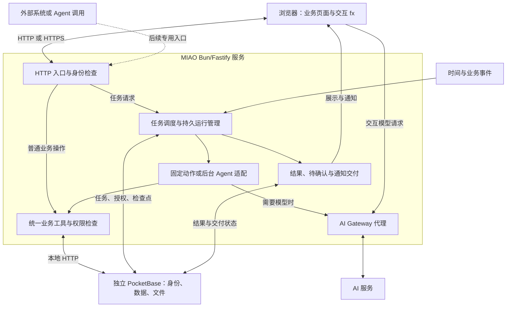
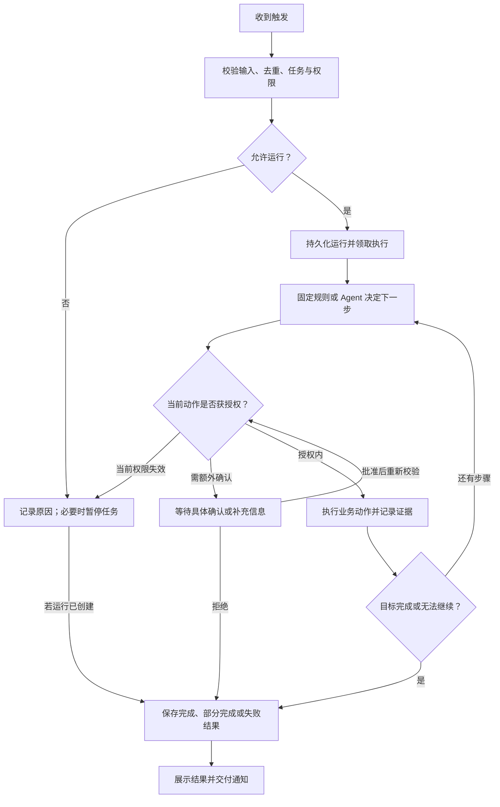

# MIAO 产品与运维手册

本文档是 MIAO 唯一的详细产品、接口与运维手册。根目录 [README.md](../README.md) 提供项目概览和快速开始；仓库维护指引见 [AGENTS.md](../AGENTS.md)。

第 1–8 节记录当前代码实现和操作方式；第 9 节定义 Agent 运行模型与验收要求，9.14 明确本次实现范围及待交接内容。2026-09-30 已完成生产部署、现有自动化测试、干净目录迁移和固定后台报表验收；真实 AI、邮件与其他异常场景仍未完成验收。新增能力实现后，应同步更新当前功能、边界和 API 参考，避免把产品决策写成已上线功能。

## 1. 产品概览

MIAO 帮助企业员工通过内置 fx Agent 创建和使用内部业务工具。PocketBase 管理身份与业务数据；MIAO API 按请求检查工作区和应用权限。企业 AI 密钥保存在服务端，浏览器 Agent 通过已认证的 MIAO 代理访问 AI 服务。

MIAO 的工作流程是：描述业务目标、由 Agent 规划数据结构和业务界面、预览并确认发布，然后在持久化的业务界面里处理日常工作。数据表和记录管理作为检查与维护入口保留。

当前 Agent 在浏览器中通过 WebAssembly SDK 运行，使用 MIAO 明确提供的工具。它不继承 fx CLI 的文件系统、Shell、Keychain 或 MCP 配置；当前浏览器运行需要支持 WebAssembly JSPI。后台任务由 Bun 服务执行：固定数据快照不调用模型，需要分析时使用 libfx 的 native 后端；任务、动作回执和运行结果保存在 PocketBase。后台代码已接入，目标环境兼容性与端到端行为尚待验证。

## 2. 当前功能

访问根路径 `/` 直接显示登录页面，不再提供宣传首页。注册和忘记密码入口保留在登录页；退出登录、登录凭证失效及邮箱验证完成后返回登录页。已有有效登录状态时继续进入工作台并恢复当前工作区视图。登录、工作台、数据检查和平台后台沿用 `miao.my/docs/prototypes` 的白色背景、黑色主按钮与细边框界面风格。

- 账号注册、登录、邮箱验证、密码重置；支持注册策略和邮箱域限制。
- 工作区、成员邀请、工作区角色，以及应用访问名单。
- 应用、数据表、字段和记录的管理；字段支持文本、数字、布尔、日期、邮箱、网址、选项、关联和附件。
- 受限 schema v1 业务界面：单个数据表的列表、真实数据预览、搜索、分页，以及字段条件满足时的新增和编辑表单。
- 应用界面版本、草稿修订、历史界面前向恢复和显式发布；发布前检查数据表、字段和当前发布版本。
- fx 对话在同一浏览器内按账号和工作区保存检查点与可见消息；权限变化后清除旧会话并重新授权。服务端也有私有线程 API，但浏览器会话当前未接入该 API，因此不能跨设备续接。
- Agent 支持结构化查询、批量修改预览和确认执行、到期/状态变化/新增记录提醒，以及新增记录后的固定字段动作。
- 应用后台任务：通过对话创建草稿、审阅并确认启用；支持手动、一次性、每天、每周、记录新增与指定状态变化触发。
- 持久运行与动作记录、限定字段的后台查询及单条更新、越权动作待确认、补充信息、取消和有限重试；应用菜单提供后台任务与运行详情，结果通过站内提醒交付。
- 工作区审计、数据 JSON 导出、平台管理、AI 用量统计与服务端密钥配置。

## 3. 权限模型

工作区 owner 管理空间和应用访问权限。应用权限分为 viewer（只读）、editor（修改普通记录）、manager（管理应用与草稿）、publisher（管理并发布）。批量修改需要单独授予 `can_batch`；viewer 不能写入。未受限应用默认对工作区成员开放普通记录编辑，发布、应用管理和结构变更仍检查对应角色。

任务管理和运行处理要求任务创建者具有 publisher 权限，或由当前工作区 owner 操作；后台实际执行仍使用创建者的当前权限，不因 owner 处理而继承 owner 身份。任务列表和结果按应用访问权限读取。

平台管理员只能管理账号、工作区和应用元数据、AI 配置与汇总用量，不能浏览业务记录、附件内容或 fx 对话正文。每个业务 API 都会在服务端检查当前工作区与应用权限；隐藏前端按钮不构成授权。

## 4. 已知范围与安全边界

- 当前业务界面仅支持一张现有数据表的受限列表定义，不运行模型生成的任意 JavaScript；没有通用工作流画布或拖拽式编辑器。
- 运行时的新增和编辑表单仅在界面覆盖全部必填且受支持字段时提供；附件和关联字段仍需从数据检查页维护。
- 批量更新限同一张表、统一字段赋值、最多 100 条记录。先预览目标记录，再由用户确认；过期计划、权限变化或记录被其他操作修改时会阻止相应写入。整批操作不保证事务性回滚。
- 自动化首版提供站内通知，以及新增记录时对同一记录设置一个固定字段值；不发送邮件或企微消息。
- 原自动化规则继续执行固定动作，到期扫描每 60 秒一次。后台任务另有每 10 秒的调度检查，使用持久运行队列；同一任务串行，首版执行器全局一次执行一项运行。
- 后台任务的读写授权精确到表和字段，首版不支持附件、关联字段、新增、删除、批量写入、结构修改或任意网络工具。仅在获授权读取的字段内可申请一次具体写入确认；确认不扩大后续任务授权。
- 事件仅覆盖已接入处理的 MIAO 记录保存路径；后台写入不再触发任务，避免循环。PocketBase 直接写入没有事件接入，业务写入与事件入队目前不具备事务性或可恢复 outbox。外部 Agent 专用触发入口尚未实现。
- 首版要求单个 Bun 服务进程。记录更新共用进程内串行入口与更新时间检查；持久租约用于执行器恢复，不构成多副本部署或跨进程原子写入保证。
- 当前没有文件上传导入或 CSV/Excel 批量导入功能。Agent 不能被描述为已经支持导入现有业务文件。
- 浏览器 fx 会话当前保存在本机 IndexedDB，且会在权限变更或退出时清理；跨设备续接待完成。AI Gateway 或 JSPI 不可用时，已发布业务界面仍通过 MIAO API 工作。
- 静态检查和自动化测试不能替代目标环境中的真实账号、邮件、AI Gateway、反向代理、附件和备份恢复验收。

## 5. API 参考

API 根路径为 `/api`。登录后发送 `Authorization: Bearer <token>`。多工作区账号使用 `X-Miao-Tenant-Id` 指定工作区。JSON 请求设置 `Content-Type: application/json`。

### 身份与工作区

| 方法 | 路径 | 用途 |
| --- | --- | --- |
| POST | `/auth/register`、`/auth/login` | 注册与登录 |
| POST | `/auth/verify-email`、`/auth/password-reset/request`、`/auth/password-reset/confirm` | 邮箱验证与密码重置 |
| GET / DELETE | `/me` | 获取当前用户上下文；删除账号需密码和确认邮箱 |
| POST | `/me/deactivate` | 停用当前账号，保留数据 |
| GET | `/workspace/members`、`/workspace/invites` | 查询成员与邀请 |
| POST / DELETE | `/workspace/invites`、`/workspace/invites/:id` | 创建或撤销邀请 |
| PATCH / DELETE | `/workspace/members/:id` | 调整成员角色或移出工作区 |
| GET / PATCH | `/workspace/ai-usage`、`/workspace/ai-budget` | 查询用量或调整请求预算 |
| GET | `/workspace/audit`、`/workspace/export` | 查看审计日志或导出获授权数据 |

### 应用和业务数据

| 方法 | 路径 | 用途 |
| --- | --- | --- |
| GET / POST | `/apps` | 列表或创建应用 |
| GET / PATCH / DELETE | `/apps/:id` | 查看、修改、归档或确认后删除应用 |
| GET / POST | `/apps/:id/collections` | 列表或创建数据表 |
| PATCH / DELETE | `/apps/:id/collections/:slug` | 修改或确认后删除数据表 |
| GET | `/apps/:id/runtime` | 已发布 schema v1 界面、记录和表单能力；支持 `page`、`perPage`、`search` |
| GET | `/apps/:id/versions`、`/apps/:id/versions/:versionId` | 查询版本列表或版本定义 |
| GET | `/apps/:id/versions/:versionId/preview` | 只读预览当前有权访问的真实记录，最多 5 条 |
| POST | `/apps/:id/versions` | 创建界面草稿；支持 `based_on_version_id` 保存草稿修订 |
| POST | `/apps/:id/versions/:versionId/restore` | 从兼容的已发布历史版本创建前向恢复草稿 |
| POST | `/apps/:id/versions/:versionId/publish` | 确认发布；必须传 `expected_published_version_id`，首次发布传 `null` |
| GET / PUT | `/apps/:id/access` | owner 查看或设置成员应用角色与 `can_batch` |
| GET / POST | `/apps/:id/collections/:slug/records` | 分页查询或新增记录 |
| PATCH / DELETE | `/apps/:id/collections/:slug/records/:recordId` | 编辑或删除记录 |
| GET | `/apps/:id/collections/:slug/records/:recordId/files/:fieldName` | 下载获授权的附件 |

记录分页使用 `page`、`perPage`，支持文本搜索、排序和单字段筛选。记录写入格式为 `{"data":{"field_name":"value"}}`。附件写入额外提供 `files` 映射；每个文件最多 5 MB，支持 PNG、JPEG、GIF、WebP、PDF 和纯文本。

### Agent 操作、批量修改与提醒

| 方法 | 路径 | 用途 |
| --- | --- | --- |
| POST | `/apps/:id/query` | 结构化条件查询；最多 8 个条件，支持 `eq`、`contains`、`before`、`after`、`empty` |
| POST | `/apps/:id/batch-plans` | 预览 1–100 条记录的统一字段赋值，不写入记录 |
| GET / POST | `/apps/:id/batch-plans/:jobId`、`/apps/:id/batch-plans/:jobId/commit` | 查询计划或提交确认执行 |
| GET / POST | `/agent/threads`、`/agent/threads/:threadId/messages` | 服务端私有对话线程和消息 API；浏览器 fx 当前尚未接入 |
| GET / POST | `/apps/:id/automations`、`/apps/:id/automations/:ruleId/enable` | 查询或创建默认停用的规则，再确认启用 |
| GET | `/notifications` | 当前用户可访问应用的站内提醒 |

### 后台任务与运行

下列路径均以 `/api` 为前缀，并继续使用用户身份与工作区请求头。草稿仅保存定义，不执行。启用必须确认具体版本；运行持有不可变定义快照。

| 方法 | 路径 | 用途 |
| --- | --- | --- |
| GET / POST | `/apps/:id/tasks` | 查询前 100 项或创建任务草稿 |
| PATCH | `/apps/:id/tasks/:taskId` | 修改草稿或暂停任务，传 `expected_revision`，生成新草稿版本 |
| POST | `/apps/:id/tasks/:taskId/enable` | 传 `confirm: true`、`expected_revision` 确认启用 |
| POST | `/apps/:id/tasks/:taskId/pause` | 停止后续触发，已经入队的运行另行取消 |
| POST | `/apps/:id/tasks/:taskId/run` | 运行已启用版本，传 `expected_revision`、可复用的 `request_id`；返回 202 和运行标识 |
| GET | `/apps/:id/runs`、`/apps/:id/runs/:runId` | 分页查询运行，或读取结果及动作证据；检查点不返回浏览器 |
| POST | `/apps/:id/runs/:runId/cancel` | 请求停止尚未执行动作，不回滚已完成写入 |
| POST | `/apps/:id/runs/:runId/retry` | 失败或部分完成后传 `confirm: true`，保留原快照、预算计数和已成功动作；最多三次尝试 |
| POST | `/apps/:id/runs/:runId/resolve` | 传 `confirm: true`、`expected_updated_at` 及 `decision: approve/reject`；补充信息使用 `answer` |

创建请求示例，表和字段必须替换为当前应用真实定义：

```json
{
  "name": "每周客户跟进检查",
  "definition": {
    "goal": "检查客户最近跟进日期，列出需要处理的客户和依据，不修改记录。",
    "execution": "agent",
    "trigger": { "type": "weekly", "time": "09:00", "weekdays": [1], "timezone": "Asia/Shanghai" },
    "scope": { "tables": [{ "table": "customers", "read_fields": ["name", "last_contact"], "write_fields": [] }], "recipient_ids": [] },
    "limits": { "max_writes": 0, "max_requests": 12, "timeout_seconds": 180 }
  }
}
```

`execution: report` 为固定数据快照，只显示每张表第一页（25 条）及总量，不解释自然语言目标或进行 AI 分析。`agent` 可分页查询和调用受控工具。周日为 0；一次性 `at` 必须带时区；状态变化使用 `table`、`field`、`from`、`to`，字段必须是已授权读取的选项字段。接收人默认仅负责人，其他成员使用真实用户 ID；交付时重新检查权限。

模型完成文本不能替代实际写入回执。写入结果未知时进入待核实，核实接口只在当前记录与预期字段值一致时确认，不重新发送原写入；不一致时应拒绝此运行并基于当前记录重新建立任务。

### 平台与 AI Gateway

- `/admin/overview`、`/admin/runtime` 提供平台汇总数据与非敏感运行状态。
- `/admin/users`、`/admin/workspaces`、`/admin/apps`、`/admin/usage`、`/admin/audit` 提供分页平台管理能力。
- `/admin/ai` 管理服务端 AI 密钥；完整密钥不会返回给浏览器。
- `/fx/gateway` 是经过认证的固定代理，仅供 Agent 调用。应用运行时不直接连接 AI 服务。

## 6. 自托管部署

部署脚本支持 Linux 和 macOS 的 x64 与 ARM64。需要 Bun 1.3.6、PM2、`curl`、`unzip` 和 `openssl`。安装脚本下载 PocketBase 0.40.4，安装依赖并生成服务配置。

```sh
bun run server:install
# 按安装输出打开并修改生成的配置，至少设置管理员密码与 AI 服务密钥
bun run server:start
bun run server:status
bun run server:logs
```

默认 MIAO 监听 `0.0.0.0:41874`，PocketBase 仅监听 `127.0.0.1:8090`。对公网提供服务时，应配置 HTTPS 反向代理并限制 MIAO 服务端口的访问。

### 主要配置项

| 配置 | 用途 |
| --- | --- |
| `MIAO_DATA_DIR` | PocketBase 数据、附件、日志和运行配置所在目录 |
| `MIAO_PORT`、`POCKETBASE_PORT`、`HOST` | 服务端口和监听地址 |
| `POCKETBASE_SUPERUSER_EMAIL`、`POCKETBASE_SUPERUSER_PASSWORD` | PocketBase 服务端管理员账号 |
| `MIAO_AI_PROVIDER`、`AI_GATEWAY_API_KEY` | AI 服务提供方与服务端密钥 |
| `MIAO_AI_BASE_URL`、`MIAO_AI_MODEL` | AI Gateway 地址和模型名称 |
| `MIAO_PUBLIC_URL`、`RESEND_API_KEY`、`MIAO_MAIL_FROM` | 邮件验证、密码重置和邀请邮件 |
| `MIAO_REGISTRATION_MODE`、`MIAO_ALLOWED_EMAIL_DOMAINS` | 注册策略和允许注册的邮箱域 |
| `MIAO_ADMIN_EMAILS`、`MIAO_SETTINGS_ENCRYPTION_KEY` | 平台管理员与加密保存的服务设置 |
| `MIAO_BACKUP_DIR`、`MIAO_BACKUP_RETENTION_DAYS` | 备份目录和保留时间 |

所有密钥和管理员凭据都应保存在受限访问的服务端配置中，不能提交到版本库。

后台任务升级包含迁移 `20260930090000_background_tasks.js`，新增服务端专用的任务、运行、动作与执行租约集合。通过现有 `server:start` 脚本复制迁移并启动 PocketBase，再启动 Bun；不要只替换 Bun 代码而遗漏迁移。后台 `agent` 使用 libfx native 后端，依赖安装必须保留对应平台原生包；Linux 需要 glibc 2.34 或更新版本。生产已验证 Bun 1.3.13、原生模块初始化与迁移执行；CentOS 7 的兼容方式见下节。

### miao.minapp.xin 生产部署（2026-09-30）

此站点对应当前仓库的 Bun/Fastify + PocketBase 项目。旧 `/data/miao` 是其他项目的符号链接，`41874` 被旧 Miaozao 容器占用，不能拿来覆盖或停止。

| 项目 | 已验证配置 |
| --- | --- |
| 公网入口 | `https://miao.minapp.xin`，DNS 指向 `8.130.70.64` |
| SSH | `ssh -T -o BatchMode=yes -o StrictHostKeyChecking=yes room.minapp.xin`，root；现有 SSH 配置选择密钥 |
| 项目目录 | `/data/miao-platform`；`current` 指向 `releases/<提交号>` |
| 首次运行代码 | `3da84ff`（包括权限测试 fixture 修复） |
| 运行身份 | 独立系统用户 `miao-platform`；系统 PM2 5.4.2，`PM2_HOME=/data/miao-platform/.pm2` |
| MIAO / PocketBase | `127.0.0.1:41879` / `127.0.0.1:8091`；单 Bun 进程 |
| 配置 / 数据 | `install/miao.env`（0600）/ `data/pb_data`；附件、迁移和日志也在 `data/` |
| PocketBase / Bun | `install/bin/pocketbase` 0.40.4 / `bin/bun-real` 1.3.13 |
| 进程恢复 | systemd `pm2-miao-platform.service`，已启用并验证 PM2 resurrect |
| Nginx | `/www/server/panel/vhost/nginx/html_miao.minapp.xin.conf`；宝塔 `data/db/site.db` 已登记站点及域名 |
| HTTPS | `/www/server/panel/vhost/cert/miao.minapp.xin/{fullchain.pem,privkey.pem}`；独立 Let's Encrypt 证书，首次有效至 2026-12-29 |
| ACME | `/root/.acme.sh/miao.minapp.xin_ecc`；webroot `/data/miao-platform/acme`，现有每日 cron 续期，安装证书后的 reload 命令先做 `nginx -t` |
| 备份 | `backups/initial-20260930/` 保存切换前 vhost、rewrite、宝塔数据库和私有配置；PocketBase ZIP 在 `backups/` |

CentOS 7 自带 glibc 2.17，直接加载 libfx 会出现 `GLIBC_2.25/2.27/2.28/2.34 not found`。专用 `glibc/` 保存从现有 Debian bookworm 容器 `minixm-user-system` 提取的加载器和运行库。`bin/bun` 是包装脚本，以 `glibc/ld-linux-x86-64.so.2 --library-path /data/miao-platform/glibc /data/miao-platform/bin/bun-real "$@"` 执行 Bun。已验证 native Agent 创建并 `close()`；没有替换系统 glibc，也不依赖该容器持续运行。后续升级 Bun 必须保留此包装脚本，更新 `bun-real` 后重新验证 native 模块。Node/npm 使用 `/www/server/nodejs/v22.12.0/bin`，避免 `/usr/bin/node` 的 OpenSSL relocation error。

远端 `/data/miao-platform/ops/run` 固定以上 PATH、安装目录、配置路径、数据目录及 PM2_HOME，并切换为 `miao-platform` 用户后进入 `current`。日常操作可直接复用：

```sh
ssh room.minapp.xin '/data/miao-platform/ops/run npm run server:status'
ssh room.minapp.xin '/data/miao-platform/ops/run npm run server:start'
ssh room.minapp.xin '/data/miao-platform/ops/run npm run server:logs -- miao-platform 100'
ssh room.minapp.xin '/data/miao-platform/ops/run npm run backup'
```

日志命令持续输出，需要退出时中断即可。服务日志在 `data/logs/`，HTTP 访问日志在 `/www/wwwlogs/miao.minapp.xin.log`。`npm run server:start` 包含迁移检查、PocketBase readiness、MIAO readiness 和 PM2 save；不要另起 Bun watcher 或独立服务。首次 installer 的 GitHub 下载曾在服务器上阻塞，已由本地下载官方 Linux amd64 ZIP 后经 SCP 安装；出现相同问题时复用这条路径，勿更改 PocketBase 版本。

更新步骤：

1. 本地确认工作区状态，提交所有本次修改，运行 `npm test`、`git diff --check`。只部署明确提交的 `git archive`，不上传本地数据库、配置或 `node_modules`。记录完整提交号。
2. 上传归档到 `releases/` 并解压到新的提交目录，确认目录未存在，赋予 `miao-platform` 所有权。修改迁移时先使用 `install/bin/pocketbase migrate up --dir <新建临时数据目录> --migrationsDir <新版本>/pb_migrations` 验证；验收完成后仅清理这个临时目录。
3. 通过 `ops/run npm run backup` 保存在线 PocketBase ZIP。另建带时间戳的备份目录，保存 `install/miao.env`、当前 `current` 目标、Nginx vhost 和当前版本。禁止输出密钥。
4. 用 `ops/run npm run server:stop` 停止写入，再冷备份完整 `data/` 和 `install/`，保留各自权限；更新加锁以避免同时发布。持久数据始终留在发布目录外。
5. 在新 release 中以相同用户及环境执行 `npm run server:install`（或先切换 `current` 再使用 `ops/run`）；用临时符号链接加 `mv -Tf` 原子切换 `current`。再执行 `ops/run npm run server:start`，成功后更新 `/data/miao-platform/DEPLOYED_COMMIT`。不能编辑已经应用的迁移。
6. 验证 PM2 两个服务在线、重启计数稳定，`systemctl is-active pm2-miao-platform`、`nginx -t`、公网首页、HTTPS 证书、HTTP→HTTPS 和 `/api/health`；使用临时账号验收注册、登录、建表、记录、发布和后台任务，并清理验证账号。
7. 若启动或验收失败，先停服务并保存故障日志。数据库迁移向后兼容时切回旧 release 并使用同一 `server:start`；否则在停机状态恢复此前冷备份的 `data/` 与 `install/` 后再启动。恢复历史任务前按第 7 节隔离任务和运行，不能直接回放历史写入。全量宝塔数据库备份仅用于审计/灾难恢复，普通回滚只修改本站记录，避免覆盖其他站点的新变化。

2026-09-30 已通过 6 项 `npm test`、全部 12 个迁移在干净目录执行、native Agent 初始化、浏览器首页、公网健康接口、注册/登录/建表/记录读写/草稿发布/业务界面，以及固定后台报表持久执行；验证账号与工作区已删除。已实际生成 PocketBase 备份 ZIP，尚未演练恢复。当前生产 AI 密钥、平台管理员邮箱和邮件服务尚未配置，真实 AI 推理与邮件发送未验收；本地 CAPI 密钥在该主机 CAPI 上返回 401，不能当作可复用的生产凭据。

按用户要求移除了旧 `miaozao.minapp.xin` 的宝塔业务域名绑定，Nginx `retired_miaozao.conf` 对其返回 410，避免落到其他默认站点；DNS 记录仍解析到此主机，未在 DNS 提供商删除。旧容器和数据保留，因为 `miao.my` 仍引用旧服务；旧站点已在宝塔更名为 `miao.my`，vhost 为 `html_miao.my.conf`。后续不要重新把旧域名加到 MIAO，也不要未经确认迁移/删除旧 MongoDB 数据。

## 7. 备份与恢复

```sh
bun run backup
bun run restore -- /path/to/miao_backup.zip --confirm
```

备份归档包含 PocketBase 数据库、附件和集合结构。默认保留期为 30 天；备份脚本不会自动创建定时任务或异地副本，应由部署者配置计划任务并复制到独立存储。备份文件包含用户和业务数据，应按生产数据保护。

恢复会替换当前 PocketBase 数据。执行前停止写入、检查归档并另存当前数据；先在隔离环境演练，再恢复线上服务。恢复后检查健康接口、登录、工作区切换、业务界面、附件和记录读写。后台任务数据和检查点也包含在 PocketBase 备份中。恢复历史备份前必须停止 `miao-platform`，保持 PocketBase 供恢复脚本使用；在重启 Bun 前通过 PocketBase 管理入口暂停恢复出的已启用任务，并将历史未结束运行取消，核对恢复点之后已经发生的写入。当前恢复脚本不会自动隔离任务或取消运行，不能把普通进程恢复机制当作历史备份恢复保护。

## 8. 验证与维护

运行自动化测试：

```sh
npm test
```

在安装依赖后，前端资源构建命令为 `bun run prepare:fx`。数据库迁移使用版本化文件；已应用的迁移不得修改，应通过新迁移调整结构。

交付前还需在目标环境验证真实账号权限、邮件、AI Gateway、JSPI 浏览器、HTTPS 代理、附件授权和备份恢复。修改产品、API 或部署行为时更新本手册对应章节；保持根目录 README 聚焦项目概览和快速开始，不新建重复的产品或 API 说明文件。

## 9. Agent 运行模型与交付要求

### 9.1 已确定的产品方向

2026-09-29 确认以下决策，作为后续实现和验收依据：

1. **支持无人值守执行。** 浏览器关闭、用户退出或无人在线时，已启用的任务仍由服务端调度和执行；执行时继续检查授权有效性。退出登录不等于撤销任务授权。
2. **支持预先授权的自动操作。** 用户启用任务时确定可访问的数据、可调用的工具和可执行的动作。范围内自动执行，范围外停在相应动作之前，请求有权成员确认。
3. **保持同一套应用能力与权限。** 浏览器交互和后台执行使用相同业务工具契约与服务端权限检查。创建应用、维护应用、使用应用是 Agent 的任务场景，不重新引入 Builder/User 双 Agent 产品实体。
4. **应用仍是核心实体。** 持续任务归属具体应用和工作区，具有负责人；Agent 是执行者。用户通过对话创建、修改任务，通过简洁界面查看状态、结果并进行确认。

9.1–9.12 保留完整产品契约；当前代码覆盖范围见 9.14，不把尚未实现或验证的约定描述为可用功能。当前后台 API 和集成方式见第 5、6 节及 9.13。

### 9.2 先区分业务动作、Agent 任务和触发条件

| 概念 | 含义 | 示例 |
| --- | --- | --- |
| 业务动作 | 输入、权限和结果明确的业务操作，可以直接执行 | 保存客户、更新字段、发送已确定的站内提醒 |
| Agent 任务 | 需要理解、分析或选择工具才能完成的目标 | 分析客户流失风险，给出跟进建议 |
| 触发条件 | 决定何时创建一次执行，不决定权限，也不天然要求调用模型 | 人发送消息、每周一 09:00、新客户创建 |
| 持续任务定义 | 保存目标、触发条件、授权和交付方式，可重复运行 | 每周检查未跟进客户并汇总给销售负责人 |
| 一次运行 | 某次触发产生的执行实例，记录独立输入、版本、状态和结果 | 2026-10-05 09:00 的客户检查 |

普通表单保存继续直接调用业务 API；固定规则能完成的动作由确定性代码执行。只有需要推理的部分才启动 Agent。用户可通过 Agent 建立上述任一规则，不必让每一次规则执行都消耗模型。

### 9.3 触发场景总表

| 入口 | 谁发起、带入什么 | 执行与交付 | 当前情况 |
| --- | --- | --- | --- |
| 聊天指令 | 已登录成员；消息、所在应用、获授权的上下文 | 当前浏览器 Agent 处理，回复原对话；目标支持明确转交后台的长任务 | 已有浏览器交互和创建后台任务工具；直接转交当前聊天执行尚未实现 |
| 页面操作 | 当前成员；选中的记录和明确操作 | 普通动作直接执行；“分析客户”等 Agent 操作生成运行并在原页面展示结果 | 已有普通业务操作，通用页面 Agent 操作为目标能力 |
| 时间触发 | 已启用任务；一次性时间、周期或业务截止日期 | 服务端在无人在线时执行，将结果保存到应用并按约定通知 | 固定到期提醒保留；一次性、每日、每周后台任务已接入代码，待验收 |
| 业务事件 | 已提交的业务变化；记录标识、事件标识、必要的前后值 | 先检查事件和条件，再执行固定动作或 Agent 任务 | 新增与指定状态变化已接入后台队列；可靠事件交付尚待补齐 |
| 外部调用 | 获授权的外部系统或 Agent；经校验的 API/Webhook 输入 | 调用绑定任务，返回受限的运行标识或结果；按任务约定交付 | 外部触发 Agent 的专用入口为目标能力 |

持续监控可由周期检查或事件订阅表达，无需让模型无休止循环。审批通过、失败重试属于既有运行的续接，不是重新发起一项没有上下文的新任务。外部 Agent 也必须作为有权限的调用者进入既定任务，不能直接继承平台管理权限。

### 9.4 应用管理与业务执行的边界

| 场景 | Agent 的工作 | 执行边界 |
| --- | --- | --- |
| 创建、修改应用 | 理解需求、规划数据和界面、准备草稿 | 按当前管理权限执行；界面发布继续显式确认 |
| 日常使用 | 查询、分析、生成内容、处理业务记录 | 当前成员权限；现有批量修改继续预览和确认 |
| 后台业务任务 | 按已保存目标分析和执行获授权动作 | 任务授权与当前有效权限共同约束，不依赖浏览器会话 |

普通业务任务授权不包含修改应用结构、发布版本、管理成员或扩大自身授权。后台任务可以提出应用改进建议，但必须进入原有的管理与发布流程。这里的职责划分不要求用户创建或管理多个 Agent。

### 9.5 持续任务应保存什么

以下是产品契约，字段名称不构成数据库或 API 定稿：

| 内容 | 要求 |
| --- | --- |
| 归属与责任 | 工作区、应用、创建者、当前负责人、授权人 |
| 目标与完成标准 | 做什么、处理范围、结果格式；明确何时算完成 |
| 触发条件 | 入口类型、时间/时区或事件条件、有效期 |
| 执行方式 | 固定动作或 Agent 任务；需要的工具和数据来源 |
| 授权范围 | 可读数据、可写字段、允许动作、单次数量限制、获准通知的接收人和渠道 |
| 运行限制 | 超时、模型用量预算、并发规则、最大尝试次数 |
| 结果交付 | 结果保存位置、接收人、通知条件、异常负责人 |
| 版本与状态 | 不可变的已启用版本；草稿、已启用、已暂停、已归档及原因 |

任务目标和授权范围必须分开保存。自然语言指令只能表达意图，实际可执行动作由服务端结构化规则限制。触发输入、业务记录、附件和外部消息都是待处理数据，不能借其内容扩大授权。

### 9.6 用户如何建立和维护任务

1. 用户在应用对话中提出目标，例如“每周一九点检查七天未跟进的客户，把摘要发给销售负责人”。
2. Agent 生成任务草稿，明确时区、数据范围、工具、允许动作、接收人和完成标准；不能确定的必要信息向用户询问。
3. 展示简洁的任务摘要与预计影响。可先进行只读试运行；试运行不执行正式写入或外部发送。
4. 有权用户确认并启用任务。创建草稿不会启动调度；“启用”同时记录具体版本及其授权。
5. 后续通过“改成周五”“暂停这个任务”“立即执行一次”等对话指令维护，也保留暂停、查看结果、确认等必要界面操作。
6. 修改目标、数据范围、动作或接收人产生新草稿，确认后才影响后续运行。已有运行保留原版本，权限撤销则立即约束后续动作。

暂停任务阻止新的触发；取消某次运行要求执行者在安全边界停止尚未执行的动作。已经完成的写入或发送不会因为取消自动撤销，需要在结果中明确展示。

### 9.7 执行身份与预先授权

后台执行使用服务端任务执行上下文，记录任务负责人、授权人、触发来源和运行标识，不保存浏览器登录令牌用于长期运行，也不把 PocketBase 管理员权限当成业务授权。

首期沿用当前规则的责任关系：创建者作为任务负责人和授权人；其须具有相应任务管理及业务操作权限。每个动作的有效权限取**任务明确授权、授权人当前权限、工作区和应用约束的交集**。负责人离开工作区、权限不足、应用归档或授权失效时，暂停相关任务并记录原因；不得自动换成 owner 身份继续执行。负责人转交必须重新授权。

| 动作情况 | 执行行为 |
| --- | --- |
| 查询或分析在授权范围内 | 自动执行，结果仍按应用权限访问 |
| 写入或通知已被任务明确授权 | 在字段、数量、接收人和渠道限制内自动执行，并逐项留记录 |
| 动作超出任务授权，但属于可申请的业务操作 | 在动作发生前进入待确认，展示具体对象、变更和影响，由有权成员处理 |
| 授权人权限已撤销或应用不可用 | 阻止执行并暂停任务；不能通过普通确认绕过当前权限 |
| 无法判断目标对象、缺少必要数据 | 请求补充信息，保留当前进度，不自行猜测后写入 |

一次确认只授权所展示的具体动作，不自动扩大后续运行的权限。长期扩大范围需修改任务并重新启用。等待期间释放执行资源；批准后重新检查权限、目标记录和动作有效期，发生变化时重新预览。拒绝或确认过期均留下结果，不能无限等待。

现有批量修改的“预览后人工确认”机制继续有效。未来后台预授权批量写入需要独立验证数量、数据版本与授权证据，不能由 Agent 伪造用户确认调用现有接口。

### 9.8 时间、事件与外部输入规则

- **时间：** 支持一次性和周期任务；使用明确的 IANA 时区，并展示下一次运行时间。业务日期按任务时区解释；首期默认跳过夏令时中不存在的当地时间，对重复的当地时间仅执行第一次，并记录原因。到点表示进入调度，不承诺零延迟完成。
- **错过的运行：** 首期默认将停机期间错过的周期合并为一次恢复检查，记录遗漏区间，不自动重放多次写入或通知。需要逐次补跑的任务应显式配置并预览影响。
- **并发：** 同一任务默认串行；前一运行未结束时，周期检查合并等待，独立业务事件持久排队，不能静默丢弃不同记录的事件。积压超限时报告负责人。
- **事件：** 业务写入提交后才产生事件，包含稳定事件标识和来源。按业务条件筛选后才启动执行；写入和事件交付的失败应可恢复。当前接入点之外的直接数据库写入不在已有覆盖范围内。
- **避免循环：** 保存触发因果链，默认不让任务自身的写入反复触发同一任务；跨任务链设置次数和预算限制。
- **外部入口：** 验证调用身份或签名、时间有效性、重复请求和输入格式；调用者只能触发获授权的任务，不能提交任意系统提示或借接口创建新授权。

触发去重与业务动作去重分别处理。事件重复投递不应创建重复业务执行；一次运行重试不应再次完成已经成功的写入或发送。

### 9.9 一次运行的生命周期

后台运行使用新的 `miao_runs`，旧固定规则继续使用 `automation_runs`，两者不做隐式迁移。下表是状态含义；当前代码用 queued、running、waiting、completed、partial、failed、cancelled 表达对应状态。确认过期等未实现项见 9.14。

| 状态 | 用户含义 | 后续处理 |
| --- | --- | --- |
| 排队中 | 已收到请求，等待执行 | 可取消；执行前检查版本、权限和预算 |
| 执行中 | 正在查询、分析或调用工具 | 可进入等待、完成、失败或取消 |
| 等待处理 | 等待确认或补充必要信息 | 有权成员处理后续接；拒绝或过期后结束并注明原因 |
| 已完成 | 完成标准满足，结果已持久保存 | 可查看结果和动作明细 |
| 部分完成 | 一部分动作成功，剩余未完成 | 展示成功范围，重试只处理未完成部分 |
| 失败 | 无已确认的业务完成结果，执行无法继续 | 展示失败步骤和是否存在待核实的外部效果 |
| 已取消 | 用户取消或等待处理被终止 | 展示原因以及停止前已执行的动作 |

每次运行保存触发来源、输入引用、任务版本、执行身份、开始/结束时间、动作记录、结果、错误和用量。重试保留原运行关联和每次尝试记录；采用修改后的任务定义重新执行时，作为新运行记录，并标明关联来源。

后台执行必须在刷新、关闭浏览器和服务重启后可追踪。服务端通过持久任务状态、执行租约和检查点恢复工作，不能只依靠进程内定时器。重启后先核实未完成动作再恢复，避免重复写入。

后台任务的任务快照、授权、动作和运行检查点已纳入 PocketBase 数据备份。恢复历史备份与普通服务重启分别处理：恢复后先暂停自动执行，核对恢复点之后可能已经发生的写入和外部发送，再由负责人恢复任务，避免历史状态回退造成重复操作。

对超时、临时网络故障进行有上限的重试；权限失败、输入错误和预算耗尽需停止并报告。外部发送超时但结果未知时，先查询交付状态；无法确认且对方不支持幂等时请求人工核实，不能宣称已经送达或盲目重发。模型输出“完成”不能替代工具执行证据。

### 9.10 结果交付与界面

任务结果、通知和聊天消息各有职责：结果是持久业务产物，通知告诉相关成员有事需要关注，聊天是追问和操作入口。后台运行不依赖某个私人聊天窗口存在，也不自动暴露该窗口历史。

- **交互任务：** 在原对话或页面展示结果；转为后台前明确提示，返回可再次打开的运行入口。
- **后台任务：** 在所属应用保存结果摘要、关联业务对象和运行详情；按任务约定产生站内通知。
- **待处理事项：** 对需要确认、补充信息、执行失败的运行集中展示，标明负责人和原因。
- **通知：** 成功结果可汇总，异常和待确认事项按约定通知负责人；正常“无符合条件记录”属于成功结果，不应生成错误告警。
- **外部渠道：** 邮件、企微等作为后续扩展，需要接入凭据、接收人授权和交付回执；当前仅能承诺站内通知。

业务执行结果与通知交付状态分开记录。报告已生成但通知失败时，重试通知即可，不应重新执行报告中的业务操作。结果读取和通知内容必须再次检查接收人的当前权限，避免因链接或摘要泄露业务数据。

产品界面只需在应用内提供任务列表、运行详情和待处理入口；任务创建与复杂修改仍通过 Agent。任务列表展示名称、触发条件、负责人、状态、下次运行和最近结果，无需增加流程画布。

### 9.11 端到端业务示例

**每周客户跟进检查（时间触发、只读分析）**

用户确认每周一 09:00、Asia/Shanghai，检查指定客户表中超过七天未跟进的记录。任务有读取和向指定销售负责人发送站内通知的授权，没有客户字段写权限。即使浏览器关闭，也生成持久报告并通知负责人；没有符合条件的客户时记录正常完成。Agent 提议修改客户状态时必须等待具体确认。

**新客户分类（业务事件、获授权写入）**

新客户提交成功后触发分析，Agent 只可读取指定字段，并将“行业分类”写成允许选项之一，每次处理一条记录。信息不足时请求处理而不猜测写入。重复事件不重复分类；分类过程中客户被其他成员修改时先重新核实。该场景对应已接入的记录事件后台 Agent 路径，真实 AI 与写入行为尚待验收；旧固定字段赋值规则仍单独运行。

**页面分析与外部资料到达（另两类入口）**

员工点击客户页“生成跟进建议”，按其当前权限创建任务并在页面取回结果；需要较长时间时明确转交后台。后续接入的外部系统可用获授权入口提交资料标识，触发预先定义的分析任务；消息本身不能决定访问其他应用或新增收件人。这两个 Agent 入口尚待实现。

### 9.12 交付顺序与验收

| 阶段 | 交付内容 | 关键验收 |
| --- | --- | --- |
| 第一阶段：后台运行基础 | 任务定义、预先授权、服务端执行、持久运行记录、待确认与站内结果交付；先接入手动和时间入口 | 关闭浏览器仍完成；服务重启后可恢复；退出不撤销任务，但权限撤销阻止后续动作；超预算停止 |
| 第二阶段：事件运行 | 复用同一执行机制接入记录事件和页面 Agent 操作；补齐可靠事件交付 | 重复事件不重复写入；自身写入不循环；并发修改被识别；不同记录事件不丢失 |
| 第三阶段：外部协作 | 受限 API/Webhook 触发，以及获授权的外部通知渠道 | 调用身份校验、防重放、租户隔离、发送回执和未知结果处理 |

所有阶段都要验证：草稿不会自动运行；扩大授权需重新确认；等待处理不会占用持续模型运行；部分成功如实展示；重试不重复已成功动作；普通已发布业务界面在模型不可用时仍可使用。

2026-09-30 确认保留 Bun/Fastify + 独立 PocketBase，使用本地 HTTP 通信；对应架构见 9.13。后台 fx native 适配、持久队列与主要交互已进入实现，尚未运行验收，不改变以上产品契约。实施前如需改变无人值守、授权范围、应用管理权限或结果可见性等产品边界，先由产品负责人决策，并更新本节，避免在代码中隐式改变约定。

### 9.13 已选架构与任务流程

**架构决策：** MIAO 后端继续使用 Bun/Fastify，PocketBase 保持独立服务。沿用当前 MIAO 服务端口和仅绑定回环地址的 PocketBase 端口；由 PM2 和现有项目脚本统一管理生命周期。业务数据通过 PocketBase API 访问，Bun 不直接写其 SQLite 文件。任务调度、运行管理、权限检查和结果交付先作为 Bun 服务内模块实现。

下图对应当前模块关系；外部专用入口仍为后续扩展，以虚线标识。框表示模块职责，不要求每个框成为独立服务。



图中内部持久化连接均通过服务端 PocketBase 客户端和本地 HTTP 完成；业务工具及运行管理必须执行应用层授权，不能依赖服务端管理员凭据自动获得业务权限。时间触发由调度模块产生，业务事件在受控写入提交后产生，外部调用先在 HTTP 入口验证身份与输入再进入运行管理。

浏览器 fx 使用 Wasm SDK，后台 Agent 使用同一 libfx 包的 native 后端，直接作为 Bun 内模块调用，不新增 Agent 服务端口或 CLI 子进程。两者共用 AI Gateway 传输适配、应用权限解析、记录校验和更新入口；后台工具在此基础上进一步限制任务授权字段与预算。后台检查点以不透明数据保存到 PocketBase，运行快照及动作回执才是恢复与核实的依据。

用户建立任务的流程：对话描述目标 → 生成任务草稿 → 展示范围和动作 → 有权用户确认启用 → 保存版本及授权 → 调度后续运行。普通页面保存直接使用业务工具；需要推理的页面操作才创建 Agent 任务。



每次动作都重新检查权限、任务授权和业务对象；模型推理不代替授权。等待确认时释放执行资源，续接时重新核实数据与权限。执行异常按 9.9 处理，保留已成功动作并只重试未完成部分；通知失败只重试交付，不重做业务操作。对应代码已实现主要路径，真实运行和异常场景尚未验收，具体边界见下一节。

### 9.14 本次实现与交接边界

原架构实现阶段按产品负责人要求优先实现架构和交互，测试交由其他人员。2026-09-30 的生产部署随后完成自动化测试、干净目录迁移、服务启动、native 初始化和固定报表验收，具体证据见第 6 节；真实 AI 调用及下列异常场景仍待验证。

| 模块 | 代码职责 |
| --- | --- |
| `src/business/` | 共用应用权限、记录校验、查询条件与串行记录更新 |
| `src/runtime/task-definition.js` | 校验结构化授权，计算明确时区下的下次运行 |
| `src/runtime/repository.js` | 持久入队、触发去重、定义快照和动作标识 |
| `src/runtime/worker.js` | 调度、单执行器租约、重启恢复、后台 fx、结果与通知 |
| `src/runtime/tools.js` | 受控字段查询、逐条更新、确认等待和缺失信息请求 |
| `src/routes/tasks.js` | 草稿、版本确认、暂停、运行、取消、重试和续接 |
| `public/modules/app-tasks.js` | 任务与运行列表、进度刷新、动作证据及待处理交互 |
| `public/modules/fx-assistant.js` | 在应用对话中创建、修改、启用和查看后台任务 |

交接时重点验证：草稿不运行、关闭浏览器后执行、原生 fx 与现有 Gateway 配合、重启后不重复已确认动作、字段越权先暂停、权限撤销停止、并发记录变更被阻止、取消保留成功证据，以及通知失败不重做业务操作。

完整契约尚未全部覆盖：没有只读试运行、确认有效期、负责人转交、任务归档、积压告警、每次尝试的独立历史、原子事件 outbox、跨任务因果链、外部 API/Webhook、外部通知渠道或备份恢复后的自动隔离。界面展示最近 25 次运行，API 可翻页；任务列表暂限前 100 项。运行重试沿用已有预算计数，不重新授予写入或模型额度。部分完成后的动态推理仍需要通过真实场景核实，动作去重仅针对相同运行中相同工具和相同参数，不承诺任意业务目标的语义去重。

周期积压在同一任务有未结束运行时合并跳过；停机后至多补一次到期检查，保存计划时间和检查时间，但未单独生成遗漏区间清单。夏令时计算已实现跳过不存在时间、选择重复时间第一次的规则，未持久记录跳过原因。模型完成标准目前依赖任务目标、终止原因与工具错误检查，没有独立业务验收器。运行等待不持续占用模型，但未设置自动过期；负责人应在应用内处理或取消。
